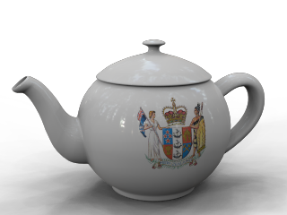
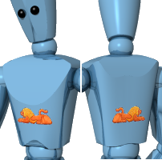

---
title: Decals
---
<!-- TODO: This page should be updated. There are at least, 3 points to improve, more likely some more: 1. Compare instructions to add decal with actual process in the program. 2. There is another decal type, "spherical", that's not mentioned in the text. 3. Clicking on "Properties" doesn't open a dialog but returns an error message. -->

# {{page.title}}
Decals are non-tiling image maps that apply directly to objects instead of indirectly using a material. Use decals to modify a limited part of an object's color, reflectivity, or bumps.
Decals consist of a single instance of the image, rather than being tiled as they are when used in a [material definition](materials-tab.html).
Some uses for decals include:

>Hanging artwork on interior walls.
>Placing labels or logos on products.
>Adding signs to the model.
>Creating stained glass windows.

 **Note:** Decal previews will only display in wireframe views if OpenGL is enabled for wireframe mode. The **Pipeline** setting must be **OpenGL** in **Options**  &gt; **View**  &gt; **Display Modes**  &gt; **Wireframe**  &gt; **Other Settings**  &gt; **Display Pipeline assignment**.

## Decal Placement
{: #decal-list}
{: #decal-placement}

###  **Add**
{: #add-decal}
1. Select one or more objects.
1. On the **Edit** menu, click **Object Properties**.
1. On the **Properties** list, click **Flamingo nXt Decals**.
1. Click the **Add** button.
1. In the **Open Bitmap** dialog box, select a bitmap name, and click **Open**.
1. In the **Decal Properties** dialog box, select options, and click **Place**.
1. At the prompts for points, pick points on the model to locate the decal.
The precise sequence depends on the type of decal selected: [Planar](#decal-planarmapping), [Cylindrical](#decal-cylindricalmapping), or [UVMap](#decal-uvmapping).

###  **Edit Placement**
{: #decal-edit-placement}
1. Click the **Edit Placement** button.
1. At the **Select control point** prompt, use the graphical editor to change the placement of the decal.
1. Press **Enter** when finished.

###  **Properties**
{: #decal-properties}
1. Click the **Properties** button.
1. In the **Decal Properties** dialog box, use the controls to change the decal's properties.

###  **Delete**
{: #decal-delete}

>Click the **Delete** button.

###  **Move up** / **Move down**
{: #decal-movedown}
{: #decal-moveup}
When multiple overlapping decals are applied on a single object, the order in which they are applied may be significant. Decals are applied in the order they appear in the list. The last decal in the list appears to be on top.

>Click **Move Up** or **Move Down** to change a decal's position in the list.

##### To place a planar decal
1. At the prompts, pick locations for the decal's **Width**, and **Height direction**.
1. At the **Select control point...** prompt, select a control point to adjust the image size, rotation, or location.
Or press **Enter** to complete the decal placement.

### Options

#### Move
Moves the decal. At the Point to move from and the Point to move to prompts, enter any locations as for the Rhino Move command.

#### UseImageAspectRatio
Restores a stretched decal to the aspect ratio of the original bitmap.

##### To place a cylindrical decal
1. At the prompt, pick a location for the **Center point** of the cylinder.
1. At the **Select control point...** prompt, select a control point to adjust the image size, rotation, or location.
Or press **Enter** to complete the decal placement.

## Set or edit the decal placement using the control widget
Note: When using the planar mapping on a curved object, the entire bitmap must lie behind the surface of the object. Portions of the bitmap that lie in front of the surface will not be visible.

#### To resize the decal width and height at the same time

>Drag the control points at the corners of the control widget.

#### To change the decal height

>Drag the center control point on the top and bottom edges of the control widget.

#### To change the decal width

>Drag the center control point on the left and right edges of the control widget.

#### To move the decal

>Drag the control point in the center of the control widget.

#### To rotate the decal

>Drag the x-, y-, or z-axis control point on the widget axis icon.

## Decal Properties
{: #dialogbox-editdecal}
The information from the bitmap replaces or blends the object's color with the decal's color. This is the most common use of decals.

## Projection
{: #projection}
The mapping style determines how to project the decal onto the object. It is a good idea to draw construction lines in the scene to help accurately place decals. A rectangle drawn just behind a surface can act as a guide for a standard decal. Use object snaps for accurate placement.

### Cylindrical
{: #decal-cylindricalmapping}
The cylindrical mapping type is useful for placing decals onto objects that curve in one direction, such as labels on wine bottles.
The cylindrical projection maps the bitmap onto the cylinder with the bitmap's vertical axis along the cylinder's axis, and the horizontal axis around the cylinder.

### Planar
{: #decal-planarmapping}
Planar mapping is the most common mapping style. It is appropriate when mapping to flat or gently curved objects.
The corners define the bitmap's location and extents. If the rectangle does not have the same proportions as the bitmap, the bitmap will be stretched or compressed to fit.
When using planar mapping on a curved object, the entire bitmap projection must lie behind the surface of the object. Portions of the bitmap that lie in front of the surface will not be visible.

### UV Map
{: #decal-uvmapping}
Decals using UV mapping are useful for objects like hair and tree bark where the decal flows and stretches to fit the surface.
The decal covers the entire object; there is no control over the decal placement.
UV mapping uses the u- and v-parameterization of the surface to bend and stretch the image; therefore, no manual placement is necessary.

### Browse
{: #file-browse}
Change the image file.



## Strength
{: #decalmappingstrength}

### Color
{: #decal-color}
Varies the relative strength of the image color with respect to the underlying material. See also, [Material Texture Properties, Color Strength](texture-properties-main.html#color).

### Bump
{: #decalmappingbump}
Bump maps create simulated shadows and highlights on the surface. See also, [Material Texture Properties, Bump Strength](texture-properties-main.html#bump).

## Reflective finish
{: #reflective-finish-and-highlight}
Controls the same properties that are controlled by a material definition. Apply these properties to the specific areas of the object that are affected by the decal. By default, decals have a matte finish.

### Intensity
Adjusts the strength of the highlight. Larger values increase the size and strength of the highlight. See [Advanced Material Properties, Intensity](advanced-material-properties-main.html#intensity).

### Sharpness
Sets the size of the highlight. Lower numbers specify a broader highlight; higher numbers focus the highlight in a smaller area. See [Advanced Material Properties, Sharpness](advanced-material-properties-main.html#sharpness).

### Metallic
Sets the highlight color to match the base color. See [Advanced Material Properties: Metallic](advanced-material-properties-main.html#metallic).


## Advanced
{: #advanced}

### Double Sided
{: #double}
Causes the decal to appear on the back face of the surface on which it is placed as well as the front face.

### Mirror
{: #mirror}
Mirrors the decal image.

## Projection direction
{: #projection-direction}

### Backward
Projects the decal away from the back of the decal image.
Front (left), back (right).

### Forward
Projects the decal away from the front of the decal image.
Front (left), back (right).

### Forward &amp; Backward
Projects the decal away from both the front and the back of the decal image.
Front (left), back (right).

### Transparency
Sets the transparency for the decal. See [Transparency](advanced-material-properties-transparency.html).
IOR
Sets the index of refraction for the transparent decal. See [Index of Refraction](advanced-material-properties-transparency.html#index-of-refraction)
