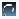

---
---

# {:height="75px" width="75px"} Render Options
The render tab controls the main properties of the final rendering.  Use this tab to control quality and length of time a rendering can take.  Resolution of the final image is one of the biggest influences on overall rendering times.

Note: A good practice is to leave the rendering resolution low during draft renderings. Use high resolution renderings for final renderings only.

#### Where can I find Flamingo Lighting control?

 1. Toolbars >Flamingo nXt Toolbar > Render Options tab
 1. Menus > Flamingo nXt 5.0 Pulldown > Show Control Panel > Flamingo nXt > Render Options tab

## Viewport to render
{: #viewtorender}
Set the view that Flamingo nXt 5 will be rendering.  This is a very useful setting when working on the model and rendering, but there is one specific view that should always render.  For instance, Perspective view is many times the view of interest.  By setting this drop down, then you do not need to make sure the view is current before starting the rendering.

#### Active view
Use this option to render the current active view.  This is the default setting.

#### List of available viewports
This list includes all the named views in the model.  Select the view name that should always be rendered.

## Rendering resolution
{: #resolution}
The Rendering resolution is one of the most important render settings.  This control sets the image size and resolution to be saved in the Rhino file.  Increasing resolution will exponentially increase rendering time.  So, it is important to handle this setting carefully.

#### Total pixels
{: #resolutionimagepixels}
Sets the number of total pixels in the final rendering, using the current view for height and width ratios.  This is a great setting to use while working on renderings.  It is the best setting to match the current view to render. It is simple to increase or decrease the resolution of the image by simply changing the total number of pixels.

### Viewport resolution
Uses the viewport size in pixels to determine the rendered image size.  This creates a 1 to 1 recreation of the viewport aspect ratio and resolution.  This is a useful mode, but can get slower when rendering a full screen viewport vs a quarter screen viewport in the standard Rhino 4 view configuration.

### Image size
{: #resolutionprintedsize}
Image size will set the final resolution based on several different variables.  This is the best way to match an exact size and resolution of a final image. If the height and width of the final rendering does not match the same aspect ratio of the view being rendered, there may be some clipping of the view on the top and bottom or sides of the view. Note: These controls can also lead to very high resolution renderings that may take a very long time to complete.  Use these controls for final high resolution renderings.

There are four unit types which can be used:

>Pixels
>Inches
>Millimeters
>Centermeters

#### Pixels
Sets the render image units to pixels.  Use this setting to simply set the final width and height of the final rendering by the number of pixels.

#### Inches
Sets page units to inches. Inches are used in combination with resolution settings to determine the final resolution of the rendered image.  To determine final resolution, multiple the number of inches in width and height by the resolution DPI value.

#### Millimeters
Sets the page units to millimeters. Use millimeters in combination with resolution settings to determine the final resolution of the rendered image.  To determine final resolution, multiply the number of millimeters in width and height by the resolution dots per millimeter value.

#### Centimeters
Sets the page units to centimeters. Use centimeters in combination with resolution settings to determine the final resolution of the rendered image.  To determine final resolution, multiply the number of centimeters in width and height by the resolution dots per centimeter value.

#### Apply view aspect ratio
Use this setting to keep the width and height setting in the same aspect ratio to the current view.  This will assure the complete view is rendered in the final image.

#### Width
Printed image width in current unit size.  Multiply this setting by the resolution setting to reach the final image size in total number of pixels.

#### Height
Printed image height in current size units.  Multiply this setting by the resolution setting to reach the final image size in total number of pixels.

### Resolution
{: #printsizepixelsperunit}
{: #printsizedpi}
{: #printsizeresolution}

#### Display
The image is rendered using the DPI resolution of the viewport. This is the density of pixels on a devise.  Normally it is expressing the [dots pre inch (DPI)](https://en.wikipedia.org/wiki/Dots_per_inch)

#### Custom
The image is rendered using a custom resolution. Type the custom width and height resolution in **Pixels per: control**.

#### Printer, draft quality
Set the resolution to 100 pixels per inch or 4 pixels per mm.

#### Printer, normal quality
Set the resolution to 150 pixels per inch or 6 pixels per mm.

#### Printer, high quality
Set the resolution to 300 pixels per inch or 12 pixels per mm. This is quite a high resolution for rendering.  This works well for smaller renderings, but for large poster or wall size renderings, the overall resolution can get very high with this setting. High resolutions can lead to long rendering times.

#### Pixels per
When Resolution control is set to Custom, use this control to set the resolution per selected unit. When a preset resolution is selected, this control displays the current resolution.

## Depth of field
{: #depthoffieldoption}
This effect creates a depth of field blur that mimics a photographer's lens. A lens can only focus precisely at exactly one distance, but the decrease in sharpness is gradual around the focal distance.

#### Enabled
Turns on the depth-of-field effect.

#### Strength
Controls the size of the focus area. Setting Strength to zero makes the entire image is sharp. Increasing the Strength makes the areas outside the focal distance more blurry and makes the area in focus smaller.

#### Focal distance
{: #focaldistance}
Sets the distance for the depth of field. The distance around the depth of field point at which objects will be in focus. If the Focal distance is set to ten units, objects about seven units behind the depth of field point and about three units in front of the depth of field point will be in focus.

#### Pick >>
Pick a point in the model for the focal distance.

## Render Engine
{: #render-engine}
There are three different render engines within Flamingo.  Each render engine will produce slightly different results in normal rendering conditions.

Flamingo use progressive, multi-step rendering techniques to create renderings.  With progressive steps, as Flamingo does, there can be unfinished artifacts in the rendering at each step. Artifacts are render effects that leave unusual uncompleted effects in a rendering.  Technically all three render engines will result in the the same rendering, given enough time.  But realistically time is always a limiting factor. So, the trick is to select a render engine that will best render the current scene in the least number of steps.

It is very easy to simply select a different render engine and then render to see the results.

### Default
The default algorithm produces a very high-quality simulation. The default engine is a good render engine for a wide variety of scenes.  While the other two engines have greater strengths, they also have greater weaknesses.  The Default engine is a good starting point.

The default render engine has a very noticeable artifact in the renderings in the early passes.  The artifact is hard overlapping shadows.  As passes progress these shadows will soften up.  This allows the default engine to return a result quickly, but may take more passes to actually soften the shadows out.

The difference in quality between the default method and the path tracer can be very subtle, particularly if indirect lighting is enabled. The difference in quality may not be worth the extra processing time.

### Path Tracer
{: #path-tracer}
The path tracer begins by displaying a grainy image that gradually refines and becomes smooth. This process is known as *convergence*. The path tracer can provide a better quality finished product for many models (with a simpler setup), but does so at the expense of a more complex and time-consuming calculation. **Note:** Using the path tracer can cause bright spot or speckle artifacts to occur during the rendering process. These artifacts are normal to the path tracer and will resolve over time.

Certain advanced effects, such as caustics or blurry transmission, can be calculated with better accuracy using the path tracer. Images rendered with instancing, plants, and displacement maps can converge faster. The path tracer is usually easier to set up than the default method. Advanced settings such as reflection shaders, daylight portals, and ambient lighting are not used when the path tracer engine is selected.

Images rendered using the path tracer will generally take longer to converge than images rendered using the default method. Interior daylight simulations, particularly those scenes where the windows are relatively small, may take much longer to finish.

### Hybrid
The Hybrid engine is an attempt to use the best between the Default engine and the Path Tracer engine.  It uses effects from both.  The hybrid engine will always calculate indirect light.  The artifact of the hybrid is an extensive dot pattern that will reduce over multiple passes. in some situations it may take many passes to remove that dot pattern. For many renderings this may be the best engine to use.

###  **Advanced**
Opens the Document Properties dialog box at the [Flamingo nXt](documentproperties-flamingo.html) page. There are several advanced rendering properties that can be set here to further customize the final rendering quality.
