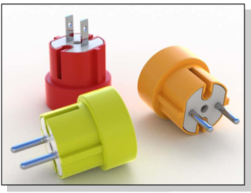

# {: .inline} {{page.title}}
The render window provides options for exposure adjustment and adding post-processing effects. The mainframe of the render windows is part of Rhino's rendering framework.  For details on the render window menus and icons see the [Render Window topic](http://docs.mcneel.com/rhino/5/help/en-us/index.htm#information/renderwindowpostprocess.htm).  This topic covers the Flamingo specific additions to the rendering process.

## Managing an Active Rendering
Once the rendering starts, the [Render Window](http://docs.mcneel.com/rhino/5/help/en-us/index.htm#information/renderwindowpostprocess.htm) starts up and the rendering will proceed.  Flamingo is a multi-pass system that updates the rendered image in stages. Flamingo first looks for any changes to its internal model, then starts an initialization process.  This process can take a few seconds or a few minutes.  This is when the model is imported, material bitmaps are collected from the hard drive, and the render image buffer is created. There are some key steps to the process to managing the rendering:

1. [Multiple pass rendering](#multi-pass)
1. [Stopping a rendering](#stop-render)
1. [Adjusting the Image](#adjusting)
1. [Saving the Image](#saving)

### Multiple Pass Rendering
{: #multi-pass}
Flamingo nXt is a completely new rendering engine. Using a method of multi-pass refinement allows more advanced rendering effects without the overhead of a complicated interface. In the first few rendering passes, there will be unusual artifacts.  For instance you will see shadows start out very sharp and linear. With each pass, the shadows will get softer as they blend together. There are many other effects that will also improve with each rendering pass.  Use the [Flamingo Tab](#flamingo-tab) to track the rendering process.

In this way, a nXt rendering is never "finished"; you merely decide when it is good enough to stop. You can let images that look good continue to improve. But, if you want to change or save something, you can also stop an image at any time.

Some of the effects that improve on each pass are:

* Lighting (such as global illumination if enabled)
* Soft Shadows
* Reflections (blurry)
* Refraction
* Anti-aliasing
* Depth of field

### Stopping a rendering
{: #stop-render}
You can stop the rendering several ways:

{: .inline} Click the “X” button in the upper right of the render window to stop the rendering immediately and close the render window. This is the best method for quickly getting back to the model to make changes.

{: .inline} Click the Stop Raytrace button to stop the rendering at the end of the current pass. This is the best option before saving an image.

{: .inline} Double-click the Stop Raytrace to stop the rendering immediately and leave the render window open.

### Adjusting a rendering
{: #adjusting}
After stopping an image, use the controls in the [Flamingo Tab](#flamingo-tab) to quickly adjust the image and lighting. This is a very important set of tools when producing high end images.

Controls used for images adjustment include:

* [Adjust Image](#adjust-image)
* [Channels](#channels)
* [Post Effects](#post-process-effects)

### Saving Images
{: #saving}
There are many ways to save an image depending on the plans for the image.  Normally saving as a JPG or PNG image file is the recommended process for most images.  But there are other options.

#### {: .inline} Save Image
Saving a JPG or PNG image file is the normal process after adjusting the image.  

A JPG image is a very efficient, small file format.  This is good for images placed on the web or emailed around.  But that efficiency comes at a small price, as some colors are removed from the image.

PNG is a compressed format that contains 100% of the color information and alpha channel information. This is a good format for high quality images.

#### Save with background alpha channel
{: #save-with-alpha-channel}
Saves image as a 32-bit PNG, TIF, and BMP including alpha channel background. Use the Alpha channel versions of the file formats for high-quality compositing. Backgrounds will appear black when the rendering is saved with Alpha channel.  There is a checkbox on the [Flamingo Tab](#flamingo-tab) and the [Save dialog](#saving) box to successfully save the alpha channel. The PNG file format is the proper format to use to capture the alpha information.

#### Export to native Flamingo nXt file (.nXtImage)
{: #export-to-nxtimage}
Saves uncompressed luminance and color information. Saves all rendered channels including [alpha](environment-tab.html#alpha). The nXt Image files can be opened in the [Image Editor](image-editor.html) where [exposure](#adjust-image) and [post-processing effects](#effects) can be applied and the image resaved to another bitmap format.

The .nXtImage format is the native image format of the nXt renderers. It is the recommended format for storing your renderings, since it preserves the most information about your rendering. Images stored in this format can be manipulated in the [nXt Image Editor](image-editor.html) and special effects can be added. From this editor, you can save to many popular standard formats, including all the formats supported in nXt. You can also save to [Piranesi EPix file (.epx)](http://www.piranesi.co.uk/) format.

#### Export to HDR file
{: #export-to-hdr}
Saves uncompressed luminance and color information. The .hdr format stores luminance data directly in a High Dynamic Range format. Non-luminance backgrounds, such as normal photographs, appear black when saved in one of these formats.

#### Export to EXR file
{: #export-to-exr}
A high-dynamic-range image file format, released as an open standard along with a set of software tools created by Industrial Light and Magic (ILM), released under a free software license. This file format supports 16-bits-per-channel floating-point values (half precision) with a sign bit, five bits of exponent, and a ten-bit mantissa. This allows a dynamic range of over thirty stops of exposure. See [Wikipedia article: OpenEXR](http://en.wikipedia.org/wiki/OpenEXR).
The .exr format stores luminance data directly in a High Dynamic Range format. Non-luminance backgrounds, such as normal photographs, appear black when saved in one of these formats.

#### {: .inline} Exit
Closes the render window.

#### Pulldown Menus
For details on the render window menus and icons see the [Render Windows topic](http://docs.mcneel.com/rhino/5/help/en-us/index.htm#information/renderwindowpostprocess.htm).

## Flamingo Tab
{: #flamingo-tab}
The Flamingo Tab in the Render window adds many controls specific to the Flamingo render engine.  Understanding these controls is key to managing the active Flamingo renderings.

#### Save with alpha channel
Saves 32-bit PNG, TIF, and BMP images including alpha channel background. The Alpha channel versions of the file formats are used for high-quality compositing. Backgrounds will appear black when the rendering is saved with Alpha channel.  Use this checkbox and the [Save dialog](#saving) box to successfully save the alpha channel. The PNG file format is the proper format to use to capture the alpha information.

## Progress
{: #progress}
Use the Progress information to check the status and progress of a Flamingo rendering.

#### Action
Shows the current status of the rendering as is works through the model.

Status messages include:

* Rendering Started - Once a rendering begins, there is some setup work that includes converting the model and setting up memory for the rendering.
* Action Done - Once the Stop button is clicked and the render engine finishes a pass, then the stop action is done.
* Pass Complete - This message posts each time a pass is complete.
* Resume Rendering - If a resume is possible, this displays.
* Updating - The render engine is in the middle of a pass, currently updating the rendering.

#### Pass
This is the current pass Flamingo is rendering.  Flamingo is a multi-pass render engine.  Each pass will refine add lighting effects and refine the complex rendering effects.

#### Scan line
A pass progresses along a stretch of horizontal pixels.  Each row of pixels is a scanline.  This reports the current scanline returned from the render engine.

#### Elapsed time
This is the time that has passed from the beginning of the rendering.  This does not include the setup time for the rendering.

#### Rays / second
The number of rays resolved into the scene per second.

#### Pixels / second
The number of pixels resolved in the image per second.

## Adjust Image
{: #adjust-image}
This is one of the most important controls in Flamingo. Just like a camera, you can adjust image exposure.  This is the best way to make renderings brighter, darker, add contrast, or increase color saturation. This adjustment process is called [tone mapping](https://en.wikipedia.org/wiki/Tone_mapping). Flamingo works in luminance space, a much broader range of colors and brightness than can be shown on a screen or printer.  Tone mapping is the process of converting the luminance data into Red, Green, and Blue (RGB) pixels that can be displayed on a screen or printed. The settings also control how images are saved.

{: .inline} {: .inline}
*The default image on the left. The corrected image after applying brightness (0.20), burn (0.16) and saturation (1.20).*
Use this process to quickly adjust the brightness of an image and overall color of an image without needing to re-render.

### Brightness
{: #brightness}
Adjusts the overall brightness of the image. For example, if a white surface in the model is rendering gray, increase the brightness until the surface appears white. Or, if the exterior scene seems overexposed, decrease the brightness until the scene appears more correct.

*Brightness at default (left) and increased.*



### Burn
{: #burn}
Adjusts the image white point. This is the brightest white color in the image. A little burn can add drama, life, and sharpness to a rendering by adding more areas of white to contrast with the dark areas.
See [Wikipedia article: White point](http://en.wikipedia.org/wiki/White_point).

*Burn at the default setting (left) and increased.*

### Saturation
{: #saturation}
Saturation controls the amount of color in the image. A saturation of 0.00 will result in a grayscale image. Values above 1.00 can make colors richer.

*Saturation at the default (left) and increased by about 3 (right).*

### Histogram
{: #histogram}
Graphically displays the distribution of the light and dark areas in the image after the Adjust images controls are applied. The left edge of the chart are the darks to black.  The right edge of the graph shows the amount of light colors to white. This is a great way to determine the important parts of the image. A good goal is to adjust the image to have a full range of values in the image.  For instance, if the histogram stops before getting to the far right of the graph, use more brightness or higher burn to push the brighter portions of the render to white. See: [Wikipedia article: Histogram](http://en.wikipedia.org/wiki/Histogram). The internet has many articles about using histograms to evaluate exposure in digital photography. The principles are the same for rendering.

*An example histogram showing the distribution of color in an image.  The gray graph shows a few dark areas (left side) and a large range of lighter colors (right side).  This graph also shows there a few completely white pixels because the graph falls short of the right edge (bright colors to white are at the extreme right).*

#### Histogram options
Right-click the histogram image for the following options.  These options simply change the way the histogram displays the information. They do not actually change the values in the histogram.

* **Fit** - This fits the highest verticals into the chart.
* **Median** - This fits the median value in the vertical. This is a good way to see the details at the edges of the chart.
* **Mean** - This fits the mean value in the vertical direction.
* **Show Sorted Graph** - This sorts all the values based on the amount they exist in the image.
* **Show Scale** - Shows the corresponding values along the bottom of the chart.
* **Graph Color...** - Sets the graph color.

### Lock exposure
{: #lock-exposure}
When the exposure settings are locked, changing the lighting will not adjust the exposure to compensate.

## Render Constraints
{: #number-of-passes}
{: #time}
{: #render-constraints}


## Information
{: #information}

#### Resolution
Displays the current [rendering resolution](render-tab.html#resolution).

#### Faces
Displays the number of mesh faces used to render the model.  This a a good value to compare various [render mesh settings](http://docs.mcneel.com/rhino/5/help/en-us/index.htm#documentproperties/mesh.htm) in Rhino.

#### Apparent faces
When there are blocks in the model, Flamingo nXt is able to use the block definition to render block instances without remeshing each instance. The Apparent faces display shows how many more temporary faces would be generated if the block instances did not exist.

#### Lighting information
This is some information on the current lighting setup of the rendering.  Here is a list of lighting information listed:

* [Presets](lighting-tab.html)
* [Sun](sun-and-sky-tabs.html#sun)
* [Sky](sun-and-sky-tabs.html#sky)
* [Lights](lights-tab.html)
* [Indirect](lighting-tab.html#indirect)
* [Ambient On/Off](lighting-tab.html#ambient)

## Channels
{: #channels}
Use these controls to change the lights channels in real time. Assign lights to one of eight channels. After you produce the rendering, adjust the lighting in the rendered image. This is a powerful feature when working to balance multiple light sources in a rendering. For more details see the [Rendering Channels](render-channel.html#adjustng-channels) topic.

## Post Effects
{: #post-process-effects}
Apply post-processing effects after rendering the image. Turn post-processing effects on and off and reorder in the list. Each effect has its own settings. Effects include:

* Fog
* Glow
* Glare
* Depth of Field
* Points
* Curves
* Isocurves
* Annotations

For more details on specific filters see the [Post-process images](http://docs.mcneel.com/rhino/5/help/en-us/index.htm#information/renderwindowpostprocess.htm) topic.
