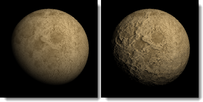
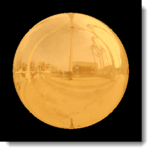
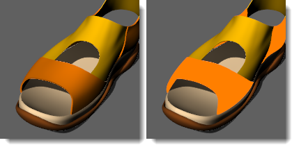

---
---

# Simple Material Properties
The Simple Material Properties dialog box give easy access to the properties you will usually want to change to make a material look different without changing the material style from, say Solid Color to Glass. For most materials, changing the color is all that is necessary to get a different look. You can change the advanced properties. These are pre-set by the material template to help you quickly achieve the appearance you want.{: #materialname}

## Solid Color
{: #solid-color}
Solid Color materials have only a [name](advanced-material-properties-main.html#name) and a [color](advanced-material-properties-main.html#color).

###
Properties available from the **Simple Material Properties** dialog box:

> [Name](advanced-material-properties-main.html#name)
> [Color](advanced-material-properties-main.html#color)

All other properties are set to a default (usually off or zero).

###  **Advanced**
Opens the [Advanced Material Properties](advanced-material-properties-main.html) dialog box.

## Metal
{: #metal}
Metal materials have a highlight whose color matches the [color](advanced-material-properties-main.html#color). You can control the [Sharpness](advanced-material-properties-main.html#sharpness) of this highlight from the **Simple Material Properties** control.

###
Properties available from the **Simple Material Properties** dialog box:

> [Name](advanced-material-properties-main.html#name)
> [Color](advanced-material-properties-main.html#color)
> [Sharpness](advanced-material-properties-main.html#sharpness)

Properties pre-set by the template:

> [Highlight color](advanced-material-properties-main.html#highlight-color) : The Highlight color matches the base color.
> [Intensity](advanced-material-properties-main.html#intensity)
> [Fresnel](advanced-material-properties-main.html#fresnel)
> [Type](advanced-material-properties-main.html#type)

###  **Advanced**
Opens the [Advanced Material Properties](advanced-material-properties-main.html) dialog box.

## Glass
{: #glass}
Glass materials have an [Index of Refraction](advanced-material-properties-transparency.html#index-of-refraction) (IOR) that you can adjust.

###
Properties available from the **Simple Material Properties** dialog box:

> [Name](advanced-material-properties-main.html#name)
> [Color](advanced-material-properties-main.html#color)
> [Index of Refraction](advanced-material-properties-transparency.html#index-of-refraction)

Properties pre-set by the template:

> [Highlight color](advanced-material-properties-main.html#highlight-color)
> [Intensity](advanced-material-properties-main.html#intensity)
> [Fresnel](advanced-material-properties-main.html#fresnel)
> [Sharpness](advanced-material-properties-main.html#sharpness)
> [Transparency](advanced-material-properties-transparency.html)

###  **Advanced**
Opens the [Advanced Material Properties](advanced-material-properties-main.html) dialog box.

## Plastic
{: #plastic}
Plastic materials have a white [highlight](advanced-material-properties-main.html#highlight-color) set by the template.

###
Properties available from the **Simple Material Properties** dialog box:

> [Name](advanced-material-properties-main.html#name)
> [Color](advanced-material-properties-main.html#color)

Properties pre-set by the template:

> [Highlight color](advanced-material-properties-main.html#highlight-color)
> [Intensity](advanced-material-properties-main.html#intensity)
> [Fresnel](advanced-material-properties-main.html#fresnel)
> [Sharpness](advanced-material-properties-main.html#sharpness)

###  **Advanced**
Opens the [Advanced Material Properties](advanced-material-properties-main.html) dialog box.

## ClearFinish
{: #clearfinish}
The ClearFinish material simulates car paint, porcelain, ceramics, varnished woods, or any material with a plastic or clear-coat layer. ClearFinish uses the [Fresnel](advanced-material-properties-main.html#fresnel) setting to change the material color based on angle to the view. These materials tend to be a deep color when looked at straight on, but as the surface curves away from the view, they become more and more reflective. Car paints with a clear-coat or clear lacquer finishes are good examples.

###
Properties available from the **Simple Material Properties** dialog box:

> [Name](advanced-material-properties-main.html#name)
> [Color](advanced-material-properties-main.html#color)

Properties pre-set by the template:

> [Highlight color](advanced-material-properties-main.html#highlight-color)
> [Intensity](advanced-material-properties-main.html#intensity)
> [Fresnel](advanced-material-properties-main.html#fresnel)
> [Sharpness](advanced-material-properties-main.html#sharpness)

###  **Advanced**
Opens the [Advanced Material Properties](advanced-material-properties-main.html) dialog box.

## Glossy
{: #glossy}
Glossy materials have a highlight with low Highlight [Intensity](advanced-material-properties-main.html#intensity) and [Sharpness](advanced-material-properties-main.html#sharpness) settings that you can control from **Simple Material Properties**.

###
Properties available from the **Simple Material Properties** dialog box:

> [Name](advanced-material-properties-main.html#name)
> [Color](advanced-material-properties-main.html#color)
> [Intensity](advanced-material-properties-main.html#intensity)
> [Highlight sharpness](advanced-material-properties-main.html#sharpness)

Properties pre-set by the template:

> [Fresnel](advanced-material-properties-main.html#fresnel)
> [Type](advanced-material-properties-main.html#type)

###  **Advanced**
Opens the [Advanced Material Properties](advanced-material-properties-main.html) dialog box.

## Textured
{: #textured}
Textured materials use images to create colored and patterned materials. The image name, resolution, tile size, and highlight intensity and sharpness are controlled from the **Simple Materials Properties** dialog box.

###
Properties available from the **Simple Material Properties** dialog box:

> [Name](advanced-material-properties-main.html#name)
> [Color](advanced-material-properties-main.html#color)
> [Tiles](texture-properties-main.html#tiles) : [Width/Height](texture-properties-main.html#width-height) and [Mirror tiles](texture-properties-main.html#mirror-tiles)
> [Linked status](texture-properties-main.html#linking)
> [Intensity](advanced-material-properties-main.html#intensity)
> [Sharpness](advanced-material-properties-main.html#sharpness)

###  **Advanced**
Opens the [Advanced Material Properties](advanced-material-properties-main.html) dialog box.

## Texture Set
{: #texture-set}
 [Texture set materials](texture-set-materials.html) support&#160;third-party texture maps that contain information such as displacement, normal, or bump maps. Displacement maps cause the material to have depth. The image names, tile size, and map properties are controlled from the **Simple Materials Properties** dialog box.

###
Properties available from the **Simple Material Properties** dialog:

> [Name](advanced-material-properties-main.html#name)
> [Color](advanced-material-properties-main.html#color)
> [Tiles](texture-properties-main.html#tiles) : [Width/Height](texture-properties-main.html#width-height)
> [Map Properties](texture-properties-main.html)

###  **Advanced**
Opens the [Advanced Material Properties](advanced-material-properties-main.html) dialog box.
&#160;

## Color
Sets the material's base (also called *diffuse* ) color.
The color used to [render](render.html) surfaces, polysurfaces, or polygon meshes.
The color option does not affect the select wireframe display. To change the color of the wireframe display, change the color of the object's [layer](layer.html) or set the color in [Object Properties](properties.html)

##### To change the color

>Click the color swatch to select a color from the [Select Color](select-color.html) dialog box.

>Click the menu arrow or [id="a2" style="position: relative;">right-click]() the swatch to open the context menu.

### Menu options

#### Color Picker
Opens the [Select Color](select-color.html) dialog box.

#### Eye Dropper
Allows picking the color from anywhere on the screen.

#### Copy
Copies the color in the color swatch.

#### Paste
Pastes the color from one color swatch to another.

>In the edit box, specify the percentage of strength the color.

## Gloss finish
Adjusts the highlight from matte to glossy.

##### To change the glossiness

>Move the slider to the right to increase the glossiness.

## To set the gloss color

>Select the gloss color using the color swatch.

 **Note:** Set the highlight color to match the base color for metallic materials. Set the gloss color to white for plastic materials.

## Reflectivity
Sets the material's reflectivity.

>Move the slider to the right to increase the reflectivity.
>Select the reflective color using the color swatch.

## Transparency
Adjusts the transparency of an object in the [rendered](render.html) image.

>Move the slider to the right to increase the transparency.
>Select the transparent color using the color swatch.

#### IOR (Index of Refraction)
Sets the level of transparency based on the index of refraction (IOR) scale.
Example IOR values are shown in the following table:

### Material

### IOR
Vacuum
1. Air
1. Ice
1. Water
1. Glass
1. Emerald
1. Ruby/Sapphire
1. Diamond
1. Textures
Textures (bitmap images or procedural textures) can be used for color, transparency, bump, and environment.
 **Note** : Images changed outside of Rhino in Photoshop or a similar program automatically update in the rendered view.
The following bitmap formats are supported:

>Windows Bitmap (.bmp)
>JPEG - JFIF Compliant (.jpg, .jpeg, .jpe)
>Portable Network Graphics (.png)
>Tagged Image File Format (.tif, .tiff)
>Truevision Targa (.tga)
>DDS files (.dds)
>HDRi files (.hdr, .hdri)
>OpenEXR files (.exr)

##### To specify an image

>Click in the **(empty - click to assign)** control.

The checkbox automatically becomes checked the first time you do this. You can clear the checkbox to turn off the assignment.

>Select an image file to use.
>In the edit box, specify the percentage of strength the image will use to affect the color, transparency, bump, or environment.

## Color
Specifies a texture to use as the material's color.

## Transparency
Sets a texture to use as the material's transparency.

## Bump
Sets a texture to use as the material's bump.
Defines the name of a bitmap file that will be mapped on the surface as a bumpmap when you render the scene.
A bitmap image makes a surface appear bumpy in a rendered image but does not modify the shape of the surface.

## Environment
Sets a texture to use as the material's environment. This will be mapped onto the surface as though it were being reflected.
 **Note** : The bitmap should be an *angular map* or *light probe* projection (spherical) image.&#160;Other image projections will produce the reflection effect, but it will be distorted and not produce the realistic environment reflection.

Advanced Settings

### Emission color
Adds a color to the shaded result. It does not take into account the lighting, so if the emission color is white, the object will always appear white. If the emission color is grey, all parts of the object will appear brighter than they would otherwise.
 *Orange material emission color black (left); emission color blue (right).*

### Ambient color
Adds a color to the unlit part of the object. This is used rarely to brighten up shadowed areas. The results are not normally useful.

### Enable diffuse lighting
If this setting is off, the object will render the diffuse color all over with no shadowing or shading. It is used for picture frames to ensure that the color of the texture remains constant over the surface.
 *Orange material diffuse lighting on (left); diffuse lighting off (right).*
Notes
Add notes to provide extra information. The notes are saved with the model and appear as tooltips in the Library, Material, Environment, and Texture panels when you mouse-over the thumbnails.
Blend Material Settings
The Blend material takes two materials and blends between them by the amount specified.

### Material 1 / Material 2
The two materials to mix.

### Mix amount
The value represents the percentage of Material 1.

Composite Material Settings
The Composite material is a more complex blending material capable of merging up to ten materials with different blending modes (Add, Subtract, Multiply). Each material can have a different mode and amount specified.

