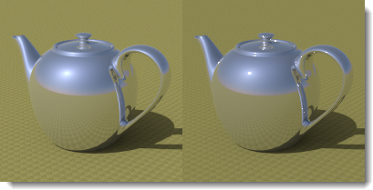
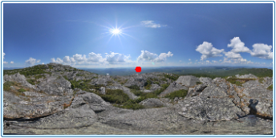

---
---

# {:height="75px" width="75px"} Sun and Sky
The [Sun](#sun) and [Sky](#sky) are closely related to each other. The Sun can change the brightness of the Sky in Auto mode. If the Sun is on and the Sky is an HDRI balancing their strengths is important.

## Sun
{: #sun}
The Sun is a powerful invisible parallel light. Factors simulating real-world conditions such as latitude and longitude, time of day, and season control the Sun's direction and brightness.

This help topic reviews the Flamingo Sun control.  The [Rhinoceros Sun](http://docs.mcneel.com/rhino/5/help/en-us/commands/sun.htm) control may also be used to place the sun.  Flamingo will keep the two sun controls in sync.

##### Where can I find Flamingo Sun control?

The Sun must be activated through the [Lighting Preset](lighting-tab.html#lighting-presets) or the [Custom Lighting settings](lighting-tab.html#sun).

* Toolbars >Flamingo nXt Toolbar
* Menus > Flamingo nXt 5.0 Pulldown > Show Control Panel > Flamingo nXt Tab > Sun

<!-- TODO: For tabs, I find Sky, Lights, Custom, and Render Options, but no Sun. I must be lost.  -->

Solar angles are required to perform sunlight calculations. There are two ways to specify the sun direction: by date, time, and place; and by direct angle. Use date, time, and place positioning to simulate the real sun in a study of your model's site. Direct sun angle controls the light angle without reference to a real sun. Use the direct sun angle to try lighting effects.

  
*Sydney, Australia, 21-June, 09:30 (on the left). Stockholm, Sweden, 21-June, 09:30 (on the right).*

### Set azimuth and altitude
{: #set-azimuth-and-altitude}
Use solar angles to manually set the sun's direction. Enables [Azimuth](#azimuth) and [Altitude](#altitude) controls.

#### Azimuth
{: #azimuth}
Sets the sun's direction in angle degrees from North (0) in the horizontal plane.  The circular map shows the world in a plan view.

#### Altitude
{: #altitude}
Sets the sun's height in the sky in angle degrees from the Equator (0).  The half circle map simulates a section through the vertical direction of the world coordinates.

### Set location on Earth
{: #set-location-on-earth}
Use the sun angle calculator to place the sun based on Date, Time, Location.  Note: As with all Sun calculators, the Sun position accuracy may vary. If absolute accuracy is required it is recommended to verify the sun location.  

#### Date
{: #date}
Specifies the date.

#### Time
{: #time}
Specifies the local time of day.

#### Daylight savings time
{: #daylight-savings-time}
Sets the time forward by one hour.

#### Latitude/Longitude
{: #latitude-longitude}
Enter a latitude and longitude or pick a location on the map.
The numbers will also update to display the latitude and longitude of a location picked on the map with the mouse cursor.

#### Time zone
{: #time-zone}
Displays the time zone based on Latitude and Longitude for the current location.

#### City list
{: #city-list}
Use this to select a major city to set the location.

#### Map
{: #map}
Click the map to specify a location. Drag with the left mouse button to pan the map.

### Sun intensity
{: #sun-intensity}
Modifies the brightness of the sun (direct) daylight component. The intensity of sun is automatically calculated based on solar angles and sky conditions, but can be modified to balance with other lights.

### Sun highlight
{: #sun-highlight}
The sharpness of the sun highlight.

*Sun highlight=0 (left) and 1 (right).*

Note : Solar highlight artifacts can sometimes be seen on exterior renderings when the Sun highlight setting is used. To mitigate or eliminate this artifact, set the Sun highlight to a smaller value.
{: #speckle-artifacts}



#### North Direction
{: #north}
Note : North is the World Y direction.

## Sky
{: #sky}
The Sky is a large sphere around the rendering that can be used for lighting. The Sky is very different from environment.  Sky controls lighting. Environment controls what is reflected and visible in the background. There are many situations where the Sky and Environment might be set differently.

#### Where can I find Flamingo Sky control?
The Sky must be activated through the [Lighting Preset](lighting-tab.html#lighting-presets) or the [Custom Lighting settings](lighting-tab.html#sky).

 1. Toolbars >Flamingo nXt Toolbar
 1. Menus > Flamingo nXt 5.0 Pulldown > Show Control Panel > Flamingo nXt Tab > Sky

The lighting preset schemes for [Exterior](lighting-tab.html#exterior-daylight) and [Interior](lighting-tab.html#interior-daylight) daylight use the Automatic sky by default. The [Studio](lighting-tab.html#studio-lighting) lighting preset scheme uses HDR image lighting by default.

Sky can be set five ways:

>[Off](lighting-tab.html#off)
>[Automatic Sky](#automatic-sky)
>[High Dynamic Range Image (HDRI)](#high-dynamic-range-image-sky)
>[Color](#color-sky)
>[Image](#image-sky)

The two best settings for sky lighting types are [HDR image](lighting-advanced-tab.html#hdri) sky and [Automatic sky](#automatic-sky). HDR image sky uses an image with lighting values stored on each pixel to provide light and reflection. Automatic sky uses a real-world sun location and cloudiness to simulate a sky.  These settings will produce the most dynamic renderings.
<!-- TODO: Bad links -->

### Automatic Sky
{: #automatic-sky}
Automatic sky uses settings from the [Sun tab](sun-and-sky-tabs.html) to specify the color range and intensity of the skylight.  For instance, when the sun is high in the sky, the lighting and colors of the sky are very different than when the sun is low in the sky.

*Automatic sky: sun high (left) and low (right) in the sky.*

#### Cloudiness
{: #sky-cloudiness}
When Cloudiness is turned off, the sky is considered clear and strong shadows are created. The greater the cloudiness, the less contrast there will be between the light and shadows. Greater cloudiness will create lighter shadows and a more even lighting effect. The Cloudiness setting affects many aspects of the daylight calculation, including the relative amounts of direct vs. indirect lighting, the way indirect lighting is calculated, and the background color if Automatic Sky mode has been selected. The Cloudiness setting varies from 0 (clear) to 1 (completely overcast). The cloudiness settings around 0.35 - 0.50 is a very sensitive and dynamic range.

*Cloudiness 0 (left) and 1 (right).*

#### Sky intensity
{: #sky-intensity}
Modifies the brightness of the sky (indirect) daylight component. The intensity of skylight is automatically calculated based on solar angles and sky conditions, but can be modified. Note: This setting only matters if there are other lights in the scene that have to be compensated for. If there are no other lights, the tone operator will compensate the exposure and the rendered image will not be brighter or dimmer based on this setting.



### High-Dynamic-Range Image Sky
{: #high-dynamic-range-image-sky}
A [high-dynamic-range (HDR or HDRI)](https://en.wikipedia.org/wiki/High-dynamic-range_imaging) image is a special 2-D image file. These images contain a much broader range of values at each pixel then standard image files, such as a .jpg or .png. This extra data can be used to light models. If the values contained in the HDR are accurate, then the lighting will be accurate. This can produce very dynamic lighting in a scene. The preset Studio Lighting scheme uses HDR images for the sky. If you are thinking of studio lighting as an indoor activity, think of the HDR image as a ceiling that emits light based on the colors in the image.

*HDRi lighting.*

It is assumed that HDR images contain radiance values expressed in watts units. If this is not the case, the intensity of these HDR images may need to be adjusted in order to achieve proper illumination levels.

In addition to the Sky, a different HDR image can be used for each of the three visible backgrounds: [Visible](environment-tab.html#advanced-background), [Reflected](environment-tab.html#advanced-background), and [Refracted](environment-tab.html#advanced-background) background.

#### HDRI Image
Specifies the HDR image file. Click on the image to select a different HDRI.

*Equarectangular projection.*

HDRI images come in two projection types which allow the image to properly wrap around the sky sphere. The most popular is equirectangular.  These images are rectangular with an aspect ratio of 2:1. Equirectangular images will have similar resolution over the whole image. The second projection is spherical. Spherical HDRI images are square in aspect ratio and the image will show great curvature. Spherical projections have less resolution at the seam.
<!-- TODO: HDRI or HDRi? -->

#### Intensity
Modifies the brightness of the HDR image light. This setting only matters if there are other lights in the scene that have to be compensated for. If there are no other lights, the tone operator will compensate the exposure and the rendered image will not be brighter or dimmer based on this setting.

*Low and high HDR intensity.*
<!-- TODO: Bad image here somewhere (hdri-spherical.png) -->

In the illustration, the image has been rotated so the reflection of the sun appears on the object. Enter rotation degrees or interactively move the rotation widget indicator.

*Image rotated so the sun appears on the object.*

#### Saturation
The color saturation for the light. Since the light from an HDR image is the color of the pixels in the image, this sometimes produces unwanted color effects. Set the saturation low if you want the light from the image, but not the color.

*Low (left) and high (right) saturation.*





### Color
{: #color-sky} 
It is possible to use a color or gradient of color to light the scene. The colors in the sky are multiplied by the intensity value to give the colors a lighting value.

#### Intensity
The Intensity value is used to multiply the colors in the Sky and result in a lighting value.  Colors can range from 0 - 256 per channel. Intensity will multiply those values.

#### Color type
There are three ways to control the color of the sky.  These are similar to the Color Environment controls.  See [Color Background](environment-tab.html#environment-color-and-gradient-backgrounds) controls for more information.

### Image
{: #image-sky}
It is possible to use an image to light the scene. The colors in the image are multiplied by the intensity value to give the colors a lighting value.

#### Intensity
The Intensity value is used to multiply the colors in the Sky and result in a lighting value.  Colors can range from 0 - 256 per channel. Intensity will multiply those values.

#### Image Projection
There are many ways to control how an image is mapped to the sky.  These are similar to the Image Background controls.  See [Image Background](environment-tab.html#environment-image) controls for more information.
