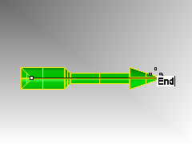

---
---

# Precision modeling
So far you have been drawing imprecise lines. Now you will try drawing lines at specific places. To do this you will use coordinates.
Whenever you draw a curve, or create a solid primitive, Rhino asks you for a series of points. You can tell that Rhino is asking for point input two ways: the command prompt has a prompt like Start of line, Start of polyline, Start of curve, or Next point and the arrow-shaped cursor turns into a cross-shapedcursor.
You can enter a point two ways: pick a point in a viewport with the mouse or type coordinates at the command line.
You will select the units and tolerance of the model before you begin. You can do this in the Options dialog under the Units page or by picking a template that has units and Tolerance already set.
You can change the tolerance after you start, but objects that are edited before the change still have the old tolerance value.

## Coordinate entry
Rhino uses a fixed Cartesian coordinate system called the world coordinate system (WCS), based on three axes (the x-, y-, and z-axes) that define locations in three-dimensional space.
Each viewport has a construction plane that defines coordinates for that viewport. We will work in the Top and Perspective viewports where the two coordinate systems are the same.

### Absolute coordinates
The first forms of coordinates you will use are called absolute coordinates. Absolute coordinates are exact locations relative to the x-, y-, and z-axes.

#### Exercise 9¾ Setting up a model

 1. From the **File** menu click **New**.
 1. Click **Small Object - Millimeters.3dm**, and then click **Open**.
 1. From the **File** menu click **Save As**. Name the model **BOXES** .Use the BOXES.3dm model to learn how to draw with absolute coordinates.

#### Exercise 10—Entering absolute coordinates

 1. Double-click the viewport title to maximize the Top viewport.
 1. From the **Curve** menu click **Polyline**, and then click **Polyline** .
 1. To **Start** type **0** and pressEnter.If you are going to start at the origin of the sheet (0,0,0) you can simply type 0 as a shortcut.
 1. For the **Next point** type **5,0** and pressEnter.
 1. For the **Next point** type **5,5** and pressEnter.
 1. For the **Next point** type **0,5** and pressEnter.
 1. Click **Close** to close the polyline.

### Relative coordinates
Absolute coordinates can be slow and cumbersome, but they do work. Most of the time, relative coordinates are easier to use.
Every time you select a point, Rhino saves that point as the last point.
Relative coordinates are based on the last point entered, instead of on the origin (0,0,0) of the construction plane.
Precede the x,y,z coordinates with a single R (upper or lower case) to enter relative coordinates. Use the @ symbol instead of an R to start relative coordinates if you prefer.

#### Exercise 11—Entering relative coordinates

 1. From the **Curve** menu click **Polyline**, and then click **Polyline**.
 1. To **Start** type **8,0** and pressEnter.These are absolute coordinates.
 1. For the **Next point** type **R5,5** and pressEnter.These are relative coordinates.
 1. For the **Next point** type **R-5,0** and pressEnter.
 1. Click **Close** to close the polyline.

### Polar coordinates
Polar coordinates specify a point that is a distance and direction away from 0,0 in the current construction plane.
Vector directions in Rhino start with Zero degrees at 3 o'clock on a standard clock. They change in an anti-clockwise direction as illustrated below.
For example, if you want a point four units away from the construction plane origin, at a 45° angle counterclockwise from the construction plane x-axis, type 4&lt;45, and pressEnter.
Relative polar coordinates are preceded by R or @; absolute polar coordinates are not.
Instead of using x, y, and z coordinates, enter relative polar coordinates like this: Rdistance&lt;angle.
&#160;

#### Exercise 12—Entering polar coordinates

 1. From the **Curve** menu click **Polyline**, and then click **Polyline**.
 1. To **Start** type **0,8** and pressEnter.
 1. For the **Next point** type **R5&lt;0** and pressEnter.
 1. For the **Next point** type **R5&lt;90** and pressEnter.
 1. For the **Next point** type **R5&lt;180** and pressEnter.
 1. Click **Close** to close the polyline.

## Distance and angle constraint entry
Using distance constraint entry, you can specify a point by typing a distance and pressingEnter. Then as you move your cursor in any direction, the distance from the last point will be constrained. This is a good way to specify a line length quickly.
Using angle constraint entry, you can specify an angle by typing &lt; followed by a value and pressingEnter. The next point is constrained to lines at multiples of the angle relative to the x-axis you specified.

##### Using theShiftkey to toggle Ortho on and off
When Ortho is off, hold theShiftkey down to toggle it on. This method is an efficient way to draw perpendicular lines. In the following example, draw a line five units long using distance constraints.

#### Exercise 13—Distance constraint entry

 1. From the **Curve** menu click **Polyline**, and then click **Polyline**.
 1. To **Start** type **8,8** and pressEnter.
 1. For the **Next point** type **5** and pressEnter.
 1. Hold theShiftkey down and pick a point to the right.Shifttoggles Ortho mode to constrain the marker to 0 degrees.
 1. For the **Next point** type **5** and pressEnter.
 1. Hold theShiftkey down and pick a point above the last point.Shifttoggles Ortho mode to constrain the cursor to 90 degrees.
 1. For the **Next point** type **5** and pressEnter.
 1. Hold theShiftkey down and pick a point to the left of the last point.Shifttoggles Ortho mode to constrain the cursor to 180 degrees.
 1. Click **Close** to close the polyline.

#### Exercise 14—Distance and angle constraint entry

 1. From the **Curve** menu click **Polyline**, and then click **Polyline**.
 1. To **Start** type **16,5** and pressEnter.
 1. For the **Next point** type **5** and pressEnter, then type **&lt;45** and pressEnter.As you drag your cursor around, the marker snaps to a distance of 5 and an angle of 45 degrees.
 1. Pick a point down and to the right of the previous point.The angle constraint sets the angle.
 1. For the **Next point** type **5** and pressEnter, then type **&lt;45** and pressEnter.
 1. Pick a point up and to the right.The angle constraint sets the angle.
 1. For the **Next point** type **5** and pressEnter, then type **&lt;45** and pressEnter.
 1. Pick a point up and to the left.The angle constraint sets the angle.
 1. Click **Close** to close the polyline.
 1.  **Save** your model. You will use this model for another exercise.

#### Exercise 15—Practice using distance and angle constraint entry

 1. Start a new model, use the **Small Objects - Millimeters.3dm** template. **Save as Arrow** .Since the object is symmetrical, you will only draw the lower half of the model.
 1. Draw the arrow with a polyline, using a combination of absolute coordinates (x,y), relative coordinates (Rx,y), polar coordinates (Rdistance&lt;angle), and distance constraint.
The following are examples of the command line input that you might use:

##### Absolute x,y

 1. From the **Curve** menu click **Polyline**, then click **Polyline**.
 1. For the **Start of Polyline** type **-11,0**.

##### Relative x,y

 1. For the **Next point**, type **r-2,-2**.

##### Distance constraint

 1. For the **Next point**, type **8** and pressEnter, turn Ortho on and then pick to the right.

##### Relative x,y

 1. For the **Next point**, type **r1,1**.

##### Relative polar

 1. For the **Next point**, type **r11&lt;0**.

##### Distance constraint

 1. For the **Next point**, type **1** and pressEnter, turn Ortho on and then pick down.
 1. For the **Next point**, type **r6,2**.
 1. For the **Next point**, pressEnterto end the command.
 1.  **Save** your model.

##### To make a copy of the polyline

 1. Select the polyline.
 1. From the **Transform** menu click **Copy** .
 1. For the **Point to copy from**, pick a point near the polyline.
 1. For the **Point to copy to**, type **6** and pressEnter, turn **Ortho** on and pick above the selected polyline.
 1. PressEnterto end the command.

##### To make a mirror image of the polyline

 1. Select the original polyline.
 1. From the **Transform** menu click **Mirror** .
 1. For the **Start of mirror** plane, type **0** and pressEnter.
 1. For the **End of mirror plane**, turn **Ortho** on and then pick to the right.

##### To make it 3&#8209;D

 1. Right-click on the **Perspective title** and set the display mode to **Shaded**.
 1. Select the original polyline and the mirror copy.
 1. From the **Solid** menu and click **Extrude Planar Curve**, click **Straight**.
 1. For the **Extrusion distance**, type **1** and pressEnter.

##### To make it 3&#8209;D (alternate)

 1. Select the copy of the polyline.
 1. On the **Status bar**, click **Osnap**.
 1. On the **Osnap** toolbar check **End**.
 1. From the **Surface** menu click **Revolve** .
 1. For the **Start of revolve axis**, select the end of the polyline.
 1. For the **End of revolve axis**, select the other end of the polyline along the center line.
 1. PressEnterto use the default **Start angle**.
 1. PressEnterto use the default **Revolution angle** .

##### To deform the shape

 1. Select the 3-D arrow.
 1. From the **Transform** menu click **Bend** .
 1. For the **Start of spine**, click the end point on the left end of the arrow.
 1. For the **End of Spine**, click the end point on the right end of arrow.&#160;
 1. For the **Point to bend through**, drag the cursor down and pick a point.

#### Exercise 16—Practice using distance and angle constraints

 1. Start a new model using the **Small Objects – Millimeters.3dm** template. Save as **V-Block**.
 1. Double-click the viewport title in the Front viewport to maximize it.
 1. Create the following model in the front construction plane.
 1. Draw the object below using a combination of absolute coordinates (x,y), relative coordinates (rx,y), and relative polar coordinates (rdistance&lt;angle).
 1. Start your model at 0 in the Front viewport.Try to create the model using a single polyline in a clockwise direction.
 1. Double-click the viewport title of the Front viewport to restore your views.
 1. Select the polyline.
 1. From the **Solid** menu click **Extrude Planar Curve**, and then click **Straight** .&#160;
 1. For the **Extrusion Distance** type **150**, and pressEnter.You can view the model as a three-dimensional object in the Perspective viewport.
 1.  **Save** your model.

## Object Snaps
Object Snaps (osnaps) are tools for specifying points on existing objects. Use object snaps for precision modeling and to get accurate data. Object snaps are often referred to as object snaps. In Rhino, reliable modeling and easy editing depends on objects actually meeting at specified points. Objects snaps give you precision you cannot get using the “eyeball” method

##### To open the Osnap toolbar

 1. Click the **Osnap** pane in the status bar.The display of the Osnap control is controlled with the Osnap pane in the Status bar.
 1. Click it to toggle the display on and off.The Osnap control turns persistent object snaps on and off.

Use persistent objects snaps to maintain an object snap through choosing several points without having to reactivate the object snap.
When an object snap is active, moving the cursor near an eligible point on an object causes the marker to jump to that point and a tooltip to appear.
Left-click a check box to turn on the object snap.
Right-click a check box to turn on the object snap and clear all other object snaps.
You can place the control anywhere on your desktop.
rces/TableStyles/CommandOptions.css');" cellspacing="0">CommandButtonDescriptionEndEnd snaps to the end of a curve, surface edge corner or polyline segment end.NearNear snaps to the nearest point on an existing curve or surface edge.PointPoint snaps to a control point or point object.MidMidpoint snaps to the midpoint of a curve or surface edge.CenCenter snaps to the center point of a curve. This works best with circles and arcs.IntIntersection snaps to the intersection of two curves.PerpPerpendicular To snaps to the point on a curve that makes a perpendicular to the last selected point. It doesn't work on the first point that a command prompts you to pick.TanTangent To snaps to the point on a curve that makes a tangent to the last selected point. It doesn't work on the first point that a command prompts you to pick.QuadQuad snaps to the quadrant point. The quadrant point is the maximum or minimum direction on a curve in the x or y construction plane direction.KnotKnot snaps to knot points on curves or surface edges.ProjectProjects the snap point to the construction plane.VertexMesh vertex is the location where the edges of the mesh faces meet.DisableTemporarily turns off persistent object snaps, retaining settings
