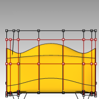
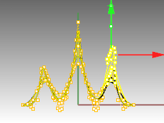
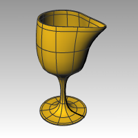

---
---

# Point editing
You can display the control points or the edit points of an object so that you can adjust the shape of an object, rather than manipulating the whole object at once. That is called control point editing.
You can use point editing on meshes, curves, and surfaces, but not on polysurfaces or solids.
Rhino’s curves are represented internally with non-uniform rational B-splines(NURBS). Three things determine the shape of a NURBS curve:

 1. A list of points called control points
 1. Degree
 1. A list of numbers called knots
If you change any of these things, it changes the shape of the curve.

### About control points, edit points, and knots

 1. Control points do not have to be on the curve.
 1. Edit points are always on the curve.
 1. Rhino lets you edit curves and surfaces by moving control points and edit points.
 1. Knots are parameters (that is, numbers, not points).
 1. Adding knots to a curve or surface lets you control the movement of the object during control-point editing.

#### Exercise 53—Control point editing
In this exercise we are going to experiment with moving control points. Understanding how curves and lines react when control points are moved is very important to understanding NURBS modeling.

##### To edit control points

 1.  **Open** the model **Control Point.3dm** .There are pairs of curves with different degrees in the model.
 1. Turn **Ortho** and **Grid Snap** on.
 1. From the **Edit** menu click **Select Objects**, and then click **Curves**.
 1. From the **Edit** menu click **Control Points**, and then click **Control Points On** F10.
 1. In the Front viewport select the middle row of points.
 1. Drag the points vertically, 8 units.Notice that the degree 1 curves (polylines) come to a point at each moved control point and the control points are exactly on the curve.The degree 3 and 5 curves are smooth. The degree 3 curves have more curvature than the degree&#160;5 curves&#160;Individual points have more influence on a small area of the curve with degree 3 curves, while points have greater influence over a wider span of the curve with degree 5 curves.

##### To check the differences

 1. Turn off the control points by pressing theF11key or use theEsckey.
 1. Turn the Plane layer on.
 1. Select the curves and the plane.
 1. From the **Curve** menu click **Curve** from objects, then click **Intersection** .Lines are shown on the surface showing the intersections.&#160;
 1. Note the difference between the degree 3 and 5 curves.The higher the degree, the greater the influence over the span of a curve, when you edit control points.As you can see by the illustration, editing one point out of 11, on the degree 5 curve, influenced most of the curve. The degree 3 curve has a sharper curvature, because the influence of one point takes place over a shorter span.
 1.  **Undo** twice, until you get back to seeing just the curves.The intersections will disappear, and the Plane layer is off.

##### To continue editing control points

 1. In the Front viewport select the two rows of points that are three points on either side of the center.
 1. Drag the points vertically, 5 units.
 1. Turn off the control points by pressing theF11key or use theEsckey.When a curve or polyline bends sharply at a point, like this, it is called a kink.If you create a surface from a curve that has a kink, it will have a seam at the kink.&#160;

##### To make a lofted surface

 1. Select the curves.
 1. From the **Surface** menu click **Loft**.
 1. In the **Loft options** dialog box, click **OK** .Because the degree 1 curves were included in the loft, a polysurface is created with a seam at each&#160;kink.
 1. Select the surface.
 1. Turn on the control points.The points do not turn on and the following message is displayed on the command line: Cannot turn on points for polysurfaces.
 1. Undo the loft.

##### To change the polylines into curves without kinks

 1. Select both polylines.
 1. From the **Edit** menu click **Rebuild** .
 1. In the **Rebuild** dialog box change the point count to **11** and the degree to **3**, and click **OK** .A degree 3 curve cannot have kinks. The curve smoothens and changes shape.&#160;

##### To loft a surface over the curves

 1. Select all of the curves.
 1. From the **Surface** menu click **Loft**.
 1. In the **Loft Options** dialog box, click **OK** .A single surface appears over the curves. The surface can be edited with control points.
 1. Select the surface.
 1. Turn on the control points.Note that there are more control points than what you started with. Rhino adds control points to make the surface conform the original curves.&#160;
&#160;

##### To rebuild a surface

 1. Turn off the control points.
 1. Select the surface.
 1. From the **Edit** menu click **Rebuild** .
 1. In the **Rebuild Surface** dialog, change the **point count** to **8** in **U** direction and **13** in the **V** direction. Change the **degree** to **3** for both **U** and **V**. Check **Delete input** .The surface is smoother with fewer control points.&#160;

### Nudge Controls
Another method to move control points and other geometry in a more subtle way is to use the Nudge keys. The nudge keys are the arrow keys on the keyboard activated with theAlt,Alt+Ctrl, andAlt+Shiftkeys.

##### To change the nudge settings

 1. From the **Tools** menu click **Options**.
 1. In the **Options dialog** box, on the **Modeling Aids** page, note the **Nudge** settings.Any of these values can be changed.

##### To use Nudge keys to move control points

 1. Select one or two control points in the Front viewport.
 1. Hold theAltkey down and press an Arrow key.The control points move(nudges)a small amount.
 1. Hold theAltand theCtrlkey down and press another Arrow key.The movement is much smaller.
 1. Hold theAltand theShiftkey down and press another Arrow key.The movement is magnified.&#160;
 1. Hold theAltand press thePage UporPage Downkey to nudge in the CPlanes Z direction.

##### To use Set X, Y, Z coordinates to adjust points

 1. Select all the points in one row along the top of the surface.
 1. From the **Transform** menu click **Set X, Y, Z coordinates** .
 1. In the **Set Points** dialog box, check **Set Z**, and uncheck **Set X** and **Set Y** .
 1. In the Right viewport move the points and click.The control points are aligned in the World Z direction.
 1. Repeat this on some of the other rows of points.&#160;

##### To use Gumball to move Control Points
You can use the Gumball to move, rotate and scale Control Points, in a very similar way as you were able to transform objects. Let’s look at moving the Control Points with the Gumball.

 1. Select the surface.
 1. From the **Edit** menu select **Control Points** and **Control Points On** F10.&#160;
 1. Turn on **Gumball** and select the points in one row along the top of the surface.
 1. In the Front viewport, pick to the upper left of the screen.
 1. Next, drag the cursor to the lower right and pick. A selection window will appear and select all the points within the window.The points along the top row are selected.&#160;
 1. In the Front viewport, pick the **green Gumball arrow**, drag up and pick. The points move up.
 1. In the Front viewport, pick the **red Gumball arrow**, drag to the right and pick. The points move to the right. PressEscto unselect points.&#160;
 1. In the Front viewport, pick the **green Gumball arrow**, drag down and pick.The points move in the top rows move down. **Note** : Use the Gumball for Control Point editing whenever possible in the next few exercises.&#160;
&#160;

#### Exercise 54—Practice with curves and control point editing

 1. Start a new model, use the **Small Objects - Millimeters.3dm** template. **Save as Glass**.
 1. Use the **Curve** command to create a half cross-section of the glass.
 1. Use control point editing to adjust the curve until you get the desired shape.

##### To make it 3&#8209;D

 1. Select the curve you created.
 1. From the **Surface** menu click **Revolve**.
 1. For the **Start of revolve axis**, pick one end of the curve.
 1. For the **End of revolve axis**, pick the other end of the curve.
 1. For the **Start Angle**, click **Deformable=Yes** .This changes the structure of the revolved surface to make it easier to deform without creating kinks.
 1. For the **Start Angle**, click **FullCircle**.
 1.  **Save** your model.
 1. Experiment with adjusting the control points to see what happens.
 1.  **Save** your model.

