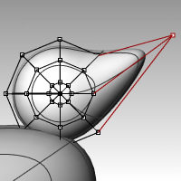
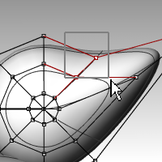
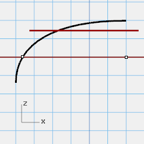

---
---

# Creating Deformable Shapes
When building models in Rhino, you should first determine which methods should be used for each part of the project. There are two basic ways to model in Rhino—free-form and accurate. Some models require more attention to exact dimensions because they might have to be manufactured or parts may have to fit together. Sometimes it is the shape of the object, not the accuracy that is important. These techniques can be merged together to create accurate, free-form shapes. This tutorial focuses only on the free-form, squishy aspect. The exact size and placement of the objects is not critical. The overall form is the main objective.

## The Rubber Ducky
This exercise shows:

 1. Simple surface creation
 1. Surface rebuilding
 1. Control point editing
 1. Curve creation (&#160;drawing, projecting&#160;)
 1. Splitting surfaces with curves and surfaces
 1. Blending between two surfaces
 1. Lighting and rendering
When you model the rubber ducky, you will use similar modeling techniques for the head and the body. You will create spheres that will be deformed to make the shapes.
If you need to know more about control points and surfaces, search the Rhino Help index for “control points.”

#### Exercise 55—Creating a rubber duck

 1. Start a new model use the **Small Objects - Millimeters.3dm** template.
 1. Save as **Duck**.
 1. You can use layers to separate your parts, but for this model, it is not necessary.For more information about layers, look up “layer” in the Rhino Help index.

### Create the body and head shapes
The body and head of the ducky are created by modifying two spheres. The size and placement of the spheres does not need to be exact.

##### To create the basic shapes

 1. From the **Solid** menu click **Sphere**, and then click **Center, Radius** .
 1. Pick a point in the Front viewport.
 1. Pick another point in the same viewport to create a sphere.
 1. Repeat this procedure for the second sphere.

##### To make the spheres deformable

 1. Select both spheres.
 1. From the **Edit** menu click **Rebuild** .
 1. In the **Rebuild Surface** dialog box, change the **Point Count** to **8** for both **U and V**.
 1. Change the **Degree** to **3** for both **U and V**.
 1. Check **Delete Input**, clear Current Layer, and click **OK** .&#160;The spheres are now deformable. Having more control points allows more control over smaller parts of the surface. A&#160;degree-three surface will have a smoother shape when deformed.

##### To modify the body shape

 1. Select the large sphere.
 1. From the **Edit** menu click **Control Points**, and then click **Control Points On** .
 1. In the Front viewport select the control points near the bottom of the sphere.To window select, drag a box left to right around the control points.
 1. From the **Transform** menu click **Set X, Y, Z coordinates** .
 1. In the **Set Points** dialog box check **Set Z**, and **Align to World** as illustrated above.
 1.  **Drag** the selected control points up, snap to one of the upper most selected points.This aligns all of the selected control points to the same world z-value (vertical in Front viewport), flattening the surface.&#160;&#160;

##### To scale the sphere shape

 1. Turn off control points and select the body shape.
 1. From the **Transform** menu click **Scale**, and then click **Scale1D** .
 1. For the **Origin point**, pick a point near the center of the body sphere.
 1. For the **First reference point**, with Ortho on, pick a point to the right in the Front viewport.
 1. For the **Second reference point**, pick a point further to the right in the Front viewport.The body is shaped like an ellipsoid.&#160;

##### To reshape the chest and tail

 1. Turn the control points on.
 1. Window select the control points at the top right of the body, and drag them to the right to bulge out the chest.&#160;
 1. Window select the control points at the upper left edge of the body, and drag them up to form the tail.Notice in the Top viewport that two control points are selected, though in the Front viewport, it looks like only one is selected. This is because the second control point is directly behind the one you can see in the Front viewport.&#160;

##### To add control for further shaping the tail
Before we start to edit the tail further, we will add an additional set of points to the tail portion of the body.

 1. From the **Edit** menu click **Control Points**, and then click **Insert Knot** .
 1. For the **Surface for knot insertion**, pick the body surface.A surface isocurve will be displayed. It will either be in the U or the V direction.
 1. Change the direction if necessary.
 1. For the **Point on surface to add knot**, pick a point midway between the tail and the center of the body.&#160;
 1. PressEnterto end the command.A new set of isocurves and a new row of points have been added to the body.
 1. Window select the control points at the upper part of the new isocurve, and drag them down to further form the tail and the body.
 1. You can adjust the control points further until you get the shape you want.&#160;
 1.  **Save** your model.

##### To create the head

 1. In the Front viewport select the small sphere.
 1. From the **Edit** menu click **Control Points**, and then click **Control Points On**.
 1. Select the control points on the right side and drag them to begin forming the bill.&#160;
 1. Window select the control points further back on the same isocurve and drag them forward to widen the bill.Remember to use a window to select the control points. There may be multiple control points in the same location in this view.
 1. &#160;&#160;
 1. Window select control points at the top of the bill and drag them down as shown.
 1. PressEscto turn control points off.&#160;&#160;

### Separate the bill from the head
For the final rendering, the bill must be a different color from the body. To do this, they must be separate surfaces. You can split a single surface into multiple surfaces many ways. The following technique is just one.

##### To split a surface with a curve

 1. In the Front viewport create a curve that looks like the illustration on the right.
 1. Select the head.
 1. From the **Edit** menu click **Split**.
 1. For the **Cutting object**, pick the curve you just created.
 1. PressEnter.The bill and head are now separate surfaces. This will allow you to render the surfaces with different colors.&#160;

### Create the duck’s neck
The ducky needs a neck. You will first make an edge on the surface of the head and a corresponding edge on the surface of the body so you can create a blended surface between the two edges.

##### To trim the head and the body

 1. Draw a Line across the bottom of the head.
 1.  **Copy** the line and adjust it so that it intersects the top of the body as illustrated on the right.It is important that the lines intersect the bottom of the head and the body completely.
 1. Select the lines.
 1. From the **Edit** menu click **Trim** .&#160;
 1. For the **Object to trim**, pick the bottom of the head and the top of the body.The bottom of the head and the top of the body is trimmed.
 1.  **Save** your model.&#160;&#160;

##### To create the blend surface between the head and body

 1. From the **Surface** menu click **Blend Surface** .
 1. For the **Segment for first edge**, pick the edge curve at the bottom of the head.
 1. If the whole edge is not selected, click **All** on the command line.
 1. PressEnterto go to the next stage of the command.
 1. For the **Segment for second edge**, pick the edge curve at the top of the hole in the body.
 1. If the whole edge is not selected, click **All** on the command line.
 1. PressEnterto go to the next stage of the command.
 1. In the **Adjust Surface Blend** dialog box, check the **Preview** box.The blend surface between the body and the head is displayed.
 1. Make any adjustments you desire by moving the slider bars in the dialog box, click **OK** when finished.If you click the lock icon at the left of the sliders the surface adjustments are symmetrical.
 1.  **Save** your model.

##### To join the parts

 1. Select the body the blend surface and the back of the head.
 1. From the **Edit** menu click **Join** .The three surfaces are joined into one. The bill is left separate for rendering purposes.

##### To make an eye
For this part of the exercise we will make a curve and revolve it to get the surfaces for the eye.

 1. Toggle Ortho and Grid Snap on to help.
 1. From the **Curve** menu click **Conic**.
 1. In the Front or Right viewport make a conic curve as illustrated.Start of Conic (1), End of Conic (2), Apex (3), Curvature point.
 1. Use **SmartTrack**, with **Point**, **End** and **Int** object snaps on, to help place the two points as illustrated.These points will be used for placement of the eye on the head.
 1. From the **Curve** menu click **Point Object**, then click **Multiple Points**.
 1. For the **Location of point object**, hover over the end of the conic until the point activates, drag you cursor down and click to place the point.The point should be placed above the lower end of the conic.This will be the insertion point for eye.&#160;
 1. For the **Location of point object**, hover over the point you just made until the point activates, drag you cursor left and click when you reach the intersection point.This point is for scaling and rotating the eye.

##### To split the curve

 1. Draw a line that intersects the conic
 1. Select the conic curve,
 1. From the **Edit** menu click **Split**.
 1. For the **Cutting** object, select the **line** .Splitting the curve allows you to assign a different color and material properties for the eye and the pupil.This step can be done at this stage or after you make the surface.&#160;

##### To make the surface

 1. Select both parts of the conic curve.
 1. From the **Surface** menu click **Revolve**.
 1. For the **Start of revolve axis**, snap to the point.
 1. For the **End of revolve axis**, snap to the end of the conic.
 1. For the **Start Angle**, click **FullCircle** .&#160;

##### To assign display color and material color

 1. Select the top of the eye.
 1. From the **Edit** menu click **Object Properties** .
 1. For the **Display color**, choose a contrasting color, like red.
 1. With surface still selected, in the **Properties** pane, select the **Material** page button
 1. In **Assign Materials by** select **Object**.
 1. With **Default Material** selected, type the name of the new material to be used for the pupil of the eye, like **Black**.
 1. In the **Basic Settings**, select the **Color swatch**. The **Select Color** dialog appears. Pick **Black** and **Ok** .Also set the **Gloss finish** to **50%**.
 1. Repeat these steps create a white material for the eye.&#160;
 1. From the **Render** menu, click **Render Preview** to see the material color.

##### To place the eye on the head

 1. In the Top viewport select both parts of the eye.
 1. From the **Edit** menu click **Groups** and then click **Group** .The eye parts are grouped as one object.
 1. Select the group.
 1. From the **Transform** menu click **Orient**, then click **On Surface**.
 1. For **Base point**, snap to the point at the center of the eye.
 1. For **Reference point for scaling and rotation**, snap to the point at the edge of the eye.
 1. For **Surface to Orient** on, pick the head.&#160;
 1. In the **Orient on Surface** dialog, for **Scale** check **Prompt** and **Rigid**, click **OK**.
 1. For the **Point of surface to orient to**, pick a point on the head.
 1. For the **Scale factor**, drag your mouse and pick to scale the eye.
 1.  **Mirror** the eye to the other side of the head.&#160;

### Render a picture of the ducky
Rendering creates a realistic picture of your model with colors you assign. These render colors are different from the layer colors you might be using, which control the display in wireframe and shaded mode.

##### To render the ducky

 1. Select the beak.
 1. From the **Edit** menu click **Object Properties**.
 1. In the **Properties** panel, on the **Material** page, click **Basic** and click the **color swatch .** 
 1. In the **Select Color** dialog box, select a color for the beak, like orange.
 1. Select the body.
 1. From the **Edit** menu click **Object Properties**.
 1. In the **Properties** panel, on the **Material** page, check **Basic** and select a color for the body, like yellow.
 1. From the **Render** menu click **Render** .
&#160;

##### To place lights

 1. From the **Render** menu click **Create Spotlight** .
 1. Select a point in the middle of the model.&#160;
 1.  **Drag** the radius until it is approximately three times as large as the model.
 1. Pick a point in the Top viewport while holding theCtrlkey down to activate elevator mode.In the Front viewport pick a point slightly above the object.
 1. From the **Render** menu click **Render** .&#160;

