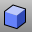
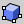
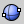
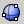
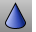
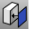
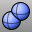
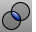

---
---

# Modeling with Solids
Several commands that enable you create and edit solid objects.
Solids in Rhino are closed surfaces or polysurfaces that enclose a volume. Some of the solid primitives are closed single-surfaces carefully edge-matched, others are polysurfaces.
Rhino’s polysurface objects are deformable by using the UDT (Uniform Deformation Technology) tools. You can also extract surfaces and deform the surfaces with control point editing like the last exercise.
In this part of the class we will focus on making some solids, separating the parts, making changes and then joining the parts back together to make a solid.
eft: 0;margin-right: auto;mc-table-style: url('../Resources/TableStyles/CommandOptions.css');" cellspacing="0">ButtonCommandDescriptionBoxDraw a rectangular box from two diagonal corners and a height.Box 3PointDraw a box from two adjacent corners, a point on the edge across from them, and a height.SphereDraw a sphere from a center point and a radius.Sphere 2PointDraw a sphere from the two ends of a diameter.Sphere 3PointDraw a sphere from three points on its surface.CylinderDraw a solid cylinder from a center point, a radius, and a height.TubeDraw a solid tube from a center point, two radii, and a height.ConeDraw a solid cone from a base point, a base radius, and a height.TConeDraw a truncated cone that ends in a circular plane from a base point, two radii, and a height.EllipsoidDraw an ellipsoid from a center point, and three axis endpoints.TorusDraw a solid Torus from a center point, a radius for the center of the tube, and a tube radius.PipeDraw a pipe around an existing curve. The pipe has a circular cross-section and optional caps at the ends.TextObjectDraw text as outline curves, surfaces, or solids.ExtrudeCrvDraw a solid by extruding a closed planar curve vertically.ExtrudeSrfCreates a solid by extruding a surface vertically.CapCreates planar surfaces to close planar holes in a surface or partial solid.BooleanUnionBoolean operation in Rhino to combine solids.BooleanDifferenceBoolean operation in Rhino to subtract surfaces and solids from one another.BooleanIntersectionBoolean operation in Rhino to create the intersection of two surfaces or solids.
