---
---

# Creating surfaces
A Rhino surface is similar to a piece of stretchy fabric. It can take on many different shapes.
Surfaces are bounded by curves called edges. To visualize the surface shape Rhino displays a grid of isoparametric curves (isocurves) on the surface.
Surfaces have an area, their shape can be changed by moving control points, and they can be meshed.
eft: 0;margin-right: auto;mc-table-style: url('../Resources/TableStyles/CommandOptions.css');" cellspacing="0">ButtonCommandDescription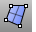SrfPtCreates a surface by picking three or four points in space for corners.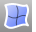EdgeSrfCreates a surface by selecting two, three, or four existing curves whose ends meet exactly.PlanarSrfCreates a surface from planar curves that enclose an area.PatchCreates a surface that approximates a set of curves and/or point objects.RevolveRevolves a curve around an axis to create a surface.LoftCreates a surface from shape curves; the normal, loose, and tight options make a surface with no creases as it passes over the shape curves.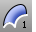Sweep1Creates a surface from shape curves that follow along a rail curve that defines one edge of the surface.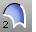Sweep2Creates a surface from shape curves that follow along two rail curves that define two edges of the surface.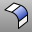FilletSrfCreates a fillet or round between two surfaces.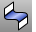BlendSrfMakes a smooth surface between two existing surfacesRailRevolveRevolves a shape curve holding one end along a rail curve. This command is very useful for putting a smooth end cap on an irregularly shaped surface.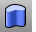ExtrudeCrvExtrudes a curve perpendicular to the construction plane with option to taper the surface with a draft angle.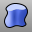ExtrudeCrvAlongCurveExtrudes a curve following along a second curve.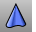ExtrudeCrvToPointExtrudes a curve to a point.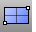PlaneCreates a rectangular planar surface parallel to the construction plane from two diagonal points.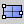Plane 3PointCreates a rectangular planar surface from 3 points.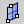Plane VerticalCreates a rectangular planar surface from 3 points that is vertical to the construction plane.
