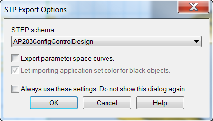

---
---

# Importing and exporting
Rhino supports many different import and export formats, making it possible to model in Rhino and then export your model to downstream processes, or import models from other software applications into Rhino. For a complete list of import and export file types refer to the Rhino Help > Contents > File I/O > File Formats.

## Exporting Rhino File Information
When you export to a format like 3DS, STL or DWG, Rhino has to convert from smooth NURBS surfaces to a polygon mesh representation made of triangles. To do a good approximation of the curved surfaces, Rhino can sometimes use many polygons. The density of triangles can be adjusted when exporting. You can create a mesh object and export it, or Rhino can create the mesh during the export process.
There are two methods to export models to other formats. You can use the **Save As** command to choose a specific export format to export an entire model. Or, you can select some objects and use the **Export Selected** command to choose a specific export format to export a portion of the model. In the following exercise you will use the **Save As** method to export three of the most common file formats.

## Importing other file formats into Rhino
We will not be importing any models in this class. Importing files from other applications is covered in our Level 2 Training course. If you have any specific questions about importing models into Rhino, consult your instructor.

#### Exercise 68—Exporting models

##### To export a model to a mesh format

 1. Open the model **Export.3dm**.
 1. From the **File** menu click **Save As**.
 1. In the **Save** dialog box, change the **Save as type** to **Stereo lithography (*.stl)**.
 1. In the file name box type **Export** and click **Save** .
 1. In the **STL Mesh Export Options** dialog box, set the **Tolerance** to **0.01**, and click **Preview**.
 1. Set the **Tolerance** to **0.1**, click **Preview**, and then click **OK**.
 1. In the **STL Export Options** dialog box, select **Binary**, check **Export open objects**, and click **OK** .Detailed mesh controls are discussed in more depth in the Level 2 training class.

##### To export a model to IGES

 1. From the **File** menu click **Save As**.
 1. In the **Save** dialog box, change the **Save as type** to **IGES** (*.igs).
 1. In the **IGES Export Options** dialog box, select **Pro E Windows solids** as the **IGES type**, click **Detailed Controls** .Detailed controls allow the user more input.
 1. Click **Cancel** to terminate, or **OK** to create the IGES file.

##### To export a model to STEP

 1. From the **File** menu click **Save As**.
 1. In the **Save** dialog box, change the **Save as type** to **STEP (*.stp, *.step)**.
 1. In the **STEP Options** dialog box, use the default setting.

