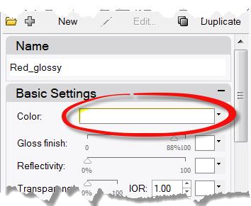
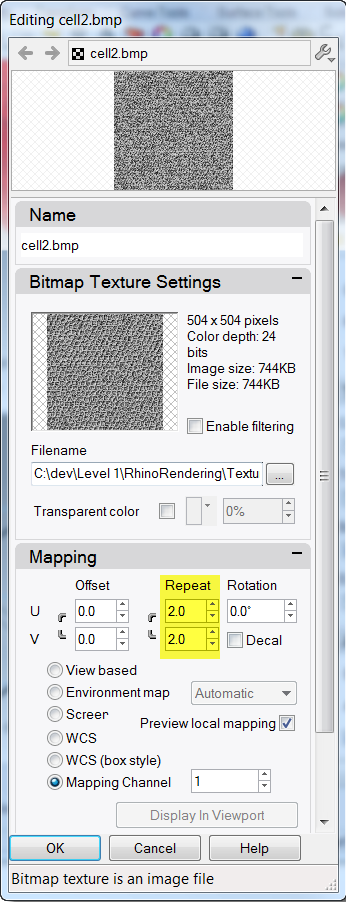
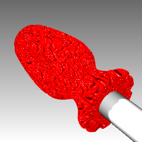
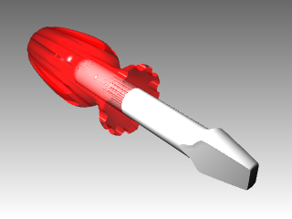

---
---

# Rendering
Rendering is available for showing your model as if it was photographed or sketched. If you render to look like a photo, this is called photorealistic rendering. Flamingo nXt is an example of a photorealistic render plug-in for Rhino. If you render to look hand sketched, this is called non-photorealistic. Penguin is an example of this type of render.
Both types of renderers are available as plug-ins for Rhino. The built-in Rhino renderer may be good enough for much of your work. If not, use another rendering program such as Flamingo nXt, V-Ray, Maxwell, Brazil or other plug-ins for higher quality results. Plug-ins for Rhino are listed on the Resources page of the Rhino web site.

## Apply materials
Rhino’s built-in renderer uses materials with color, gloss and transparency settings, spotlights, displays shadows, and does anti-aliasing. It also allows the attachment of textures and bump maps. In this exercise we will focus on the full rendering capability.

#### Exercise 69—Practice rendering a model

 1. Open the model **Render.3dm** .
 1. From the **Render** menu click **Current Renderer**, and then click **Rhino Render** .&#160;
 1. Right-click on the Perspective title bar, and then click **Rendered** display.The viewport mimics but does not exactly duplicate what you will get in a Render.

##### To assign a material to the handle by object
To render the handle in color, we will first assign a red glossy material to the handle object. This material assigned to the object will override any material that might be assigned to the layer of the object.

 1. Select the handle.
 1. In the **Properties** panel, click the **Material** button.
 1. On the **Material** page box, at **Assigned material by**, choose **Object**.
 1. From the **Material** page, in the name field type **Red_glossy** .
 1. Next click the **Color** swatch.
 1. In the **Select Color** dialog box, select a color, like **Red**, and click **OK** .To give the handle a highlight, change the Gloss finish setting.
 1. Change the **Gloss finish setting** slider to value between **80** and **90** .A gloss finish of 0 means that the object is not shiny at all and it will not have a specular highlight. A low value of gloss finish makes the shiny spot to be small, and the object will look glossier. As the gloss finish increases in value, the shiny spot gets larger—this makes the object look more like it is made out of a reflective material.The shiny spot only appears when you are looking at an object at a certain angle relative to the angle of the light.
 1. From the **Render** menu click **Render** .A display window appears with the current viewport rendered in colors, but it will probably lack detail. You can close the Display Window without disturbing your model. Placing lights will add depth and detail to the rendered image.

##### To assign a material to the blade by layer
To render the blade in color, we will next assign a yellow glossy material to the blade layer. All the objects on the blade layer that do not have an object material override, are rendered in the material. That is an advantage of rendering with material set to by layer. Changing the layer’s material will result in all the objects on that layer updating.

 1. Select the blade.
 1. Right-click on the **Properties** panel.
 1. From the right-click menu choose **Layers** .
 1. In the **Layers** panel, click the **Material** icon.
 1. In the **Layer Material** dialog, type the name **Yellow_glossy** .
 1. Under **Basic Settings**, click the **Color** swatch.
 1. In the **Select Color** dialog box, select a color, for example, **Yellow**, and click **OK** .
 1. Change the **Gloss finish** slider to value between **80** and **90** .
 1. From the **Render** menu, click **Render** .

##### To add a new material to a layer

 1. In the **Layers** panel, click the **Material** icon.
 1. In the **Layer Material** dialog, click the down arrow next to the **Yellow_Glossy** material.
 1. When the list of materials appears, click **Default** material.It’s best to use the Default material when making new materials.
 1. In the **Name** box type **White_glossy**, and change the **Gloss finish** slider to value between **80** and **90** .
 1.  **Render** the model.
 1. The next time you click the down arrow for a material listed in the **Layer Material** dialog, you will see a list of the Default material and the three materials you just created.You can switch between the any of the materials in the model or make a new one at any time. This works whether you are assigning the material by layer or object.

## Add lights
Start with a standard lighting scheme. You can experiment to develop your own lighting schemes later.

##### To place a light

 1. Zoom out in the Top and the Front viewport.
 1. Change to the Lights layer.
 1. From the **Render** menu click **Create Spotlight** .
 1. For the **Base of cone**, type **0** and pressEnter.
 1. For the **Radius**, pick a point so that the circle is larger than the entire screwdriver in the Top viewport.
 1. For the **End of cone**, hold down theCtrlkey, and pick a point below and to the right in the Top viewport.This starts elevator mode.
 1. For the **End of cone**, pick a point above the object in the Front viewport.This will be your main light.
 1. Click in the Perspective viewport.
 1. From the **Render** menu click **Render** .The image has some highlights and shadows.&#160;

##### To place a second light

 1. Zoom out in the Top and the Front viewport.
 1. From the **Render** menu click **Create Spotlight**.
 1. For the **Base of cone**, type **0** and pressEnter.
 1. For the **Radius**, pick a point so that the circle is larger than the handle of the screwdriver in the Top viewport.
 1. For the **End of cone**, hold down theCtrlkey, and pick a point below and to the left in the Top viewport.This starts elevator mode.
 1. For the **End of cone**, pick a point above the object in the Front viewport.This will be your secondary (fill) light.
 1. Click in the Perspective viewport.
 1. From the **Render** menu click **Render** .

##### To assign properties to the light

 1. Select the new light.
 1. In the **Properties** panel,, click the **Light** page.
 1. On the **Light** page, change the **Shadow intensity** to **0** and the Spotlight hardness to **60** .Experiment with these settings to get the desired effect.
 1. Click in the Perspective viewport.
 1. From the **Render** menu click **Render** .

## Add textures

##### To add a bumpy surface to the handle

 1. Select the handle.
 1. In the **Properties** panel, click the **Material** button.
 1. In the **Material Editor** page, under **Bump**, click **(empty-click to assign)**.
 1. In the **Open** dialog box, select **cell2.bmp**, and then click **Open**. **Note:** You can use any bitmap file for a bump. The bumps come from the pattern of light and dark in the bitmap image.
 1. In the **Material Editor** dialog box, under **Bump**, click **cell2.bmp**.
 1. In the **Mapping** area, change the **U Repeat** to **2 .0** and the **V Repeat** to **2 .0**, click **OK** .
 1. The Rendered display will update to display the bump.The surface of the handle has a bumpy appearance, however the color of the material and gloss setting is still used.
 1. From the **Render** menu click **Render**.
 1. From the **File** menu in the **Render** dialog, click **Save As** .
 1. Under **Save as type**, click **PNG**. Type your file name and location.
 1. Click **Save** button.

##### To add a texture to the handle

 1. Select the handle.
 1. In the **Properties** panel, click the **Material** button.
 1. In the **Textures** area, clear the **Bump** check box.
 1. In the **Textures** area, for **Color** click **(empty click to assign )** .Cleart Bump and click to assign Color texture.
 1. In the **Open Bitmap** dialog box, select **Wood.jpg**, and then click **Open** .Wood color texture is mapped to handle.
 1. Click **Wood** to open the **Editing Wood** dialog.
 1. In **Mapping** area, set the **U Repeat** to **4** and the **V Repeat** to **6**.
 1. Click **OK** to close the **Editing Wood** dialog.
 1. From the **Render** menu click **Render** or use a Rendered viewport.The surface of the handle has a wood texture appearance tiled at 4 times in the U and 6 times in the V.

##### To make the wood handle transparent

 1. Highlight the handle. In the **Properties** panel, click the **Material** button.
 1. In the **Basic Settings** area of the **Material Editor** dialog box, change the **Transparency** slider to **30** .
 1. Click back into the graphics area.
 1. From the **Render** menu click **Render** .The handle will look transparent with the Wood texture.

##### To make the red handle transparent

 1. Highlight the handle. In the **Properties** panel, click the **Material** button.
 1. In the **Basic Settings** area of the **Material Editor** dialog box, change the **Transparency** slider to **3 0** and uncheck the **Color** texture.
 1. Click back into the graphics area.
 1. From the **Render** menu click **Render** .The handle will look transparent with the red glossy material.

## Use a groundplane
The Rhino Render has a ground plane option. The ground plane provides an infinite horizontal platform for the image that stretches to the horizon in all directions positioned at a defined elevation. A ground plane renders much faster than using a surface as a background. Any material can be assigned to the ground plane.

##### Adding a ground plane

 1. Right-click Properties panel tab.
 1. Click the **Ground Plane** panel.
 1. In **Ground Plane** panel check the **On** box.The viewport will display a ground plane. Assign a material.
 1. In the **Material** area assign the existing **yellow_glossy**, a material created earlier in this exercise.Viewport will now show a yellow glossy ground plane.
 1. From the **Render** menu click **Render** .
 1. In **Ground Plane** panel, click the down arrow next to the Yellow_Glossy material.
 1. When the list of materials appears, click **Default** material.A new default material will be added.
 1. In the **Material Editor** dialog in the **Name** area type **Wood_table**.
 1. In the **Textures** area, check **Color** texture.
 1. In the **Open Bitmap** dialog box, select **Wood.jpg**, and then click **Open**.
 1. In the **Texture mapping** area, type **X** size **100** and **Y** size **75** .
 1. From the **Render** menu click **Render**.
 1. From the **File** menu in the **Render** dialog, click **Save As**.
 1. Under **Save as type**, click **PNG**. enter your file name and location.
 1. Click **Save** button.The viewport will now show and render a wood ground plane.

