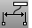

---
---

# Annotating your model
Rhino can also produce 2&#8209;D drawings of your models. Rhino has these annotation objects:

 1. Dimensions
 1. Annotation Text
 1. Leaders
 1. Dots
 1. Hatching

## Dimensions
You can create dimensions on all viewports. They will be created parallel to the current viewport’s CPlanes. Dimension commands are combined with object snaps to give precise values. There are many different types of dimensions that are used to annotate a model. We will look at linear, radial, diameter, and angular. 2-D annotation text, Leaders, and Dots will also be covered.
The dimension style controls the way a dimension displays. For example the dimension text location can be above the dimension line or in the dimension line. The end of a dimension line can display an arrow, a tick, or a dot. The dimension text can show decimal, fractional, or feet and inches numbers. A new model will open with Default as the dimension style.
You can make additional dimension styles, assign existing dimensions to a different style, or update a style to make all the dimensions assigned to that style update. You can also import a dimension style from another model. Or add the dimension style to a template so new models always have it.
Let’s look at the dimension types:

### Dimension types

### Dimension tools
eft: 0;margin-right: auto;mc-table-style: url('../Resources/TableStyles/CommandOptions.css');" cellspacing="0">ButtonCommandDescriptionDimLinear Dimension creates a horizontal or a vertical dimension.DimAlignedCreates an aligned dimension.DimRotatedCreates a rotated dimension.DimAngleCreates an angular dimension.DimRadiusCreates a radius dimension.DimDiameterCreates a diameter dimension.TextCreates 2&#8209;D annotation text.LeaderDraw an arrow leader.PropertiesEdit dimensions and text.DimRecenterTextReturns text that has been moved away from its default position to its original location.Make2DCreates curves from the selected objects as silhouettes relative to the active construction plane. The silhouette curves are projected flat and then placed on the world x,y-plane.
