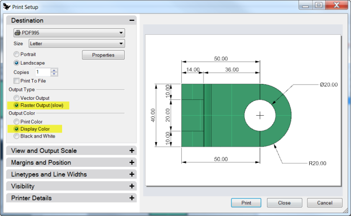
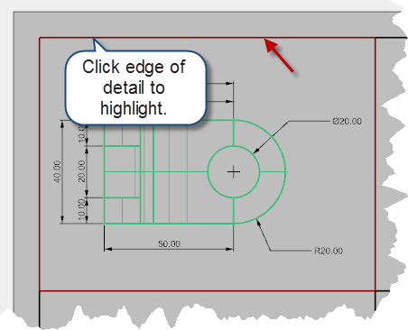
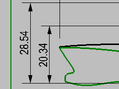

---
---

# Printing and Layouts

## Printing
The Rhino Print command will let you print one viewport at a time.

#### Exercise 72—Printing the model

 1. Open the model **Dimension.3dm**.
 1. Make the Top viewport active.
 1. On the **File** menu, click **Print**.
 1. In the **Print Setup** panel, under **Destination**, select a printer, **Letter** paper, **Landscape** orientation, **Raster Output**, and **Display Color** .
 1. Under **View and Output Scale**, select **Scale** of **2:1**, **On Paper 1.0 Millimeter**, and **In Model 0.5 Millimeter** .Rhino will print .5 mm of the model in every 1 mm on the printed sheet.

## Layouts
Rhino has a Layout feature that will print multiple details of the model on one sheet. The details can have different scales, sizes, layer color, layer visibility, and object visibility. In addition, you can add multiple layouts to a model.

##### To add a layout

 1. On the **View** menu, click **Layout** and **New Layout** .Or click theon the **Viewport Tabs** bar, located below the Rhino graphics area.The layout name is **Page 1**, by default. The sheet size is offered is the units of the model.However, selecting a different unit system will let you specify the sheet in more familiar units, without changing the layout units.
 1. In the **New Layout** dialog box, set **Width** to **11**, select **Inches**, and set **Height** to **8.5**.
 1. Set the **Initial Detail Count** to **4** .
 1.  **Double-click** to activate the **Perspective** detail.
 1. On the **View** menu, click the **Shaded** display mode.

##### To configure the perspective detail
To suppress the display of geometry in any detail, hide the object in the detail or turn off the layer in the details. Objects are hidden in the details with the **HideObjectInDetails** command and made visible with the **ShowObjectsInDetail** command
In addition, the Layers panel allows a layer to be turned off only in the detail, but remain visible in other details or viewports.

 1.  **Double-click** to activate **Perspective** detail.
 1. In the **Layers** panel, scroll to the right or undock the panel and stretch it horizontally.
 1. Highlight the **Dimension** layer, and click the light bulb icon in the **Detail On** column.All the objects on the layer that was turned off in the Detail On column are not visible in the Perspective viewport but remain visible in all other details.
 1.  **Double-click** the **Perspective** detail to de-activate. Highlight the boundary edge of the detail.
 1. In **Object Properties** set the **Print Width** to **No Print** .The edge of the detail will not print unless you assign a width.

##### To assign a scale to details
Details that are parallel can get a scale assigned to them. The scale will tell Rhino how many model units are in each paper unit. By assigning the scale to the detail, the layout can be plotted 1=1. Also by assigning the scale to the detail, details can have different scales.

 1. Select the Top detail. Do not double-click to activate.
 1. In the **Properties** panel, click the **Detail** page.
 1. In the **Scale** area, set **1.0mm** on layout equal to **1mm** in model.The scale is now set to 1=1.If you set 1mm in the layout equal to 2mm in the model detail, it is half size or 1=2.If you set 1mm in the layout equal to 10mm in the model detail, the scale is 1=10.
 1. Make detail active by double clicking it and pan geometry to center in viewport. Deactivate detail by double clicking.
 1. Select detail and in the **Properties** panel, click the **Detail** page and then click **Locked** .Details that are locked prevent zooming or panning, making it easy to keep them from changing scale.
 1. Repeat this procedure for the Front and Right details.

##### To label details

 1. Make a new layer called **Notes**.
 1. Make the **Notes** layer **Red** and current.
 1. Turn Ortho off and deactivate any details.You should be on the layout and not in an active detail.
 1. From the **Dimension** menu click **Text Block**.
 1. Pick a **Start point**, below the Top view of the part.
 1. In the **Text** dialog set the **Height** to **7mm** and type **Top View** .
 1. Repeat to add labels for Front View and Right View.

##### To add a border

 1. From the **Curve** menu click **Rectangle**, **Corner to Corner**.
 1. Snap to the lower left corner of the Front detail boundary and the upper right corner of the Perspective viewport boundary.
 1. Select the border.
 1. In the **Properties** panel, on the **Object** page, click **Print Width**, and then click **0.70mm** .
 1. Right-click on the **Layout Title (Page 1)**, and then click **Print Preview** .The layout has a thick border around the detailed viewports.You can also add a title block at this stage if you choose.

##### To print the layout

 1. From the **File** menu, click **Print**.
 1. Select a physical printer or a virtual printer like **PDF995**.
 1. Select sheet **size** as **letter** or **11x81/2** landscape.
 1. In the **View** and **Output Scale** area, set the scale to **1=1** .
 1. Toggle Output color between **Black &amp; White** and **Display Color**.
 1. Click **Print** to print; **Cancel** if no printer is available.
 1.  **Save** the file.

#### Exercise 73—Scaling and locking details on a layout.

 1. Open the model **SimpleLayout_Print.3dm** .
 1. Click in the **Top** viewport.
 1. From the **View** menu, click **Layout**, click **New Layout**.
 1. In the **New Layout** dialog, click **Landscape**.
 1. Set the **Initial Detail Count** to **4**.
 1. Adjust any other options appropriate for your printer or plotter, click **OK** .A layout page opens and a new viewport tab labeled Page 1 appears at the lower edge of the Rhino window.The new layout has four detail views, showing the object from the same direction as the four default Rhino viewports.Details are windows into the 3-D model. They can be activated as modeling viewports by double-clicking in the viewport.
 1.  **Double-click** in the **Right** detail.

##### Set scale and lock details

 1. If the **Properties** panel is not open, open it now(Edit&gt;Object Properties)and dock it to one side.With nothing selected, the properties panel shows the viewport properties.With no detail active, the properties shown are for the layout as a whole.
 1. Click the **Edit** button to edit the title, and size and printer properties.
 1. On the command line, for the **Distance on layout (mm)**, set it to **1** and pressEnter.
 1. On the command line, for the **1.000 millimeter on layout = Distance in model (m)**, set it to **1** and pressEnter.
 1. Change the title to **Right Profile**, and **Lock** the detail.
 1. Repeat this in the **Top** and **Front** details to set all of these details to the same scale.
 1. Activate the **Perspective** detail.
 1. From the **View** menu, click **Shaded** .

##### To draw borders and title blocks in the layout space

 1. Double-click in the Perspective detail to deactivate it and make the layout space active.
 1. Draw a **Rectangle** (Curve&gt;Rectangle&gt;Corner to corner) around the viewports on the Layout.
 1. From the **File** menu, click **Insert**.
 1. On the **Insert** dialog box, check **Prompt for Insertion point**, uncheck **Prompt for Scale** and **Rotation**.
 1. On the **Insert** dialog box, click **File…**, select **TitleBlock.3dm**, click **Open**, click **OK**, click **OK** to close the **Insert** dialog box and insert the title block.
 1. For the **Insertion Point**, snap to the lower right corner of the rectangle.A title block is inserted on the layout.
 1. You can add information to the title block with the text command.To edit the text on the title block, explode it first.

##### To add dimensions to the layout space

 1. On the layout use **Linear** dimensions to measure some features.The dimensions are located on the layout. The will not display in the model views.
 1. Add more dimensions as needed to the other layout viewports.

##### To set linetypes and line weights for curves
These are used in printing and can be displayed in the Rhino views using the **PrintDisplay** and **LinetypeDisplay** commands.

 1. From the **Edit** menu, click **Layers**, then click **Edit** Layers.
 1. On the **Layers panel**, in the **Print Width** column, change the width of some of the layers.
 1. Select the Border rectangle and the Title Block.
 1. On the **Properties** panel, change the **Print Width** to a thicker weight.
 1. Right-click on the Layout Title (Page 1), and then click **Print Preview** .Notice the difference in thickness of the curves.Linetypes can be adjusted the same way.

