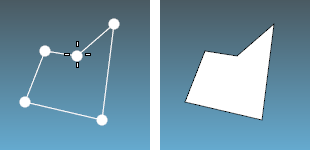
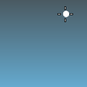
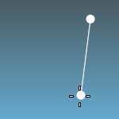
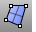

---
---

# 3DFace
{: #kanchor5}
{: #kanchor4}
 [Where can I find this command?](javascript:void(0);) Toolbars
 [Mesh Creation](mesh-creation-toolbar.html)  [STL Tools](stl-tools-toolbar.html) 
Menu
Mesh
Polygon Mesh Primitives
3-D Face
The 3DFace command draws a single mesh face.

Steps
 [Pick](pick-location.html) the first corner of the polygon.Pick the second corner.Pick additional corner points, and after picking at least three points, and press [Enter](enter-key.html) to create a face.See also
 [FillMeshHole](fillmeshhole.html) 
Fill a hole in a mesh.
 [Mesh](mesh.html) 
Create a mesh from a NURBS surface or polysurface.
 [MeshPatch](meshpatch.html) 
Create a mesh from curves and points.
 [MeshPlane](meshplane.html) 
Draw a rectangular mesh plane.
 [SrfPt](srfpt.html) 
Draw a surface from three or four corner points.
 [Draw lines and curves](sak-curve.html) 
 [Mesh Creation toolbar](mesh-creation-toolbar.html) 
 [STL Tools toolbar](stl-tools-toolbar.html) 
&#160;
&#160;
Rhinoceros 6 © 2010-2015 Robert McNeel &amp; Associates.11-Nov-2015
 [Open topic with navigation](3dface.html) 

