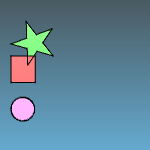

---
---

# Align toolbar
{: #kanchor2301}
 [To open a toolbar](javascript:void(0);) Toolbars can be opened as a free-standing group or added to the current group.
To open a toolbar as a free-standing group
Click theOptionsicon in any toolbar group.On the menu, clickShow Toolbar, and then select the toolbar name from the list.To open a toolbar as a new tab in the current group
Click theOptionsicon in the toolbar group where you want to add the new tab.On the menu, clickShow or Hide Tabs, and then select the toolbar name from the list. [Align, *Bottom* ](align.html) 
Lines up the bottoms of object bounding boxes.
 [Align, *Centers* ](align.html) 
Lines up the vertical and horizontal centers of object bounding boxes.
 [Align, *Left* ](align.html) 
Lines up the left sides of object bounding boxes.
 [Align, *Horizontal centers* ](align.html) 
Lines up the horizontal centers of object bounding boxes.
 [Align, *Right* ](align.html) 
Lines up the right sides of object bounding boxes.
 [Align, *Top* ](align.html) 
Lines up the tops of object bounding boxes.
 [Align, *Vertical centers* ](align.html) 
Lines up the vertical centers of object bounding boxes.
&#160;
&#160;
Rhinoceros 6 © 2010-2015 Robert McNeel &amp; Associates.11-Nov-2015
 [Open topic with navigation](align-toolbar.html) 

