---
---

# Align
{: #kanchor59}
 [Where can I find this command?](javascript:void(0);) Toolbars
 [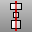Align](align-toolbar.html)  [Main2](main2-toolbar.html)  [Transform](transform-toolbar.html) 
Menus
Transform
Align
The Align command lines up the bounding boxes of objects.{: #kanchor60}
Bounding boxes can line up at their bottom, horizontal center, left, right, top, or vertical center.
Steps
 [Select](select-objects.html) the objects to align, and press [Enter](enter-key.html). [Specify](specifycommandlineoption.html) an alignment option.At the prompt for an alignment point, [pick a location](pick-location.html), or press [Enter](enter-key.html) to align based on the overall bounding box of all selected objects.Alignment type options
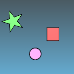
AlignTo
CPlane
Aligns objects using construction plane coordinates.
World
Aligns objects using world coordinates.
Bottom
Aligns objects by the bottom-most locations of their bounding boxes.

Concentric
Aligns objects by the horizontal and vertical centers of their bounding boxes.
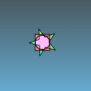
HorizCenter
Aligns objects by the horizontal centers of their bounding boxes.
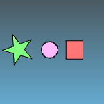
Left
Aligns objects by the left-most locations of their bounding boxes.
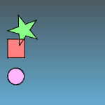
Right
Aligns objects by the right-most locations of their bounding boxes.
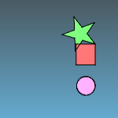
Top
Aligns objects by the top-most location of their bounding boxes.
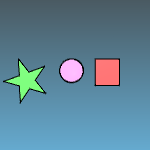
VertCenter
Aligns objects by the vertical centers of their bounding boxes.
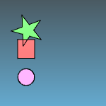

# Distribute
{: #kanchor61}
{: #distribute}
 [Where can I find this command?](javascript:void(0);) Toolbars
 [Not on toolbars.](toolbarwhattodo.html) 
Menus
 [Not on menus.](menuwhattodo.html) 
The Distribute command spreads objects out evenly between the end objects.
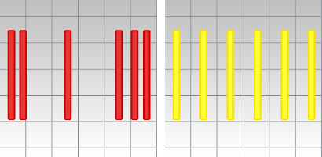
Steps
 [Select](select-objects.html) the objects to distribute, and press [Enter](enter-key.html) .Groups are considered a single object. [Specify](specifycommandlineoption.html) a direction.The objects are distributed according to even spacing between bounding box centers or according to gaps between the bounding box edges (all aligned to the direction axis).Command-line options
Direction
Defines the direction of the distribution. Point picking is constrained to the construction plane.
XAxis
Distributes objects based on x-axis of the active construction plane.
YAxis
Distributes objects based on x-axis of the active construction plane.
Mode
Specifies how the objects are distributed.
Gap
Provides even spacing between the edges of object bounding boxes.
Center
Provides even spacing between the center of object bounding boxes.
Spacing
Automatic
Automatic spacing calculates the gap/center spacing based on bounding box distances of the first and last objects, spatially sorted.
Distance
Specifies the desired spacing.
See also
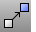 [Move](move.html) 
Move objects from one location to another.
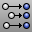 [SetPt](setpt.html) 
Move objects to a specified location in the x, y, and/or z&#160;directions.
 [Align toolbar](align-toolbar.html) 
 [Transform objects](sak-transform.html) 
&#160;
&#160;
Rhinoceros 6 © 2010-2015 Robert McNeel &amp; Associates.11-Nov-2015
 [Open topic with navigation](align.html) 

