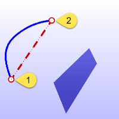
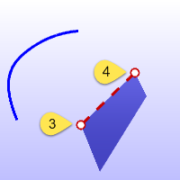
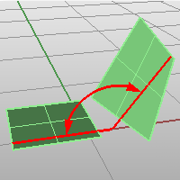

---
---

# Angle
{: #kanchor70}
{: #kanchor69}
{: #kanchor68}
 [Where can I find this command?](javascript:void(0);) Toolbars
 [Analyze](analyze-toolbar.html) 
Menus
Analyze
Angle
The Angle command reports the angle between two sets of locations on the command line.
The angle is that between picked points that represent the endpoints of two lines.
Steps
 [Pick](pick-location.html) the start of an imaginary angle line.Snap to existing geometry to establish the lines.
Pick the end of an imaginary angle line.
Pick the start of a second imaginary angle line.Pick the end of a second imaginary angle line.
The angle between the imaginary lines is reported on the command line.
Command-line options
TwoObjects
Measures the angle between two planar surfaces or two lines.

See also
 [Analyze objects](sak-analysis.html) 
 [Measure objects](sak-measure.html) 
&#160;
&#160;
Rhinoceros 6 © 2010-2015 Robert McNeel &amp; Associates.11-Nov-2015
 [Open topic with navigation](angle.html) 

