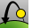

---
---

# Animation Setup toolbar
{: #kanchor2305}
 [To open a toolbar](javascript:void(0);) Toolbars can be opened as a free-standing group or added to the current group.
To open a toolbar as a free-standing group
Click theOptionsicon in any toolbar group.On the menu, clickShow Toolbar, and then select the toolbar name from the list.To open a toolbar as a new tab in the current group
Click theOptionsicon in the toolbar group where you want to add the new tab.On the menu, clickShow or Hide Tabs, and then select the toolbar name from the list. [SetFlythroughAnimation](animation.html#setflythroughanimation) 
Animate the camera and target movement along a path curve.
 [SetOneDaySunAnimation](animation.html#setonedaysunanimation) 
Animate sun movement through a specified calendar day.
 [SetPathAnimation](animation.html#setpathanimation) 
Animate the camera and target movement along separate path curves.
 [SetSeasonalSunAnimation](animation.html#setseasonalsunanimation) 
Animate sun movement through a specified week, month, or year.
 [SetTurntableAnimation](animation.html#setturntableanimation) 
Animate camera rotation once around the current target point.
&#160;
&#160;
Rhinoceros 6 © 2010-2015 Robert McNeel &amp; Associates.11-Nov-2015
 [Open topic with navigation](animation-setup-toolbar.html) 

