---
---

# Animation
{: #kanchor1695}
{: #kanchor1694}
{: #kanchor1693}
{: #kanchor1692}
The animation toolbar provides tools for creating animated views in Rhino.
Choose among the [viewport display](view-displaymode-options.html) and [render](render.html) modes to display the animation images.
To set up an animation
In theAnimationtoolbar, click theSetup animationbutton, and click the button for the animation type.After setting up the animation, [preview](#playanimation) or [record](#recordanimation) it.Options
Set up one day sun study
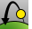 [SetOneDaySunAnimation](#setonedaysunanimation) 
Animate sun movement through a specified calendar day.
Set up seasonal sun study
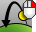 [SetSeasonalSunAnimation](#setseasonalsunanimation) 
Animate sun movement through a specified week, month, or year.
Set up fly-through animation
 [SetFlythroughAnimation](#setflythroughanimation) 
Animate the camera and target movement along a path curve.
Set up path animation
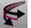 [SetPathAnimation](#setpathanimation) 
Animate the camera and target movement along separate path curves.
Set up 360 degree turntable animation
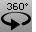 [Turntable](turntable.html) 
Rotate a view around the target.
Limitations
Rhino provides limited tools for creating animations of your models. These animation tools move only the camera and the sun. Rhino includes no tools for animating objects.
Rendering the frames creates a series of still images. These still images can be combined into an animation file.
Rhino does not include tools for compiling the frames into animation files, but many third-party products specialize in this process.

# SetTurntableAnimation
{: #kanchor1698}
{: #kanchor1697}
{: #kanchor1696}
{: #setturntableanimation}
 [Where can I find this command?](javascript:void(0);) Toolbars
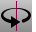 [Animation Setup](animation-setup-toolbar.html) 
Menus
 [Not on menus.](menuwhattodo.html) 

The SetTurntableAnimation command animates the camera rotation once around the current target point.
The view rotates once around the current target point. To get an idea of what the animation will look like, click in the Perspective viewport and press and hold the left arrow&lt;—or right arrow—&gt;key.
Before setting up a turntable animation
Use the [ViewportProperties](viewport.html) or [Camera](camera.html) command to position the camera and target.Turntable animation options
Direction
AntiClockwise
Clockwise
Animation options
Number of frames
Specify the number of frames for the animation.
File type
Supported types: jpg, bmp, png, tga.
Capture method
Select from [RenderFull](render.html) using the current renderer or any [viewport display style.](view-displaymode-options.html) 
Viewport
Select from viewports in the model.
Animation name
Specify a name for the animation.

# SetPathAnimation
{: #kanchor1701}
{: #kanchor1700}
{: #kanchor1699}
{: #setpathanimation}
 [Where can I find this command?](javascript:void(0);) Toolbars
 [Animation Setup](animation-setup-toolbar.html) 
Menus
 [Not on menus.](menuwhattodo.html) 

The SetPathAnimation command animates the camera or target movement.
The camera, target, or both are moved. The three results you can get are: moving camera fixed target, moving target with fixed camera, or moving camera with moving target.
Before setting up a path animation
Create the path [curves](curve.html) for the camera and target.The direction of the curve will be used for the travel direction of the camera and target. Use the [Dir](dir.html) command to view or change the direction.Options
For a moving camera with fixed target:
Draw a [curve](sak-curve.html) for the camera path, and create a [point object](point.html) for the target path.For a moving target with a fixed camera:
Draw a curve for the target path and create a point object for the camera path.For a moving camera and a moving target:
Draw curves for both the camera and target paths.Path animation setup
 [Select](select-objects.html) the camera path object.Select the target path object.Animation options
Number of frames
Specify the number of frames for the animation.
File type
Supported types: jpg, bmp, png, tga.
Capture method
Select from [RenderFull](render.html) using the current renderer or any [viewport display style.](view-displaymode-options.html) 
Viewport
Select from viewports in the model.
Animation name
Specify a name for the animation.

# SetFlythroughAnimation
{: #kanchor1704}
{: #kanchor1703}
{: #kanchor1702}
{: #setflythroughanimation}
 [Where can I find this command?](javascript:void(0);) Toolbars
 [Animation Setup](animation-setup-toolbar.html) 
Menus
 [Not on menus.](menuwhattodo.html) 

The SetFlythroughAnimation command animates the camera and target movement.
A fly-through animation looks ahead as the camera moves along the path.
Before setting up a fly-through animation
Create the path [curve](curve.html) for the camera and target.The direction of the curve will be used for the travel direction of the camera and target. Use the [Dir](dir.html) command to view or change the direction.Fly-through animation setup
 [Select](select-objects.html) the path curve.Animation options
Number of frames
Specify the number of frames for the animation.
File type
Supported types: jpg, bmp, png, tga.
Capture method
Select from [RenderFull](render.html) using the current renderer or any [viewport display style.](view-displaymode-options.html) 
Viewport
Select from viewports in the model.
Animation name
Specify a name for the animation.

# SetOneDaySunAnimation
{: #kanchor1707}
{: #kanchor1706}
{: #kanchor1705}
{: #setonedaysunanimation}
 [Where can I find this command?](javascript:void(0);) Toolbars
 [Animation Setup](animation-setup-toolbar.html) 
Menus
 [Not on menus.](menuwhattodo.html) 

The SetOneDaySunAnimation command animates sun movement through a specified calendar day.
Note
A daily sun study moves the sun across the sky to show how the shadows change on a given day.This animation type is useful if you need to see where shadows are going to fall based on the location of the sun. Architects, civil engineers, and city planners use these studies to determine if new construction will block sunlight from existing structures and green spaces.Daylight savings time is automatically taken into account.Sun study animations do not move the camera or target locations. Instead, they animate the sun. You cannot combine sun study animations with other animation types.One Day Sun Animation Options
Latitude (-90 to 90)
Specifies the model's latitude location.
Longitude (-180 to 180)
Specifies the model's longitude location.
North angle (clockwise from y&#160;axis)
Specifies the model's north direction.
Date
Specifies the date.
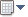Calendar
Click to select a date from calendar
Start time
Specifies the start time.
End time
Specifies the end time.
Minutes between frames
Specifies time interval.
File type
Select supported file type.
Capture method
Select from [RenderFull](render.html) using the current renderer or any [viewport display style.](view-displaymode-options.html) 
Viewport
Select viewport name.
Animation name
The name for the animation file set.

# SetSeasonalSunAnimation
{: #kanchor1709}
{: #kanchor1708}
{: #setseasonalsunanimation}
 [Where can I find this command?](javascript:void(0);) Toolbars
 [Animation Setup](animation-setup-toolbar.html) 
Menus
 [Not on menus.](menuwhattodo.html) 

The SetSeasonalSunAnimation command animates sun movement through a specified week, month, or year.
Note
Shadows are shown at the same time of each day.This animation type is useful if you need to see where shadows are going to fall based on the location of the sun. Architects, civil engineers, and city planners use these studies to determine if new construction will block sunlight from existing structures and green spaces.Sun study animations do not move the camera or target locations. Instead, they animate the sun. You cannot combine sun study animations with other animation types.Seasonal Sun Animation Options
Latitude (-90 to 90)
Specifies the model's latitude location.
Longitude (-180 to 180)
Specifies the model's longitude location.
North angle(clockwise from y&#160;axis)
Specifies the model's north direction.
Start date
Specifies the start date.
Calendar
Click to select a date from calendar.
End date
Specifies the end date.
Calendar
Click to select a date from calendar.
Time
Specifies the time of day.
File type
Select supported file type.
Capture method
Select from [RenderFull](render.html) using the current renderer or any [viewport display style.](view-displaymode-options.html) 
Days between frames
Specifies time interval.
Viewport
Select viewport name.
Animation name
The name for the animation file set.

# PlayAnimation
{: #playanimation}
 [Where can I find this command?](javascript:void(0);) Toolbars
 [Animation](animation-toolbar.html)  [Animation Preview](animation-preview-toolbar.html)  [Render Tools](render-tools-toolbar.html) 
Menus
 [Not on menus.](menuwhattodo.html) 

The PlayAnimation command plays an animation or animation preview.
The preview toolbar lets you view the animation sequence in wireframe. It is much faster than rendering or shading each of the frames.
For faster playback, play the animation preview in a [Wireframe](view-displaymode-options.html#wireframe) view.
To preview the animation in the viewport
In theAnimation Previewtoolbar, click thePreview animationbutton.The viewport will change showing a preview of the animation. You cannot adjust the speed of the preview playback.Press [Esc](esc-key.html) to stop.Animation Preview toolbar{: #kanchor1710}
PlayAnimation{: #kanchor1711}
Play the animation preview.
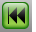{: #viewfirstframe}ViewFirstFrame{: #kanchor1712}
Go to the first animation frame
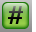{: #viewframenumber}ViewFrameNumber{: #kanchor1713}
Go to the specified animation frame number.
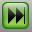{: #viewlastframe}ViewLastFrame{: #kanchor1714}
Go to the last animation frame.
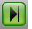{: #viewnextframe}ViewNextFrame{: #kanchor1715}
Go to the next animation frame.
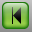{: #viewpreviousframe}ViewPreviousFrame{: #kanchor1716}
Go to the previous animation frame.

# RecordAnimation
{: #kanchor1717}
{: #recordanimation}
 [Where can I find this command?](javascript:void(0);) Toolbars
 [Animation](animation-toolbar.html)  [Render](render-tools-toolbar.html) 
Menus
 [Not on menus.](menuwhattodo.html) 
The RecordAnimation command renders and saves animation frames.
Each frame renders and saves to the specified folder. When all the frames are rendered, a preview of the animation will be displayed in your web browser.
To record the animation frames
In theAnimationtoolbar, clickRecord animationbutton.Press [Enter](enter-key.html) to start recording.Press [Esc](esc-key.html) to stop.Command-line options
TargetFolder
Specifies the folder for saving the animation frames.
RunAnimation
Runs the animation when it is complete in an HTML page.
See also
 [Animate views](sak-animation.html) 
&#160;
&#160;
Rhinoceros 6 © 2010-2015 Robert McNeel &amp; Associates.11-Nov-2015
 [Open topic with navigation](animation.html) 

