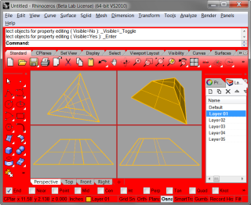

---
---

{: #kanchor2475}{: #kanchor2476}{: #kanchor2477}{: #kanchor2478}{: #kanchor2479}{: #kanchor2480}{: #kanchor2481}{: #kanchor2482}{: #kanchor2483}{: #kanchor2484}{: #kanchor2485}
# Colors
 [Where can I find this command?](javascript:void(0);) Toolbars
 [Properties](properties-toolbar.html)  [Standard](standard-toolbar.html)  [Tools](tools-toolbar.html) 
Menus
Tools
Options
TheColorsoptions manage and define the colors of the Rhino interface.
Viewport colors
{: #backgroundcolor}Background{: #kanchor2486}
The color of the working area background behind the grid lines.
Major grid line
The color of major grid lines.
Minor grid line
The color of minor grid lines.
{: #xyz-axis-line}X/Y/Z-axis line
The color of the construction plane x, y, and z&#160;axes.
World axes icon X/Y/Z
The colors of the direction arrows for the world axes icon.
Layout
The layout paper background color.
Object display
Selected objects
The color of selected objects.
Locked objects
The color of locked objects.
New Layer
The color for new layers.
Interface objects
Feedback
The color of the feedback curves. One example of a feedback curve is the line you see when you drag objects.
{: #tracking-lines}Tracking lines
The color of the tracking line. One example of a tracking line is the line you see when you use elevator mode.
Crosshair
The color of the full-screen crosshairs.
{: #layerdialog}Layer dialog box
Layout settings background
The color of the layout background.
General
Changes the colors of various parts of the Rhino window.

Window color 1
Window color 2
Window color 3
Window border
Window text
Active viewport title
Inactive viewport title
Widget colors
{: #backgroundcolor}U-axis color
The color of the mapping widget u&#160;axis.
V-axis color
The color of the mapping widget v&#160;axis.
W-axis color
The color of the mapping widget w&#160;axis.
 **Restore Defaults** 
Restores the default system values. All custom color settings will be lost.
To save options for use on other computers
 [OptionsExport](optionsexport.html) 
Save [Options](options.html) settings to a file.
 [OptionsImport](optionsexport.html#optionsimport) 
Restore [Options](options.html) settings from a file.
See also
 [Appearance options](appearance.html) 
&#160;
&#160;
Rhinoceros 6 © 2010-2015 Robert McNeel &amp; Associates.11-Nov-2015
 [Open topic with navigation](appearance-colors.html) 

