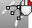

---
---

# Arc toolbar
{: #kanchor2307}
 [To open a toolbar](javascript:void(0);) Toolbars can be opened as a free-standing group or added to the current group.
To open a toolbar as a free-standing group
Click theOptionsicon in any toolbar group.On the menu, clickShow Toolbar, and then select the toolbar name from the list.To open a toolbar as a new tab in the current group
Click theOptionsicon in the toolbar group where you want to add the new tab.On the menu, clickShow or Hide Tabs, and then select the toolbar name from the list. [Arc](arc.html) 
Draw an arc with options for center, start, angle, and direction.
 [Arc,Start, End, Point on arc](arc.html) 
Arc by start, end, point on arc.
 [Arc,Point on arc, End](arc.html) 
Arc by start, point on arc, end.
 [Arc,Start, End, Direction at start](arc.html) 
Arc by start, end, direction at start.
 [Arc,Start, Direction at start, end](arc.html) 
Arc by start, direction at start, end.
 [Arc,Start, End, Radius](arc.html) 
Arc by start, end, radius.
 [Arc,Tangent to curves](arc.html) 
Arc tangent to curves.
 [Arc,Tangent, Tangent, Radius](arc.html) 
Arc tangent, tangent, radius.
 [CurveThroughPt](curvethroughpt.html) + [Convert](convert.html#arcs) 
Fit a curve through point objects and convert to arcs.
 [Convert to arcs](convert.html#arcs) 
Change a curve to arc segments.
&#160;
&#160;
Rhinoceros 6 © 2010-2015 Robert McNeel &amp; Associates.11-Nov-2015
 [Open topic with navigation](arc-toolbar.html) 

