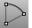
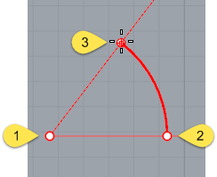
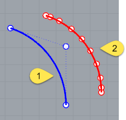
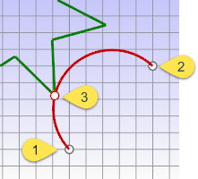
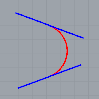
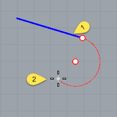
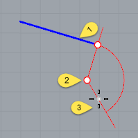

---
---

# Arc
{: #kanchor103}
{: #kanchor102}
 [Where can I find this command?](javascript:void(0);) Toolbars
 [Arc](arc-toolbar.html)  [Curve Drawing](curve-drawing-toolbar.html)  [Main](main-sidebar-toolbar.html)  [Main1](main1-toolbar.html) 
Menu
Curve
Arc
Center, Start, AngleStart, End, DirectionStart, End, PointStart, End, RadiusStart, Point, EndTangent, Tangent, RadiusTangent to Curves
The Arc command draws an arc with options for a center location (1), one end point (2), and a second end point or an angle (3).

# Arc options

## Center
The Center option is the default.
Center steps
 [Pick](pick-location.html) the center of the arc's radius.Pick the arc's first endpoint.This point is also the arc's start point.Pick the arc's second end point, or type an angle.
### Deformable
The Deformable option draws a [NURBS](http://www.rhino3d.com/nurbs) approximation of the arc with a specified degree and number of [control points](controlpoint.html).

Default degree-2 arc with three control points (1).Deformable degree-3 arc with ten control points (2).
Deformable options
Degree
Specifies the [degree](degree.html) of the arc.
When drawing a high-degree arc, the output curve will not be the degree you request unless there is at least one more [control point](controlpoint.html) than the degree.
PointCount
Specifies the number of [control points](controlpoint.html).

### Tilted
The Tilted option draws an arc whose plane is tilted from the current construction plane.
Tilted steps
 [Pick](pick-location.html) the arc's center, and choose theTiltedoption (typeT).Pick the start point for the arc.Drag the mouse to start a three-point rectangle that defines the orientation of the tilt.In a different viewport from the start point, using reference geometry, or with [elevator mode](cursor-constraints.html#elevator-mode), drag the rectangle to the angle of the tilt.Pick the arc's endpoint, or type an angle, or choose theLengthoption (type&#160;L).Your browser does not support the video tag.Tilted option
Length
The Length option sets the arc length as measured along the arc. Type a positive or negative number, or [pick two points](distance-pick-2pts.html) to specify the arc curve's length.

## StartPoint
The StartPoint option draws an arc starting from the first end of the arc.
StartPoint steps
 [Pick](pick-location.html) the arc's start point.Pick the arc's end point.Click a location the arc passes through.StartPoint options
Direction
The Direction option specifies the direction of a line tangent to the arc's start point.
Direction steps
 [Pick](pick-location.html) a start point.Pick the direction the arc will be tangent to at the start of the arc.Pick an end point.As you move the cursor, a center point for the arc appears as a reference.Your browser does not support the video tag.ThroughPoint
The ThroughPoint option specifies a location the arc curve must pass through.
ThroughPoint steps
 [Pick](pick-location.html) a start point.Pick a location for the arc to pass through.Pick the arc's endpoint.Your browser does not support the video tag.Center
The Center option specifies a center point for the arc's radius.
Center steps
 [Pick](pick-location.html) a start point. [Pick](pick-location.html) the arc's center point.Pick the arc's end point or type an angle, or choose theLengthoption (typeL).Your browser does not support the video tag.
## Tangent
The Tangent option draws an arc tangent to selected curves with options to pick a point not on the selected curves or to specify a radius. Each prompt allows you to pick a point that is not on a curve for the arc to pass through. At some prompts, the option to enter a radius appears.
The red arc in the image is tangent to both blue lines.

Tangent steps
 [Select](select-objects.html) a curve to make the arc tangent to.Select a second curve to make the arc tangent to.The tangent indicators adjust to fit the arc tangent to the two curves.Select a third curve to make the arc tangent to.The tangent indicators adjust again to fit the arc tangent to the two curves.Or press [Enter](enter-key.html) to draw the reference circle from the first two points.Drag the cursor around the arc, and click to choose from the suggested possibilities.Your browser does not support the video tag.Tangent options
Point
The Point tangent option appears for each prompt. It releases the command from the tangent constraint for that pick.
To use the point option
At any prompt, choose thePointoption, and pick any point for the arc to pass through.The tangent indicators adjust again to fit the arc tangent to the two curves.Example
In this example, the Point option is used to establish the first point on the arc.
At theFirst tangent curve ( Point )prompt, choose the Point option, and pick any point.At theSecond tangent curve or radiusprompt, select a curve.At theThird tangent curveprompt, select a curve.At theChoose arcprompt, drag the cursor around the arc, and click to choose from the suggested possibilities.Your browser does not support the video tag.Example
In this example thePointoption is used to establish the second point on the arc.
At theFirst tangent curve ( Point )prompt, select a curve.At theSecond tangent curve or radius ( Point FromFirstPoint )prompt, choose thePointoption, and pick any point.At theThird tangent curveprompt, select a curve.At theChoose arcprompt, drag the cursor around the arc, and click to choose from the suggested possibilities.Your browser does not support the video tag.FromFirstPoint
The FromFirstPoint tangent option forces the arc to go through the first picked point on the curve instead of allowing the point to slide along the curve.
Example
In this example theFromFirstPointoption is used to establish the start point on the curve.
At theFirst tangent curveprompt, select a curve.The tangent cursor slides along the curve.At theSecond tangent curve or radius ( Point FromFirstPoint )prompt, choose theFromFirstPointoption, and pick a location on the curve.At theThird tangent curveprompt, select a curve.At theChoose arcprompt, only two options are available since the first point on the arc is restricted to the location on the curve.Drag the cursor around the arc, and click to choose from the suggested possibilities.Your browser does not support the video tag.Radius
The Radius option specifies a radius. If a tangent point exists on the second curve that meets the radius requirement, the tangent constraint will appear at that point as you drag the circle.
Example
In this example theRadiusoption is used to establish the size of the arc.
At theFirst tangent curveprompt, select a curve.The tangent cursor slides along the curve.At theSecond tangent curve or radiusprompt, select a curve.At theThird tangent curveprompt, choose theRadiusoption and type a radius value.At theChoose arcprompt, only two options are available since the arc is restricted to the radius specified.Drag the cursor around the arc, and click to choose from the suggested possibilities.Your browser does not support the video tag.Extension
The Extension option extends a curve with an arc to a specified end point.
Extension steps
 [Pick](pick-location.html) the curve to extend (1).Pick the arc's end point (2).Extension option
Center
The Center option extends a curve with an arc by from a specified center and end point.
Center steps
 [Pick](pick-location.html) the curve to extend (1). [Pick](pick-location.html) the arc's center point (2).Pick the arc's end point (3).Center options
Length
The Length option sets the arc length, measured along the arc. Type a positive or negative number or pick two points to specify the arc curve's length.
Direction
The Direction option sets the direction for drawing the arc.
Counterclockwise
The Counterclockwise option draws the arc in a counterclockwise direction from the start point.
Clockwise
The Clockwise option draws the arc in a clockwise direction from the start point.
Extension option notes
The arc extension is not joined to the original curve.To draw an arc extension and join it in one step, use the [Extend](extend.html) command.The center point is constrained to a plane perpendicular to the curve end. If the extension is drawn in a view perpendicular to the constraint plane, the input will be automatically locked parallel to the [construction plane](cplane.html) .In other views Rhino tries to make sure one of the [ortho](ortho.html) directions is parallel to the [construction plane](cplane.html). Press [Shift](shift-key.html) when making the pick to maintain the ortho direction.See also
 [Draw lines and curves](sak-curve.html) 
&#160;
&#160;
Rhinoceros 6 © 2010-2015 Robert McNeel &amp; Associates.11-Nov-2015
 [Open topic with navigation](arc.html) 

