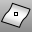

---
---

# AreaCentroid
{: #kanchor108}
{: #kanchor107}
 [Where can I find this command?](javascript:void(0);) Toolbars
 [Analyze](analyze-toolbar.html)  [Mass Properties](mass-properties-toolbar.html) 
Menus
Analyze
Mass Properties
Area Centroid
The AreaCentroid command reports the coordinates and places a point object at the area centroid of surfaces, polysurfaces, meshes, or closed planar curves.
Steps
 [Select](select-objects.html) curves, surfaces, or polysurfaces.A [point object](point.html) will be placed at the centroid coordinates.See also
 [Measure objects](sak-measure.html) 
 [Analyze an object's mass properties](sak-massproperties.html) 
&#160;
&#160;
Rhinoceros 6 © 2010-2015 Robert McNeel &amp; Associates.11-Nov-2015
 [Open topic with navigation](areacentroid.html) 

