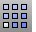
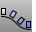
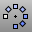

---
---

# Array toolbar
{: #kanchor2308}
 [To open a toolbar](javascript:void(0);) Toolbars can be opened as a free-standing group or added to the current group.
To open a toolbar as a free-standing group
Click theOptionsicon in any toolbar group.On the menu, clickShow Toolbar, and then select the toolbar name from the list.To open a toolbar as a new tab in the current group
Click theOptionsicon in the toolbar group where you want to add the new tab.On the menu, clickShow or Hide Tabs, and then select the toolbar name from the list. [Array](array.html) 
Copy and space objects in columns, rows, and levels.
 [ArrayCrv](arraycrv.html) 
Copy and space objects along a curve.
 [ArrayCrvOnSrf](arraycrvonsrf.html) 
Copy and space objects along a curve on a surface.
 [ArrayLinear](arraylinear.html) 
Copy and space objects in a single direction.
 [ArrayPolar](arraypolar.html) 
Copy and space objects around a central location.
 [ArraySrf](arraysrf.html) 
Copy and space objects in rows and columns on a surface.
&#160;
&#160;
Rhinoceros 6 © 2010-2015 Robert McNeel &amp; Associates.11-Nov-2015
 [Open topic with navigation](array-toolbar.html) 

