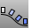

---
---

# ArrayCrv
{: #kanchor117}
{: #kanchor116}
 [Where can I find this command?](javascript:void(0);) Toolbars
 [Array](array-toolbar.html) 
Menus
Transform
Array
Along Curve
 [&#160;History enabled](historyenabled.html) 
The ArrayCrv command copies objects spaced along a curve.
Steps
 [Select](select-objects.html) objects to array.Select a path curve near the end where you want the array to start.Or use theBasepointoptionSpecify the number of elements to array or the spacing distance along the curve.Type a value of 1 or more for the number of elements.Command-line options
Basepoint
When the object to be arrayed is not on the curve and should be moved to the curve prior to the array, the Basepoint option establishes a reference location that will be move to the curve.
Method
Distance between items
 [Specify the distance](distance-pick-2pts.html) between items. The number of items is determined by the length of the curve.
Number of items
Type the number of items to array along the curve.
Orientation
Freeform
Objects are rotated in three dimensions as they are arrayed along the path curve.
Your browser does not support the video tag.No rotation
The objects do not rotate as they are arrayed, but remain in their original orientation.
Your browser does not support the video tag.Roadlike
Objects follow the curve but maintain a consistent up direction relative to the construction plane.
Your browser does not support the video tag.See also
 [Array objects](sak-array.html) 
&#160;
&#160;
Rhinoceros 6 © 2010-2015 Robert McNeel &amp; Associates.11-Nov-2015
 [Open topic with navigation](arraycrv.html) 

