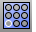

---
---

{: #kanchor120}{: #kanchor121}
# ArrayHole
 [Where can I find this command?](javascript:void(0);) Toolbars
 [Holes](holes-toolbar.html) 
Menus
Solid
Solid Edit Tools
Holes
Array Hole
The ArrayHole command copies holes in a surface in a specified number rows and columns.
Steps
 [Select](select-objects.html) a hole.Type the number of holes in the A direction.Type the number of holes in the B direction. [Pick](pick-location.html) a base point.Pick the A direction and distance.Pick the B direction and distance.Your browser does not support the video tag.Command-line options
ADirection
Changes the first direction.
ANumber
Number of holes in the first direction.
ASpacing
Distance between hole centers in the first direction.
BNumber
Number of holes in the second direction.
BSpacing
Distance between hole centers in the second direction.
Rectangular
Forces the second direction to be perpendicular to the first direction.
Your browser does not support the video tag.
UseASpacing
Use the same distance as the second direction as for the first direction.
See also
 [Array objects](sak-array.html) 
 [Create and edit holes in surfaces](sak-holes.html) 
&#160;
&#160;
Rhinoceros 6 © 2010-2015 Robert McNeel &amp; Associates.11-Nov-2015
 [Open topic with navigation](arrayhole.html) 

