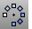
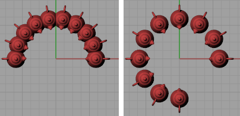
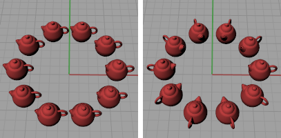
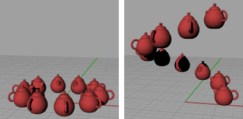

---
---

# ArrayPolar
{: #kanchor129}
{: #kanchor128}
{: #kanchor127}
{: #kanchor126}
{: #kanchor125}
 [Where can I find this command?](javascript:void(0);) Toolbars
 [Array](array-toolbar.html)  [Transform](transform-toolbar.html) 
Menus
Transform
Array
Polar
 [&#160;History enabled](historyenabled.html) 
The ArrayPolar command copies objects around a central location.
Steps
 [Select](select-objects.html) the objects. [Pick](pick-location.html) theCenterof the array.The rotation axis for the polar array is the z&#160;direction of the active construction plane at the chosen point.Type the number of items and press [Enter](enter-key.html) .Enter a value of 2 or more.Type the angle to fill.Copies of the selected objects appear, rotated around the axis defined by the center point.Your browser does not support the video tag.Command-line options
Axis
TheAxisoption defines an axis line for the array to rotate around.
Axis steps
Pick the start of polar axis.Pick the end of polar axis.The action is similar to the [Rotate3D](rotate3d.html) command.Press [Enter](enter-key.html) to rotate the array around the construction plane z&#160;axis.Preview
Displays a dynamic preview.
You can change the options and the preview will update.
StepAngle
Enter the angle between objects.
StepAngle=20 (left) and StepAngle=30 (right).
Rotate
Rotates the objects as they are arrayed.
Rotate=No (left) and Rotate=Yes (right).
ZOffset
Moves each arrayed object in the z&#160;direction by the value specified.
ZOffset=0 (left) and ZOffset=1 (right).
See also
 [Array objects](sak-array.html) 
&#160;
&#160;
Rhinoceros 6 © 2010-2015 Robert McNeel &amp; Associates.11-Nov-2015
 [Open topic with navigation](arraypolar.html) 

