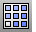

---
---

# ArraySrf
{: #kanchor130}
 [Where can I find this command?](javascript:void(0);) Toolbars
 [Array](array-toolbar.html) 
Menus
Transform
Array
Along Surface
 [&#160;History enabled](historyenabled.html) 
The ArraySrf command copies objects in rows and columns on a surface.
The surface normal direction determines the orientation of the objects.
Steps
 [Select](select-objects.html) objects. [Pick](pick-location.html) a base point relative to the objects that will be arrayed on the surface.Pick a normal (up) direction for the objects, or press [Enter](enter-key.html) if the normal direction for the object is the construction plane z&#160;axis.This direction will be normal to the surface.Select the target surface.Infinite Plane: TypeIPfor [InfinitePlane](infiniteplane.html) options.
Type the number of elements in the u&#160;direction.Type the number of elements in the v&#160;direction.The objects are arrayed over the untrimmed surface evenly, spaced along the u and v [directions](curvesurfacedirection.html) of the surface.If the surface is trimmed, some of the arrayed base points may be outside the trimmed surface but on the underlying untrimmed surface. In this case, the [ShrinkTrimmedSrf](shrinktrimmedsrf.html) command might help with placing the objects.Your browser does not support the video tag.When using History
Editing the surface updates the location of the arrayed objects.Editing the original object changes all of the arrayed objects.See also
 [Array objects](sak-array.html) 
&#160;
&#160;
Rhinoceros 6 © 2010-2015 Robert McNeel &amp; Associates.11-Nov-2015
 [Open topic with navigation](arraysrf.html) 

