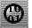
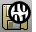

---
---

# Audit files for errors
Auditing checks files for database errors.

# Audit
{: #kanchor137}
{: #kanchor136}
 [Where can I find this command?](javascript:void(0);) Toolbars
 [Diagnostics](diagnostics-toolbar.html) 
Menus
Analyze
Diagnostics
Audit
The Audit command checks the active Rhino file for errors.
Note
When theAuditcommand detects a database error, it prints a detailed description of the error.Information displays when something is wrong with objects and their relationship to layers.
# Audit3dmFile
{: #kanchor138}
{: #audit3dmfile}
 [Where can I find this command?](javascript:void(0);) Toolbars
 [Diagnostics](diagnostics-toolbar.html) 
Menus
Analyze
Diagnostics
Audit 3DM File
The Audit3dmFile command checks any Rhino model file for errors.
If files are large, damaged, or will not open with theOpencommand, theAudit3dmFilecommand might be able to diagnose the problem.
Steps
In theOpen Rhinoceros Filedialog box, select a file to audit.See also
 [Work with files](sak-file.html) 
&#160;
&#160;
Rhinoceros 6 © 2010-2015 Robert McNeel &amp; Associates.11-Nov-2015
 [Open topic with navigation](audit.html) 

