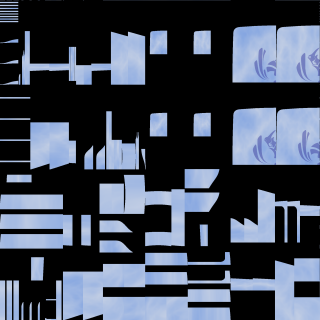

---
---

# Bake
{: #kanchor143}
 [Where can I find this command?](javascript:void(0);) Toolbars
 [Not on toolbars.](toolbarwhattodo.html) 
Menus
 [Not on menus.](menuwhattodo.html) 
The Bake command combines an object's textures and decals into a single image file and assigns that image as object's texture.
Note
Bake works only on surface, polysurface and extrusion objects.The command starts by asking for an object, image file and image size. It then bakes (combines) object's textures and decals into one image. This image is then assigned to a new material that material is assigned to the object.The object's texture mapping is changed to surface mapping.Steps
Place [textures](texturemapping.html) and [decals](decal.html) on an object.Bake the object.The object's textures and decals are combined into one image.This image is then assigned to a new material that material is assigned to the object using [surface](texturemapping.html#surface-mapping) mapping.All the decals are removed from the object. As a result the object looks much like before.See also
 [Render](render.html) 
Render the objects using the current renderer.
 [Use materials and textures](sak-materialsandtextures.html) 
&#160;
&#160;
Rhinoceros 6 © 2010-2015 Robert McNeel &amp; Associates.11-Nov-2015
 [Open topic with navigation](bake.html) 

