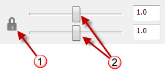
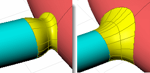

---
---

# BlendSrf
{: #kanchor152}
{: #kanchor151}
{: #kanchor150}
{: #kanchor149}
 [Where can I find this command?](javascript:void(0);) Toolbars
 [Surface Tools](surface-tools-toolbar.html) 
Menus
Surface
Blend Surface
 [&#160;History enabled](historyenabled.html) 
The BlendSrf command creates a blend surface between two surfaces.
With Record History on, the result can pay attention to changes in the input objects and have its own input settings changed using the Edit command line option.
Steps
 [Select](select-objects.html) a surface edge.Select adjacent edges or press [Enter](enter-key.html) .Select the edges to blend to and press [Enter](enter-key.html) .Select adjacent edges or press [Enter](enter-key.html) .Select and adjust control points or press [Enter](enter-key.html) .Command-line options
ChainEdges
Select connected edges based on the curve continuity of the connection between segments.
AutoChain
Selecting a curve or surface edge automatically selects all curve segments connected with the level of [continuity](continuity-descriptions.html) set by theChainContinuityoption.
ChainContinuity
Controls the level of [continuity](continuity-descriptions.html) required between segments to be selected with theAutoChainoption.
Direction
Forward
Selects curves in the positive curve [direction](dir.html#normaldirection).
Backward
Selects curves in the negative curve [direction](dir.html#normaldirection).
Both
Selects curves in both the positive and negative curve [direction](dir.html#normaldirection).
GapTolerance
If the gap between two edges/curves is less than this value, the chain selection will ignore the gap and will select the next segment.

AngleTolerance
WhenContinuityis set toTangency, if the angle between two edges/curves is less than this value, the chain selection will consider the criteria for continuity met and will select the next segment.

Options available after a chain segment is selected
Undo
Undo last segment selection.
Next
Select next segment.
All
Select all segments.
Edit
For blend surfaces created with [history](history.html), edit the blend settings and handles. The original settings are maintained and you can change individual settings.
Keys for control
Shift
By default the shape curves are separately edited at each end, Hold [Shift](shift-key.html) to retain symmetry. With symmetry, point editing is mirrored to the other end of the curve.
Alt
Hold [Alt](alt-key.html) while dragging the handles to change the angle between the shape curve and the surface edge.
By default the shape curves are perpendicular to the surface edge or parallel to the surface isocurves.If the edge is trimmed, the shapes are perpendicular to the surface edge.If the edge is untrimmed, the shapes are parallel to the surface isocurves.Your browser does not support the video tag.To drag seams(closed cross-section curves only)
Select a seam point marker, and move it along the closed curve.Continue to adjust the seam points until they line with each other and the closed curves all have the same direction, and then press [Enter](enter-key.html) .Your browser does not support the video tag.Adjust seam options
Flip
Reverses the curve direction.
Automatic
Attempts to align the seam points and directions without intervention.
Natural
Moves the seam points to the way they were at the beginning of the command.
Adjust Surface Blend Options
Lock
Check theLockbox to maintain the relationship between the two curve ends.
Sliders
Determine the distance of influence the surface has on the edge curve.
Sliders (2) control each surface end.Lock sliders icon (1), surface end bulge controls (2).
Continuity Options
Sets the [continuity](continuity-descriptions.html) for each surface end.
Your browser does not support the video tag.Position
Tangency
Curvature
G3
G4
AddShapes
Add additional curve profile shapes to increase control over the blend surface shape. This is especially important if the input shapes are complex and you want to control the shape in more locations.
Click a location on each surface edge to add another shape curve.
Your browser does not support the video tag.When you snap to a point and add a shape, the command automatically creates a shape that connects to the corresponding point on the other side, which attempts to keep the blend simple.
Planar sections
Forces all shape curves to be planar and parallel to the specified direction.
Your browser does not support the video tag.Same height
If the gaps between the surfaces vary, this option maintains the height of the shape curves throughout the blend.
Your browser does not support the video tag.Preview
Check to dynamically display a preview as the options change.
Note
If you try to create a blend between a surface and a hole in another surface that is exactly the same size as the surface, Rhino will be forced to make the blend surface dip in quite a bit so it is smooth to both surfaces.
Hole the same size as surface (left). Hole larger than surface (right).
If the edges of two surfaces you are trying to blend share a corner intersection, theBlendSrfcommand will select all the contiguous edges as one. To choose the second edge separately, press [Enter](enter-key.html) after choosing the first edge, then choose the edge of the second surface.Sometimes some holes appear in rendering between blend surfaces and their original surfaces appear in rendering. This is because the rendering was done with polygon mesh approximations of the true surfaces, so the meshes are not matching up exactly.Use the [Join](join.html) command to join them together into one object so the rendering and meshing won't have any cracks in it and will match up exactly.Tips
Always blend from the largest radius to the smallest radius across a model.Remove any edges you can prior to blending with [MergeAllFaces](mergeallfaces.html) or by way of surfacing in a simpler manner. Fewer intersected edges = Fewer problems as the blend rolls along any edges and tries to trim and join with the adjacent surfaces.Make sure there is enough room for the blend surface to trim and join with adjacent surfaces. The angle relationships between surfaces, sharpness of the bend in the edge around corners, and blend type all play a part in any particular case.See also
 [Fillet, blend, or chamfer between curves and surfaces](sak-fillet-blend-chamfer.html) 
&#160;
&#160;
Rhinoceros 6 © 2010-2015 Robert McNeel &amp; Associates.11-Nov-2015
 [Open topic with navigation](blendsrf.html) 

