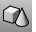
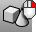
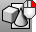

---
---

# Block toolbar
{: #kanchor2309}
 [To open a toolbar](javascript:void(0);) Toolbars can be opened as a free-standing group or added to the current group.
To open a toolbar as a free-standing group
Click theOptionsicon in any toolbar group.On the menu, clickShow Toolbar, and then select the toolbar name from the list.To open a toolbar as a new tab in the current group
Click theOptionsicon in the toolbar group where you want to add the new tab.On the menu, clickShow or Hide Tabs, and then select the toolbar name from the list. [Block](block.html) 
Define a block object.
 [BlockEdit](blockedit.html) 
Allow selecting a block instance to change the block geometry and update the block definition.
 [BlockEdit](blockedit.html) 
Allow selecting a block instance to change the block geometry and update the block definition.
 [BlockManager](blockmanager.html) 
Manage the block definitions.
 [ExplodeBlock](explode.html#explodeblock) 
Explode a block including any nested blocks into component objects.
 [Insert](insert.html) 
Insert block objects stored in the file or import a file as a block definition.
 [ExportWithOrigin](export.html#exportwithorigin) 
Save objects to a new file with a specified origin and construction plane.
 [ModelBasepoint](modelbasepoint.html) 
Set a world origin that is used when inserting the model into another.
 [ReplaceBlock](replaceblock.html) 
Replace block instances with a different block definition.
&#160;
&#160;
Rhinoceros 6 © 2010-2015 Robert McNeel &amp; Associates.11-Nov-2015
 [Open topic with navigation](block-toolbar.html) 

