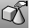

---
---

# BlockManager
{: #kanchor161}
{: #kanchor160}
{: #kanchor159}
{: #kanchor158}
{: #kanchor157}
 [Where can I find this command?](javascript:void(0);) Toolbars
 [Block](block-toolbar.html) 
Menus
Edit
Blocks
Block Manager
The BlockManager command manages the block definitions in the model.
Steps
In theBlock Managerdialog box, set block properties.Block Manager
Block Definitions
Name
Displays a list of block definitions in the model.
Link Status
Displays the status of block instances linked to external files.
Up to date
The block definition and link file match.
Linked file is older
The linked file is older than the block definition.
Linked file is newer
The linked file is newer than the block definition.
Linked file is different
The linked file and the block definition do not match.
Not linked
The block definition was not created by importing a file.
File not found
The file that was used to create the block definition cannot be found.
The missing block location is marked with a text dot object listing the missing block name.
For a description of the process Rhino 5.0 uses to locate files used by worksessions and linked instance definitions, see [Rhino Wiki: File finding](http://wiki.mcneel.com/rhino/rhinov5status_filefinding#searching_for_files).
To resolve the issue
Click **Properties** to locate the missing block file, and then click theUpdatebutton to restore the missing block.Or, click **Delete** to remove the link.Link File Name
The name of the file that was imported to create the block definition.
No hidden / &lt; *n* &gt; Hidden blocks in current model
Show hidden block definitions
Allows display of block names beginning with * (asterisk character).
Show nested reference block definitions
You can look at and modify the properties of nested linked blocks. However, any changes made to nested linked block settings are temporary and are never saved. To permanently change linked block settings, edit the model containing the linked block.
Description
Displays the description field of the block definition.
Embedded and linked blocks should
Always update
Updates externally linked blocks automatically each time the model is opened.
Prompt when update required
Prompts to update externally linked blocks.
When a file opens, the [Block Definitions to Update](#block-definitions-to-update) dialog box prompts for action.
Never update
Never updates externally linked blocks and does not prompt.
Block preview
Turns on a graphical preview of the block.
Right-click menu
Sets the [display mode](view-displaymode-options.html) and the [view](setview.html).
Wireframe
Sets the view to [Wireframe](view-displaymodes-wireframe.html) display mode.
Shaded
Sets the view to [Shaded](view-displaymodes-shaded.html) display mode.
Rendered
Sets the view to [Rendered](view-displaymodes-rendered.html) display mode.
Top
Sets the view to [World Top](setview.html#worldtop).
Bottom
Sets the view to [World Bottom](setview.html).
Left
Sets the view to [World Left](setview.html).
Right
Sets the view to [World Right](setview.html#worldright).
Back
Sets the view to [World Back](setview.html#worldback).
Perspective
Sets the view to [World Perspective](setview.html#worldperspective).
Properties
Opens the [Block Definition Properties](#block-definition-properties) dialog box.
Export
Exports the blocks' component objects to a file.
Delete
Delete the selected block definitions and all instances of the block in the model.
Block definitions nested in another block cannot be deleted.
{: #update}Update
Redefines the block definition to match the original imported file. Use the information in theLink Statuscolumn to determine if the file needs to be updated.
Used by
Lists block definitions that contain the selected block as a nested block.
Count
Counts the number of instances of the block in the model. Nested instances are included in the count.
Select
Selects and highlights block instances of the selected block definition name in the model.
If block instances are selected before the Block Manager is opened, those block names will be selected in the Block Definition list.
Refresh
Refreshes the block list, updating the link status and block properties. This is useful when linked block references may have changed outside the current model.
{: #block-definition-properties}Block Definition Properties
Block Definition Name
The block name.
File name
The external file name linked to the block definition.
Browse
Change the name or location of the external file.
External File
For a file inserted as block instance.
Read linked blocks from this file
Blocks linked to the file being inserted are also inserted.
Block definition type
Blocks linked to the file being inserted are always read as linked blocks, no matter what the Block definition type is.
Embed
Insert geometry into the current file. This will not update if the external file changes.
Embed and link
Insert geometry into the current file and maintain a link to the external file. Linked geometry can be updated when the external file changes. If the external file cannot be located, the geometry is still defined in the current file.
Link
Maintain only a link to the external file. Linked geometry is updated when the external file changes. If the external file cannot be located, the geometry will *not* appear in the current file.
Blocks are saved with both absolute and relative paths.
Layer Style
Defines how layer names are organized
Active
Merges layers with the same names.
Reference
Creates a parent layer using the name of the linked file. Layers in the linked file appear as sub-layers under the parent layer.
Description
Type an optional description.
Hyperlink
Adds hyperlink information to a block definition. This information can be retrieved with the [Hyperlink](hyperlink.html) command.
Description
A description of the URL.
URL
A web address. Click the address to open the page in the default browser.
{: #block-definitions-to-update}Block Definitions to Update
This model contains blocks linked to external files that have changed.
Select the block definitions to update.
Name
Displays a list of block definitions in the model.
Link Status
Displays the status of block instances linked to external files.
Link File Name
The name of the file that was imported to create the block definition.
Select All
Selects all block definition names in the list.
Clear All
Clears all block definition names in the list from the selection.
Update Later
Updating the block definitions is postponed until you [update manually](#update) or reopen the file.
Update Now
Updates all of the selected block definitions.
See also
 [Work with blocks, groups, and worksessions](sak-blocksgroups.html) 
&#160;
&#160;
Rhinoceros 6 © 2010-2015 Robert McNeel &amp; Associates.11-Nov-2015
 [Open topic with navigation](blockmanager.html) 

