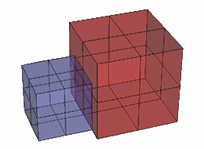

---
---

# BooleanIntersection
{: #kanchor179}
{: #kanchor178}
{: #kanchor177}
{: #kanchor176}
{: #kanchor175}
{: #kanchor174}
 [Where can I find this command?](javascript:void(0);) Toolbars
 [Solid Tools](solid-tools-toolbar.html) 
Menus
Solid
Intersection
The BooleanIntersection command trims the unshared areas of selected [polysurfaces](polysurface.html) or surfaces.
Steps
 [Select](select-objects.html) the first set of objects and press [Enter](enter-key.html) .Infinite Plane: TypeIPfor [InfinitePlane](infiniteplane.html) options.
Select the second set of objects and press [Enter](enter-key.html) .Your browser does not support the video tag.
## Troubleshoot Boolean Operations
If the Boolean operation fails, text dots that indicate the area where there is a naked edge or a bad intersection are placed in the model. Search for these dots to examine the area causing the problem.
Detailed information about the error is contained in the dot properties under [Secondary text](dot.html#secondary-text).

Boolean commands can be used with surfaces and open [polysurfaces](polysurface.html). The result depends on the [direction](dir.html) of the normals of the object. Use the [Dir](dir.html) command to see the direction. If the results are the opposite of what you want, reverse the direction of the surface with the [Dir](dir.html) or [Flip](flip.html) commands and try again.
Try the [Join](join.html) command first on surfaces.
For mesh objects the steps are the same as for the NURBS Boolean equivalent. The result of a command is always a mesh regardless of the input object type.

## What makes Boolean operations fail?
Boolean operations can fail for a number of reasons:
Normals may not point the way you expect. [Control points](controlpoint.html) tend to stack up at the intersection of the two objects.Objects may have overlapping surface areas.
### Surface Normals
The Boolean operations use the surface normal to determine which parts to keep and which to throw away. When you attempt a [BooleanDifference](booleandifference.html) and you get a [BooleanUnion](booleanunion.html) instead, or vice versa, this is because the objects have normals that are the opposite of what you expect. This tends to happen often if one or more objects are not fully closed. If an object is not closed, Rhino has no way to determine which side is outside and which is inside. Use the [Dir](dir.html) command to see which way the normals point on these objects and use theFlipoption as needed to make sure the normal direction is what you consider to be the outside of the object. Fully closed objects will always have normals pointing outward.

### Coincident Control Points
Coincident [control points](controlpoint.html) occur when the control points at the edge of a surface are at an identical location. This occurs in Rhino naturally at the tip of a cone or the pole of a sphere or a three-sided plane. You can also move control points to the same location. This point is also called a singularity.
When a singularity point occurs at the intersection of two objects you want to Boolean, the operation can fail.

### Overlapping Surface Area
Overlapping surface areas occur when two surfaces share the same area. In this example, the two boxes are just touching along one side. The objects will [Union](booleanunion.html), but [Difference](booleandifference.html), and [Intersection](#) will not work.

### Nonmanifold edges
In addition to overlapping surfaces, non-manifold edges can also cause failures.
Edges of polysurfaces or meshes that have more than two faces joined to a single edge are non-manifold.

## What to do
If your objects won't Boolean, you can use other techniques to get the results you want.
In this example, the apex of the cone is exactly at the corner of the box. This is one of the situations that can cause the Boolean operations to fail.
Instead of using Boolean operations in this case, use the [Explode](explode.html) command to separate polysurfaces into single surfaces if necessary. Use the [Intersect](intersect.html) command to create curves that represent the intersection of the two surfaces. To create the parts, use these curves to [Trim](trim.html) and/or [Split](split.html) and then [Join](join.html) them back together.
See: [Rhino Wiki: Boolean FAQ](http://wiki.mcneel.com/rhino/booleanfaq) 
See also
 [Boolean objects](sak-boolean.html) 
&#160;
&#160;
Rhinoceros 6 © 2010-2015 Robert McNeel &amp; Associates.11-Nov-2015
 [Open topic with navigation](booleanintersection.html) 

