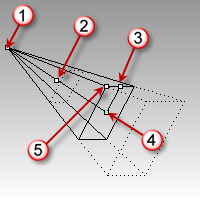

---
---

# Camera
{: #kanchor254}
{: #kanchor253}
{: #kanchor252}
{: #kanchor251}
{: #kanchor250}
 [Where can I find this command?](javascript:void(0);) Toolbars
 [Not on toolbars.](toolbarwhattodo.html) 
Menus
View
 [Viewport title](rhino-window.html#viewport-title-menu) 
Set Camera
Show Camera
Shortcut
F6
The Camera command shows, hides, and toggles the visibility of the viewport camera widget.
The viewport camera widget displays a representation of the camera and target for the viewport that is active when theCameracommand is started.
The camera is associated only with the viewport for which it is shown and is only visible in the other viewports.
Use the camera widget's control points to move the camera widget, to drag the [camera](viewport.html#cameraandtarget) and [target](viewport.html#target-location) points, and to change the lens length of the perspective viewport.

Viewport camera diagram.
The camera viewpoint.
The camera location can be used to move the whole camera widget.
The roll control tilts the camera.
The target point.
The field of view/lens angle.
The dotted rectangles are near and far clipping planes. You cannot see anything farther away than the far clipping plane, nor nearer than the near (to the camera point) clipping plane.
The purpose of the camera widget is to show a graphical representation of the camera's location, angle, and field of view.
For example:
You may want to place a light above and to the left of the camera of the perspective view. You can turn on that camera and see it while you place the light using the other views.You may want a light to have a strong specular reflection in the top surface of the object to render: if you can see the camera, you can set the light to be opposite to, and at the same angle as, the camera.You can set the camera's viewpoint to a specific location with object snaps by dragging the camera point to the endpoint of a line, surface edge, etc.The [Zoom](zoom.html) command,Targetoption lets you set the camera target and then zoom to a window around it. You don't need to see the camera to do this, but the camera helps to illustrate the target's usefulness.Command-line options
Show
Shows the view camera.
Hide
Hides the view camera.
Toggle
Toggles the visibility of the view camera.
See also
 [Navigate in the viewports](sak-navigate.html) 
&#160;
&#160;
Rhinoceros 6 © 2010-2015 Robert McNeel &amp; Associates.11-Nov-2015
 [Open topic with navigation](camera.html) 

