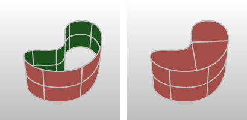

---
---

# Cap
{: #kanchor257}
{: #kanchor256}
{: #kanchor255}
 [Where can I find this command?](javascript:void(0);) Toolbars
 [Solid Tools](solid-tools-toolbar.html) 
Menus
Solid
Cap Planar Holes
The Cap command fills openings in surfaces or polysurfaces with a planar surface joined to the hole edge.
The openings must have edge loops that are closed and planar.

Steps
 [Select](select-objects.html) surfaces or polysurfaces.See also
 [Edit solid objects](sak-solidtools.html) 
&#160;
&#160;
Rhinoceros 6 © 2010-2015 Robert McNeel &amp; Associates.11-Nov-2015
 [Open topic with navigation](cap.html) 

