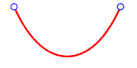
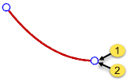

---
---

# Catenary
{: #kanchor259}
{: #kanchor258}
 [Where can I find this command?](javascript:void(0);) Toolbars
 [Curve Drawing](curve-drawing-toolbar.html) 
Menu
Curve
Catenary
Through Point
From Length
From Parameter
From Apex

The Catenary command draws a curve that a hanging chain or cable assumes under its own weight when supported only at its ends.

Catenary curve.
Note
Catenaries cannot be exactly represented using [NURBS](http://www.rhino3d.com/nurbs), so the output is always approximate.The created curve endpoints are exactly at the picked points, and the curve end tangents are evaluated from the actual catenary.Steps
 [Pick a location](pick-location.html) for the start of catenaryPick a location for the end of catenary.Pick a location to show the catenary axis direction.An arrow points toward the default direction.Press [Enter](enter-key.html) to accept the default.Or select a point depending on the options.Pick a point on the catenary.Command-line options
Mode
ThroughPoint
The next pick specifies a point for the catenary to go through.
Note
If the two end points are on the same line perpendicular to catenary axis, the catenary apex cannot be at either end point, it must be between them.If the axis is not perpendicular to the line between the two end points, a catenary with an apex at the end point does exist. Press [Enter](enter-key.html) or snap to the second end point to make the apex at the second point.Curve endpoint (1) and catenary apex (2) are at the same location.Point on catenary
Pick a location that will be on the curve.
Length
Type or pick the catenary length.
The length needs to be longer than the distance from catenary start to end.
Parameter
Type or pick the catenary parameter.
Note
The basic catenary equation isy=a*cosh(x/a).The catenary parameter is "a" in the equation. Smaller numbers make longer, saggier curve, larger numbers make shorter, tighter curve.The command remembers the length and parameter in all four modes.Apex
The last pick defines the catenary apex height.
Output
Specifies the output type.
Smooth
Creates a smooth curve
Polyline
Creates a polyline.
PointCount
Specifies the number of [control points](controlpoint.html) in the output curve. The more points, the more accurate the catenary approximation.
MarkApex
Places a point object at the catenary apex.
The point is evaluated at the actual catenary apex, so it may be slightly off the output curve, especially if the output is a polyline.
See also
 [Draw lines and curves](sak-curve.html) 
 [Wikipedia: Catenary](http://en.wikipedia.org/wiki/Catenary) 
&#160;
&#160;
Rhinoceros 6 © 2010-2015 Robert McNeel &amp; Associates.11-Nov-2015
 [Open topic with navigation](catenary.html) 

