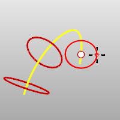
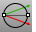
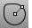
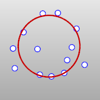

---
---

# Circle toolbar
{: #kanchor2312}
 [To open a toolbar](javascript:void(0);) Toolbars can be opened as a free-standing group or added to the current group.
To open a toolbar as a free-standing group
Click theOptionsicon in any toolbar group.On the menu, clickShow Toolbar, and then select the toolbar name from the list.To open a toolbar as a new tab in the current group
Click theOptionsicon in the toolbar group where you want to add the new tab.On the menu, clickShow or Hide Tabs, and then select the toolbar name from the list. [Circle](circle.html) 
Draw a circle from center and radius, diameter, points on the circumference, and circumference length.
 [Circle, *Diameter* ](circle.html#2point) 
Draws a circle from points on diameter.
 [Circle, *3Point* ](circle.html#3point) 
Draws a circle from 3 points on circumference.
 [Circle, *AroundCurve* ](circle.html#aroundcurve) 
Draws a circle around a curve.
 [Circle, *Tangent, Tangent, Radius* ](circle.html#tangent) 
Draws a circle tangent to two curves and a radius.
 [Circle, *Tangent* ](circle.html#tangent) 
Draws a circle tangent to 3 curves.
 [Circle, *Vertical to CPlane: center, radius* ](circle.html#vertical) 
Draws a circle from a center and radius vertical to CPlane.
 [Circle, *Vertical to CPlane: diameter* ](circle.html#vertical) 
Draws a circle from points on diameter vertical to CPlane.
 [Circle, *Deformable* ](circle.html#deformable) 
Draws a deformable NURBS circle.
 [Circle, *Fit Points* ](circle.html#fitpoints) 
Fits a circle through points.
&#160;
&#160;
Rhinoceros 6 © 2010-2015 Robert McNeel &amp; Associates.11-Nov-2015
 [Open topic with navigation](circle-toolbar.html) 

