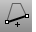

---
---

# CloseCrv
{: #kanchor346}
{: #kanchor345}
{: #kanchor344}
 [Where can I find this command?](javascript:void(0);) Toolbars
 [Curve Tools](curve-tools-toolbar.html) 
Menus
Curve
Curve Edit Tools
Close Curve
The CloseCrv command closes open curves.
Curves are closed either with a straight segment or, if they are within joining tolerance of one another, by moving the curve end point to the curve start point.
Steps
 [Select](select-objects.html) open curves and press [Enter](enter-key.html) .The number of curves closed by adding segments and the number closed by moving endpoints are reported.See also
 [Draw lines and curves](sak-curve.html) 
&#160;
&#160;
Rhinoceros 6 © 2010-2015 Robert McNeel &amp; Associates.11-Nov-2015
 [Open topic with navigation](closecrv.html) 

