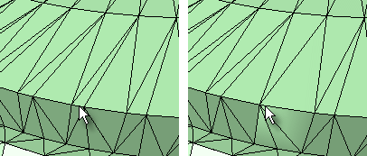

---
---

# CollapseMeshEdge
{: #kanchor390}
 [Where can I find this command?](javascript:void(0);) Toolbars
 [Collapse Mesh](collapse-mesh-toolbar.html) 
Menus
Mesh
Mesh Edit Tools
Collapse
Edge
The CollapseMeshEdge command moves the vertices of a mesh edge to a single vertex.

Steps
 [Select](select-objects.html) a mesh edge.The surrounding faces and edges adjust.Note
Some STL/SLA printers have problems if meshes contain many long, thin facets. These can slow the printer's slicing process down, produce odd printed results, and run the printer out of memory.The [MeshRepair](meshrepair.html) command may be useful when tuning up meshes for STL/SLA printing.See also
 [Collapse mesh faces and vertices](sak-collapsemesh.html) 
&#160;
&#160;
Rhinoceros 6 © 2010-2015 Robert McNeel &amp; Associates.11-Nov-2015
 [Open topic with navigation](collapsemeshedge.html) 

