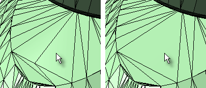
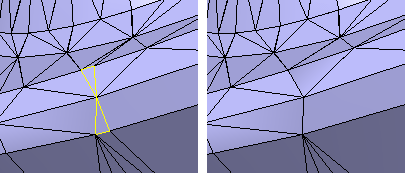
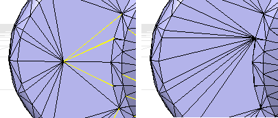

---
---

# Collapse mesh faces
The collapse mesh faces commands help to edit existing meshes by removing unwanted or unnecessary faces from the mesh. Mesh faces can be collapsed using:
 [Selecting individual faces](#collapsemeshface). [A specified maximum or minimum area](#collapsemeshfacesbyarea). [A specified aspect ratio](#collapsemeshfacesbyaspectratio). [A specified edge length](#collapsemeshfacesbyedgelength) .Note
Some STL/SLA printers have problems if meshes contain many long, thin facets. These can slow the printer's slicing process down, produce odd printed results, and run the printer out of memory.The [MeshRepair](meshrepair.html) command may be useful when tuning up meshes for STL/SLA printing.
# CollapseMeshFace
{: #kanchor392}
{: #kanchor391}
{: #collapsemeshface}
 [Where can I find this command?](javascript:void(0);) Toolbars
 [Collapse Mesh](collapse-mesh-toolbar.html) 
Menus
Mesh
Mesh Edit Tools
Collapse
Face
The CollapseMeshFace command moves the vertices of a mesh face to a single vertex.

Steps
 [Select](select-objects.html) a mesh face.The surrounding edges and faces adjust.
# CollapseMeshFacesByArea
{: #kanchor394}
{: #kanchor393}
{: #collapsemeshfacesbyarea}
 [Where can I find this command?](javascript:void(0);) Toolbars
 [Collapse Mesh](collapse-mesh-toolbar.html) 
Menus
Mesh
Mesh Edit Tools
Collapse
By Area
The CollapseMeshFacesByArea command moves the vertices of mesh faces that have a surface area greater or less than a specified value to a single vertex.

Steps
 [Select](select-objects.html) a mesh object.Collapse mesh faces by area options
Select faces larger than ___
Selects faces with an area larger than the specified setting.
 **Select smallest face** 
Select a mesh face to set the area of the smallest face.
Select faces smaller than
Selects faces with an area smaller than the specified setting.
 **Select largest face** 
Select a mesh face to set the area of the largest face.
Increment
Sets the amount theAreavalue is changed with each arrow click.
 **Select range from face** 
Select an example face to set the size range. A range of ±10% of the area of the selected face is used.

# CollapseMeshFacesByAspectRatio
{: #kanchor396}
{: #kanchor395}
{: #collapsemeshfacesbyaspectratio}
 [Where can I find this command?](javascript:void(0);) Toolbars
 [Collapse Mesh](collapse-mesh-toolbar.html) 
Menus
Mesh
Mesh Edit Tools
Collapse
By Aspect Ratio
The CollapseMeshFacesByAspectRatio command moves the vertices of mesh faces that are greater than a specified ratio of length to width to a single vertex.
A ratio of 25:1 or above is considered long.

Steps
 [Select](select-objects.html) a mesh.Collapse mesh faces by aspect ratio options
Aspect ratio ___ to 1
Set the target aspect ratio.
Increment
Sets the amount theAspect ratiovalue is changed with each arrow click.
 **Select aspect ratio from face** 
Select a mesh face to specify theAspect Ratiovalue.

# CollapseMeshFacesByEdgeLength
{: #kanchor398}
{: #kanchor397}
{: #collapsemeshfacesbyedgelength}
 [Where can I find this command?](javascript:void(0);) Toolbars
 [Collapse Mesh](collapse-mesh-toolbar.html) 
Menus
Mesh
Mesh Edit Tools
Collapse
By Edge Length
The CollapseMeshFacesByEdgeLength command moves the vertices of mesh edges that are greater or less than a specified length to a single vertex.
Steps
 [Select](select-objects.html) a mesh.Collapse mesh faces by edge length options
Edge length
Sets the edge length to compare.
 **Select edge** 
Pick a mesh edge to specify the edge length you want.
Increment
Sets the amount theEdge lengthvalue is changed with each arrow click.
Select edges:
Shorter than edge length
Selects faces with an edge length shorter than theEdge lengthsetting.
Longer than edge length
Selects faces with an edge length longer than theEdge lengthsetting.
See also
 [Collapse mesh faces and vertices](sak-collapsemesh.html) 
 [Extract object sub-elements](sak-extract.html) 
 [Edit mesh objects](sak-meshtools.html) 
 [White paper: Scan, Cleanup, Remodel](http://download.rhino3d.com/download.asp?id=ScanCleanupRemodel) 
&#160;
&#160;
Rhinoceros 6 © 2010-2015 Robert McNeel &amp; Associates.11-Nov-2015
 [Open topic with navigation](collapsemeshface-commands.html) 

