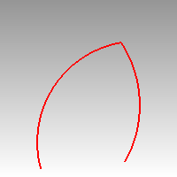
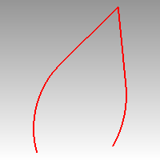

---
---

# Connect
{: #kanchor424}
 [Where can I find this command?](javascript:void(0);) Toolbars
 [Extend](extend-toolbar.html) 
Menus
Curve
Connect Curves
The Connect command extends and trims curves to meet at their endpoints.
Steps
 [Select](select-objects.html) the first curve.Select the second curve.Command-line options
Join
Joins the resulting curves.
ExtendArcsBy
Arc
Extends arcs with an arc segment tangent to the input curve.

Line
Extends arcs with a line segment tangent to the input curve.

See also
 [Extend curves and surfaces](sak-extend.html) 
&#160;
&#160;
Rhinoceros 6 © 2010-2015 Robert McNeel &amp; Associates.11-Nov-2015
 [Open topic with navigation](connect.html) 

