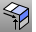

---
---

# ConnectSrf
{: #kanchor427}
{: #kanchor426}
{: #kanchor425}
 [Where can I find this command?](javascript:void(0);) Toolbars
 [Surface Tools](surface-tools-toolbar.html) 
Menus
Surface
Connect Surfaces
The ConnectSrf command extends surface edges to meet and trims the surfaces to each other.
Steps
 [Select](select-objects.html) the first surface edge.Select the second surface edge.The selected end of the surface is trimmed away at intersection line, while the other end is kept.Your browser does not support the video tag.See also
 [Extend curves and surfaces](sak-extend.html) 
&#160;
&#160;
Rhinoceros 6 © 2010-2015 Robert McNeel &amp; Associates.11-Nov-2015
 [Open topic with navigation](connectsrf.html) 

