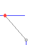
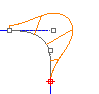
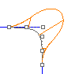
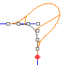
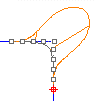

---
---

Continuity descriptions{: #kanchor3091}
A curve or surface can be described as having Gncontinuity,nbeing the increasing measure of smoothness. Consider the segments either side of a point on a curve:
G0: The curves touch at the join point (position).G1: The curves also share a common tangent direction at the join point (tangent).G2: The curves also share a common center of curvature at the join point (curvature).{: #position-g0}Position (G0)
Position (G0 continuity) measures location only. If the end points of each curve are in the same location in space, the curves are position continuous (G0) at the ends. In other words, the two curves in question touch each other at their end points.

{: #tangency-g1}Tangency (G1)
Tangency (G1 continuity) measures position and curve direction at the ends. in other words, the two curves not only touch, but they go the same direction at the point where they touch.
The direction is determined by the first and second point on each curve. If these two points fall on a line, the two curves are tangent at the ends.
The first derivative of the two curves is equal at the point where they touch.

{: #curvature-g2}Curvature (G2)
Curvature continuity (G2 continuity) between two curves measures position, direction, and radius of curvature at the ends. If the radius of curvature is the same at the common end point, curves are curvature continuous (G2). In other words, the curves not only go the same direction when they meet, but also have the same radius at that point. This condition is not easy to determine by just looking at where the points are located.
Both the first and second derivatives of the equations are equal at that point.

{: #g3}G3
G3 continuity adds a third requirement: planar acceleration. Curves that are G3 continuous touch, go the same direction, have the same radius, and that radius is accelerating at the same rate at a certain point.
G3 continuous curves have equal third derivatives.

{: #g4}G4
G4 continuity is very seldom used, but can be important in certain isolated cases. G4 continuous curves have all the same requirements as G3 curves, but their curvature acceleration is equal in three dimensions.

 [Open topic with navigation](continuity-descriptions.html) 

