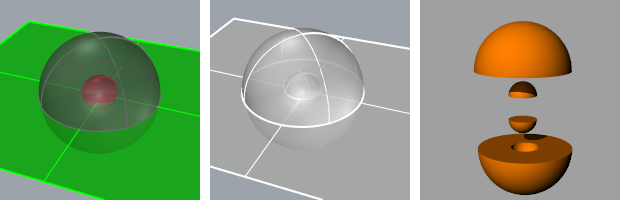

---
---

# CreateRegions
{: #kanchor476}
 [Where can I find this command?](javascript:void(0);) Toolbars
 [Not on toolbars.](toolbarwhattodo.html) 
Menus
 [Not on menus.](menuwhattodo.html) 
The CreateRegions command replaces a [non-manifold polysurface](non-manifold-edges.html) with all solid manifold regions defined by the surfaces of the input.
This command is typically used after the [NonmanifoldMerge](nonmanifoldmerge.html) command.
Two spheres and a plane (left), after NonmanifoldMerge (middle), exploded view after CreateRegions (right).
Select a polysurface whose surfaces bound one or more solid regions in space. The command will replace this with the solid polysurfaces that form the regions.
See also
 [Edit solid objects](sak-solidtools.html) 
&#160;
&#160;
Rhinoceros 6 © 2010-2015 Robert McNeel &amp; Associates.11-Nov-2015
 [Open topic with navigation](createregions.html) 

