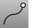
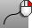

---
---

# CrvStart
{: #kanchor487}
{: #kanchor486}
 [Where can I find this command?](javascript:void(0);) Toolbars
 [Point](point-toolbar.html) 
Menus
Curve
Point Object
Mark Curve Start
The CrvStart command places a point object at the start of a curve.
Steps
 [Select](select-objects.html) the curves.
# CrvEnd
{: #kanchor489}
{: #kanchor488}
{: #crvend}
 [Where can I find this command?](javascript:void(0);) Toolbars
 [Point](point-toolbar.html) 
Menus
Curve
Point Object
Mark Curve End
The CrvEnd command places a point object at the end of a curve.
Steps
 [Select](select-objects.html) the curves.See also
 [Point](point.html) 
Draw a single point object.
&#160;
&#160;
Rhinoceros 6 © 2010-2015 Robert McNeel &amp; Associates.11-Nov-2015
 [Open topic with navigation](crvstart.html) 

