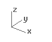

---
---

{: #kanchor2554}{: #kanchor2555}{: #kanchor2556}{: #kanchor2557}{: #kanchor2558}{: #kanchor2559}{: #kanchor2560}{: #kanchor2561}{: #kanchor2562}{: #kanchor2563}{: #kanchor2564}{: #kanchor2565}{: #kanchor2566}{: #kanchor2567}{: #kanchor2568}{: #kanchor2569}{: #kanchor2570}{: #kanchor2571}{: #kanchor2572}{: #kanchor2573}{: #kanchor2574}{: #kanchor2575}{: #kanchor2576}{: #kanchor2577}{: #kanchor2578}{: #kanchor2579}{: #kanchor2580}{: #kanchor2581}{: #kanchor2582}{: #kanchor2583}{: #kanchor2584}{: #kanchor2585}{: #kanchor2586}
# Cursor constraints
Make the mouse cursor go where you want it to go.
Normally, dragging the mouse moves the cursor on the construction plane in the active viewport. Simply move the cursor to another viewport to change the construction plane.
You can also restrict the cursor movement in the following ways:
 [To a specified coordinate point](#coordinate-entry)  [Angle](#angle)  [Distance](#distance-constraint)  [Vertical](#elevator-mode)  [To a coordinate point relative to the current location](#relative-coordinates)  [In a specified direction based on the cursor location](#directionlock)  [To the x, y, or z&#160;coordinate of specified location](#point-filters) 
## Coordinate entry
{: #coordinate-entry}
Places the cursor at a specified x, y, and z&#160;location.
When Rhino prompts you for a point, if you type x and y Cartesian coordinates, the point will lie on the construction plane of the current viewport.
To use 2-D construction plane coordinates
At a prompt, type the coordinate in the formatx,ywherexis the x&#160;coordinate andyis the y&#160;coordinate of the point.A line from 1,1 to 4,2.To use 3-D construction plane coordinates
At a prompt, type the coordinate in the formatx,y,zwherexis the x&#160;coordinate,yis the y&#160;coordinate, andzis the z&#160;coordinate of the point.There are no spaces between the coordinate values.To place a point 3 units in the x&#160;direction, four units in the y&#160;direction, and 10 units in the z&#160;direction from the construction plane origin, type3,4,10at the prompt.If you enter only x and y&#160;coordinates, the point will lie on the construction plane.
## World coordinates
{: #world-coordinates}
Rhino contains one world coordinate system. The world coordinate system cannot be changed. When Rhino prompts you for a point, you can type coordinates in the world coordinate system.
The arrow icon in the lower left corner of each viewport displays the direction of the world x, y, and z&#160;axes. The arrows move to show the orientation of the world axes when you rotate a view.
To use 2-D world coordinates
At a prompt, type the coordinate in the formatwx,y.To use 3-D world coordinates
At a prompt, type the coordinate in the formatwx,y,zTo place a point 3 units in the world x&#160;direction, 4 units in the world y&#160;direction, and 10 units in the world z&#160;direction from the world origin, typew3,4,10at the prompt.Note
W0 is a shortcut forw0,0,0.There are no spaces between the coordinate values.
## Angle constraint
{: #angle}
Locks the next point will be placed at a specified angle relative to the last point.
To constrain to an angle
Type an angle at the command prompt in the format&lt; * **angle** * and press [Enter](enter-key.html) .The cursor moves along a line at the specified angle.The angle constraint can also be used for finalizing the pick in [elevator mode](#elevator-mode) .Example
Start theLinecommand and place the first line point.At theEnd of line…prompt, type&lt;20.The line is restricted to 20-degree angle increments.Click to place the point, or, type a distance, and press [Enter](enter-key.html) .Your browser does not support the video tag.
## Distance constraint
{: #distance-constraint}
Locks the next point will be placed at a specified distance from the last point.
To constrain to a distance
Type a number at the command prompt and press [Enter](enter-key.html) .The [marker](cursor-tracking-line.html) moves around the last point at the specified distance.Example
Start theLinecommand and place the first line point.At theEnd of lineprompt, type4.The line endpoint moves around the last point 4dim units away.Click to place the point, or, type an angle, and press [Enter](enter-key.html) .Your browser does not support the video tag.
## Relative coordinates
{: #relative-coordinates}
Rhino remembers the last point used, so you can enter the next point relative to it. Relative coordinates are useful for entering a list of points where the relative locations instead of absolute locations of the points are known. Use relative coordinates to locate points according to their relationship to the previous active point.
To use relative coordinates
At a prompt, type the coordinates in the formatrx,ywherersignifies that the coordinate is relative to the previous point.For example
Start theLinecommand.At theStart of line…prompt, click to place the first end of the line.At theEnd of line…prompt, typer2,3, and press [Enter](enter-key.html) orSpace.The line is drawn to a point 2 units in the x&#160;direction and 3 units in the y&#160;direction from the last point.
## Distance and angle constraint used together
{: #distance-and-angle-constraint-used-together}
The distance and angle constraints can be combined.
To use both distance and angle
At a prompt type the@symbol, or typerto set the distance relative to the last point.Example
Start theLinecommand and place the first line point.At theEnd of line…prompt, type@5&lt;45orr5&lt;45.The line is drawn5units from the last point at the angle45degrees from the first point.
## Direction lock (Tab key)
{: #directionlock}
TheTabkey locks the cursor's direction of travel.
ExampleStart theLinecommand and place the first line point.Use an [object snap](object-snaps.html) to locate a specific location on another object.PressTab.The [marker](cursor-tracking-line.html) is now constrained along the line between the first point and the point where the [marker](cursor-tracking-line.html), was when you pressedTab.If [grid snap](snap.html) is on and [ortho](#) is activated, the direction lock snaps to grid lines.Your browser does not support the video tag.Tips
Use direction lock constraint when you want the line to pass through the end of a curve and then go beyond it. Turn on end object snap. When you move the cursor close to the end of the curve, the [marker](cursor-tracking-line.html) snaps to the curve end. PressTaband then move the mouse beyond the curve end and pick. The line will pass through the end of the curve.Use direction lock constraint combined with the distance constraint to draw a curve of a specified length and then constrain the angle with theTabkey.
# Elevator mode
{: #elevator-mode}
Specify a point that is a given distance above or below a point on the construction plane.
 [Ctrl](ctrl-key.html) + left mouse click.
Draw a curve using elevator mode
Start theCurvecommand and place the first point.At theNext point of curve...prompt, pick another location in the perspective viewport.At theNext point...prompt, hold [Ctrl](ctrl-key.html) and pick a point in the perspective viewport.Drag the mouse in the perspective viewport.A tracking line displays, indicating that the [marker](cursor-tracking-line.html) is constrained to move perpendicular to the construction plane. Click the [left mouse button](mouse-buttons.html) to select the point. Notice the location of the [marker](cursor-tracking-line.html) in the other views.Your browser does not support the video tag.Drag objects perpendicular to the construction plane using elevator mode
Select the objects to move.Hold [Ctrl](ctrl-key.html) and click and drag with the [left mouse button](mouse-buttons.html) on the selection set.A tracking line will connect the point you picked to the [marker](cursor-tracking-line.html), indicating the new location of the selection set.Release the left mouse button to place the objects.Your browser does not support the video tag.Turn off elevator mode if you have started elevator mode in error
After starting elevator mode, hold [Ctrl](ctrl-key.html) and click the left mouse button again.Continue with picking locations.You can start elevator mode in another location.Example with angle and elevator mode
Start theLinecommand and place the first line point.At theEnd of line…prompt, move the mouse to the location where the line should end, activate [elevator](#elevator-mode) (press [Ctrl](ctrl-key.html) ), and type&lt;30.A line is drawn at 30 degree angle to the construction plane, ending on the elevator line.
## Other ways to use elevator mode
Multiple elevator
Press [Ctrl](ctrl-key.html) and click to start elevator mode.Change viewports, release [Ctrl](ctrl-key.html) and click again.A new elevator mode starts relative to the new construction plane.Canceling elevator
Press [Ctrl](ctrl-key.html) and click to start elevator mode.Release [Ctrl](ctrl-key.html) and press [Ctrl](ctrl-key.html) again and click.
## Elevator from direction lock
Elevator mode can also be activated from [direction lock](#directionlock), but only if the point can be truly 3&#8209;D.
Note
Type a number at the command prompt to specify the elevation of the point. Positive numbers are above the construction plane, negative numbers are below.Specifying 3-D points using 2-D input devices (the mouse and monitor) is aided with construction planes. Anything drawn in Rhino by simply picking points is always drawn on the construction plane of the current viewport.
## Point filters
{: #point-filters}
Point filters extract individual x, y, and z&#160;coordinate values from different points to create a new, composite point.
You can use point filters to pick one coordinate value at a time while temporarily ignoring other coordinate values. If you use point filters with object snaps, they extract coordinate values from an existing object so you can locate another point.
After you specify the first value, you are prompted for the remaining values.
Point filters only work when 3-D input is allowed, and you cannot start with one point filter and then apply another one.
Example
To place a point at the x&#160;coordinate of the right end of a line and the y&#160;coordinate of the left end of a line.
Start the [Point](point.html) command.At theLocation of point objectprompt, type.x.At theX coordinate ofprompt, with the [End](object-snaps.html#osnap-end) object snap activated, pick the right end point of the line.This sets the x&#160;coordinate of the point to the right end of the curve.At the nextLocation of point objectprompt, type.y.At theY coordinate ofprompt with the [End](object-snaps.html#osnap-end) object snap activated, pick the left endpoint of the line.This sets the y&#160;coordinate of the point to the left end of the curve.At theLocation of point objectprompt, pick to place the point.If you specified an x&#160;value, the coordinate of the new point matches the x&#160;value of the first point and the y, z&#160;value of the second point.Your browser does not support the video tag.The following filters are possible:
.x
.y
.z
.xy (.yx)
.xz (.zx)
.yz (.zy)
.wx
.wy
.wz
.wxy (.wyx)
.wxz (.wzx)
.wyz (.wzy)
See also
 [SmartTrack](modeling-aids-smarttrack.html) 
Turn on a system of temporary reference lines and points.
 [Object snaps](object-snaps.html) 
Constrain the marker to an exact location on an object such as the center of a circle or the midpoint of a line.
 [Ortho](ortho.html) 
Restrict cursor movement to an angle.
&#160;
&#160;
Rhinoceros 6 © 2010-2015 Robert McNeel &amp; Associates.11-Nov-2015
 [Open topic with navigation](cursor-constraints.html) 

