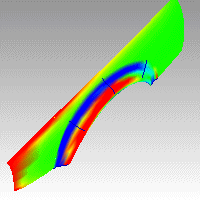
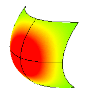
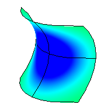
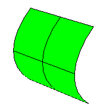

---
---

# CurvatureAnalysis
{: #kanchor502}
{: #kanchor501}
 [Where can I find this command?](javascript:void(0);) Toolbars
 [Analyze](analyze-toolbar.html)  [Surface Analysis](surface-analysis-toolbar.html)  [Surface Tools](surface-tools-toolbar.html) 
Menus
Analyze
Surface
Curvature Analysis
The CurvatureAnalysis command visually evaluates surface [curvature](http://en.wikipedia.org/wiki/Curvature) using false-color analysis.

Note
These tools can be used to gain information about the type and amount of curvature on a surface. Gaussian and Mean curvature analysis can show if and where there may be anomalies in the curvature of a surface.Unacceptably sudden changes like bumps, dents, flat areas or ripples, or in general areas of curvature that are higher or lower than the surrounding surface can be located and corrected if needed.Gaussian curvature display is helpful in deciding whether or not a surface can be developed into a flat pattern.A smooth surface has two principal curvatures. The Gaussian curvature is a product of the principal curvatures. The mean curvature is the average of the two principal curvatures.Steps
 [Select](select-objects.html) objects.The selected surface is analyzed for Gaussian curvature by default.Set the style and range.Note
If, when you use theCurvatureAnalysiscommand, any selected object does not have a surface analysis mesh, an invisible mesh will be created based on the settings in the [Polygon Mesh Options](polygon-mesh-simple-options.html) dialog box.The surface analysis meshes are saved in the Rhino files. These meshes can be large. The [RefreshShade](refreshshade.html) command and theSave geometry onlyoption of the [Save](save.html) and [SaveAs](save.html#saveas) commands remove any existing surface analysis meshes.To properly analyze a free-form [NURBS](http://www.rhino3d.com/nurbs) surface, the analysis commands generally require a detailed mesh.Curvature
Style
Gaussian{: #kanchor503}{: #kanchor504}{: #kanchor505}
In the images below, red is assigned to a positive value of Gaussian curvature, green is assigned to zero Gaussian curvature, and blue to a negative value of Gaussian curvature.
Any points on the surface with curvature values between the ones you specify will display using the corresponding color. For example, points with a curvature value half way between the specified values will be green. Points on the surface that have curvature values beyond the red end of the range will be red and points with curvature values beyond the blue end of the range will be blue.
Positive curvature
A positive Gaussian curvature value means the surface is bowl-like.

Negative curvature
A negative value means the surface is saddle-like.

Zero curvature
A zero value means the surface is flat in at least one direction. (Planes, cylinders, and cones have zero Gaussian curvature).

If you know the value range of the curvature you are interested in analyzing, type those values in the edit boxes next to the red and blue portions of the "rainbow." The values you use for red should be different from the value you use for blue, but the value for red can be larger or smaller than the value for blue.
Mean{: #kanchor506}{: #kanchor507}{: #kanchor508}
Displays the absolute value of the mean curvature. It is useful for finding areas of abrupt change in the surface curvature.
Min radius{: #kanchor509}{: #kanchor510}
If you are going to offset a surface at distance *r* or are going to mill a surface with a cutting ball of radius *r*, then any place on the surface that "curves" with a radius smaller thanrwill cause trouble.
In the case of an offset, you'll get a twisty mess that goes through itself. In the case of the mill, your cutting ball will remove material you want to keep.
In these cases you need to be able to answer the question, "Does this surface have any place where it bends too tightly?" TheMin Radiusoption should help you answer this question.
Set RED =rset BLUE = 1.5 xr
You cannot offset/mill anywhere on the surface that is red. Blue areas should be safe. However, you should view areas from green to red with suspicion.
Max radius{: #kanchor511}{: #kanchor512}
This option is useful for flat spot detection. Set the value of blue to be rather high (10-&gt;100-&gt;1000) and of red to be close to infinity. Red areas in the model then indicate flat spots where the curvature is practically zero.
Curvature Range
 **Auto Range** 
Using false color mapping, theCurvatureAnalysiscommand analyzes surface curvature. You have to map values to saturated computer colors. As a starting point, useAuto Rangeand then adjust the values to be symmetric but with magnitudes comparable to those selected byAuto Range.
TheCurvatureAnalysiscommand attempts to remember the settings you used the last time you analyzed a surface. If you have dramatically changed the geometry of a surface or have switched to a new surface, these values may not be appropriate. In this case, you can useAuto Rangeto automatically compute a curvature value to color mapping that will result in a good color distribution.
 **Max Range** 
Choose this option if you want the maximum curvature to map to red and the minimum curvature mapped to blue. On surfaces with extreme curvature variation, this may result in a rather uninformative image.
Show isocurve
Displays isocurves on the objects.
 **Add Objects** 
Turn on curvature analysis for additional selected objects.
 **Remove Objects** 
Turn off curvature analysis for selected objects.

## Curve curvature
To understand Gaussian curvature of a point on a surface, you must first know what the curvature of curve is.
At any point on a curve in the plane, the line best approximating the curve that passes through this point is the tangent line. We can also find the best approximating circle that passes through this point and is tangent to the curve. The reciprocal of the radius of this circle is the *curvature* of the curve at this point.
The best approximating circle may lie either to the left of the curve, or to the right of the curve. If we care about this, then we establish a convention, such as giving the curvature positive sign if the circle lies to the left and negative sign if the circle lies to the right of the curve. This is known as *signed curvature*.
One generalization of curvature to surfaces is *normal section curvature*. Given a point on the surface and a direction lying in the tangent plane of the surface at that point, the normal section curvature is computed by intersecting the surface with the plane spanned by the point, the normal to the surface at that point, and the direction. The normal section curvature is the signed curvature of this curve at the point of interest.
If we look at all directions in the tangent plane to the surface at our point, and we compute the normal section curvature in all these directions, then there will be a maximum value and a minimum value.

## Surface curvature
Gaussian curvature
The *Gaussian* curvature of a surface at a point is the product of the principal curvatures at that point. The tangent plane of any point with positive Gaussian curvature touches the surface at a single point, whereas the tangent plane of any point with negative Gaussian curvature cuts the surface. Any point with zero mean curvature has negative or zero Gaussian curvature.
Principal curvatures
The *principal curvatures* of a surface at a point are the minimum and maximum of the normal curvatures at that point. (Normal curvatures are the curvatures of curves on the surface lying in planes including the tangent vector at the given point.) The principal curvatures are used to compute the Gaussian and Mean curvatures of the surface.
Mean curvature
The *Mean* curvature of a surface at a point is one half the sum of the principal curvatures at that point. Any point with zero mean curvature has negative or zero Gaussian curvature.
Surfaces with zero mean curvature everywhere are minimal surfaces. Surfaces with constant mean curvature everywhere are often referred to as constant mean curvature (CMC) surfaces.
CMC surfaces have the same mean curvature everywhere on the surface.
Physical processes which can be modeled by CMC surfaces include the formation of soap bubbles, both free and attached to objects. A soap bubble, unlike a simple soap film, encloses a volume and exists in an equilibrium where slightly greater pressure inside the bubble is balanced by the area-minimizing forces of the bubble itself.
Minimal surfaces are the subset of CMC surfaces where the curvature is zero everywhere.
Physical processes which can be modeled by minimal surfaces include the formation of soap films spanning fixed objects, such as wire loops. A soap film is not distorted by air pressure (which is equal on both sides) and is free to minimize its area. This contrasts with a soap bubble, which encloses a fixed quantity of air and has unequal pressures on its inside and outside.

# CurvatureAnalysisOff
{: #curvatureanalysisoff}
 [Where can I find this command?](javascript:void(0);) Toolbars
 [Analyze](analyze-toolbar.html)  [Surface Analysis](surface-analysis-toolbar.html)  [Surface Tools](surface-tools-toolbar.html) 
Menus
 [Not on menus.](menuwhattodo.html) 
The CurvatureAnalysisOff command closes the Curvature dialog box and turns off curvature analysis display.
See also
 [Analyze objects](sak-analysis.html) 
&#160;
&#160;
Rhinoceros 6 © 2010-2015 Robert McNeel &amp; Associates.11-Nov-2015
 [Open topic with navigation](curvatureanalysis.html) 

