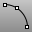
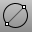
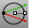
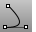
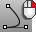
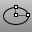
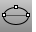
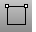
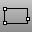

---
---

# Curve Drawing toolbar
 [To open a toolbar](javascript:void(0);) Toolbars can be opened as a free-standing group or added to the current group.
To open a toolbar as a free-standing group
Click theOptionsicon in any toolbar group.On the menu, clickShow Toolbar, and then select the toolbar name from the list.To open a toolbar as a new tab in the current group
Click theOptionsicon in the toolbar group where you want to add the new tab.On the menu, clickShow or Hide Tabs, and then select the toolbar name from the list. [Arc](arc.html) 
Draw an arc with options for center, start, angle, and direction.
Link to [Arc toolbar](arc-toolbar.html) 
 [Arc,Start, End, Direction](arc.html) 
Arc by start, end, direction at start.
 [Arc,Start, Direction, End](arc.html) 
Arc by start, direction at start, end.
 [Arc,Start, End, Point](arc.html) 
Arc by start, end, point on arc.
 [Arc,Start, Point, End](arc.html) 
Arc by start, point on arc, end.
 [Arc,Tangent](arc.html) 
Arc tangent to curves.
 [Arc,Tangent, Tangent, Radius](arc.html) 
Arc tangent, tangent, radius.
 [Cancel](cancel.html) 
Cancel the current command and deselects objects.
 [Cancel, *All* ](cancel.html) 
Turns off [Points](pointson.html), [CurvatureGraph](curvaturegraph.html), [EMap](emap.html), [Zebra](zebra.html), [MoveUVN](moveuvn.html), [CurvatureAnalysis](curvatureanalysis.html), and deselects objects.
 [Catenary](catenary.html) 
Creates a curve that a hanging chain or cable assumes under its own weight when supported only at its ends.
 [Circle](circle.html) 
Draw a circle from center and radius, diameter, points on the circumference, and circumference length.
Link to [Circle toolbar](circle-toolbar.html) 
 [Circle, *Diameter* ](circle.html#2point) 
Draws a circle from points on diameter.
 [Circle, *Tangent, Tangent, Radius* ](circle.html#tangent) 
Draws a circle tangent to two curves and a radius.
 [Circle, *Vertical to CPlane: center, radius* ](circle.html#vertical) 
Draws a circle from a center and radius vertical to construction plane.
 [Conic,](conic.html#tangent)  * [Tangent at start](conic.html#tangent) * 
Draw a conic curve tangent at the start.
 [Conic,](conic.html#tangent)  * [Tangent at start and end](conic.html#tangent) * 
Draw a conic curve tangent at the start and end.
 [Curve](curve.html) 
Draw a curve from [control point](controlpoint.html) locations.
Link to [Curve toolbar](curve-toolbar.html) 
 [CurveThroughPt](curvethroughpt.html) 
Fit a curve through point objects.
 [Ellipse](ellipse.html) 
Draw a closed elliptical curve from focus points, center and edges, bounding rectangle, and around a curve.
Link to [Ellipse toolbar](ellipse-toolbar.html) 
 [Ellipse, *Diameter* ](ellipse.html#diameter) 
Draws a closed elliptical curve by diameter.
 [Explode](explode.html) 
Break objects down into components.
 [ExtractSrf](extractsrf.html) 
Separate or duplicate a polysurface face.
 [HandleCurve](handlecurve.html) 
Draw chained [Bézier curves](http://en.wikipedia.org/wiki/Bézier_curve) with editing handles.
 [Helix](helix.html) 
Draw a helical curve with options for number of turns, pitch, vertical, reverse, and around a curve.
 [Helix, *Vertical* ](helix.html#vertical) 
Draw a vertical helical curve.
 [InterpCrv](interpcrv.html) 
Fit a curve through picked locations.
 [HandleCurve](handlecurve.html) 
Draw chained [Bézier curves](http://en.wikipedia.org/wiki/Bézier_curve) with editing handles.
 [InterpCrvOnSrf](interpcrvonsrf.html) 
Fit a curve through locations on a surface.
 [Join](join.html) 
Connect curves, surface edges, or surfaces to form a single object.
 [Line](line.html) 
Draw a single line segment.
 [Line,](line.html#normal)  * [Normal](line.html#normal) * 
Draw a line segment normal to a surface.
 [Line,](line.html#normal)  * [Normal, BothSides](line.html#normal) * 
Draw a line segment normal to a surface from its midpoint.
 [Line, *Perpendicular, from curve* ](line.html#perpendicular) 
Draw a line segment perpendicular from a curve.
 [Line, *Perpendicular, to curve* ](line.html#perpendicular) 
Draw a line segment perpendicular to a curve.
 [Line, *Tangent* ](line.html#tangent) 
Draw a line segment tangent from a curve.
 [Line,](line.html#vertical)  * [Vertical](line.html#vertical) * 
Draw a line segment perpendicular to the construction plane.
 [Line,](line.html#vertical)  * [Vertical, BothSides](line.html#vertical) * 
Draw a line segment perpendicular to the construction plane from its midpoint.
 [Move](move.html) 
Move objects from one location to another.
Link to [Transform](transform-toolbar.html) toolbar
 [Polygon](polygon.html) 
Draw a polygon with a specified number of sides with options for inscribed/circumscribed, by edge, star-shaped, around a curve, and vertical.
Link to [Polygon toolbar](polygon-toolbar.html) 
 [Polygon, *Square from center and corner* ](polygon.html) 
Draw a square polygon by center and corner.
 [Polygon, *Square, from edge* ](polygon.html) 
Draw a square polygon by edge.
 [Polygon, *Star* ](polygon.html#star) 
Draw a polygon star.
 [Polyline](polyline.html) 
Draw a multi-segment polyline with options for line and arc segments, tracking line helpers, and close.
Link to [Lines toolbar](lines-toolbar.html) 
 [Lines](lines.html) 
Draw multiple adjoining line segments.
 [Rectangle](rectangle.html) 
Draw a rectangular closed polyline from with options for starting at the center, three points, vertical, and rounded with arc or conic corners.
Link to [Rectangle toolbar](rectangle-toolbar.html) 
 [Rectangle, *3Point* ](rectangle.html#3point) 
Draw a rectangle through three points.
 [Rectangle, *Rounded* ](rectangle.html#rounded) 
Draw a rectangle with rounded corners.
 [Rectangle, *Rounded, conic corners* ](rectangle.html#rounded) 
Draw a rectangle with conic rounded corners.
 [Rectangle, *Vertical* ](rectangle.html#vertical) 
Draw a rectangle perpendicular to the construction plane.
 [Sketch](sketch.html) 
Drag the mouse to draw a curve.
 [Sketch, *on surface* ](sketch.html#onsurface) 
Drag the mouse to draw a curve on a selected surface.
 [Split](split.html) 
Divide objects using other objects as cutters.
 [Split,Isocurve](split.html#isocurve) 
Divide objects using isocurves as cutters.
 [Trim](trim.html) 
Cut and delete selected portions of an object at the intersection with another object.
 [Untrim](trim.html#untrim) 
Remove trim curves from trimmed surfaces.
&#160;
&#160;
Rhinoceros 6 © 2010-2015 Robert McNeel &amp; Associates.11-Nov-2015
 [Open topic with navigation](curve-drawing-toolbar.html) 

